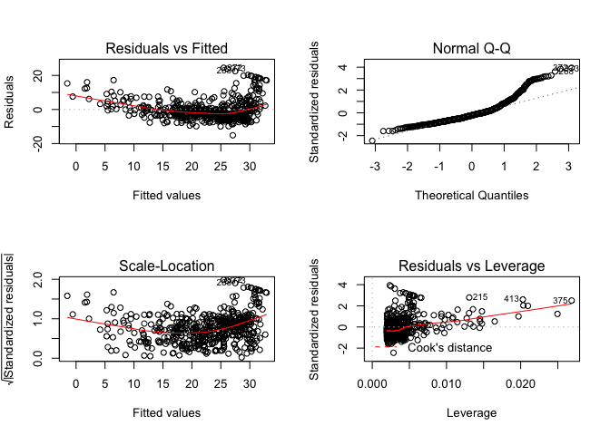
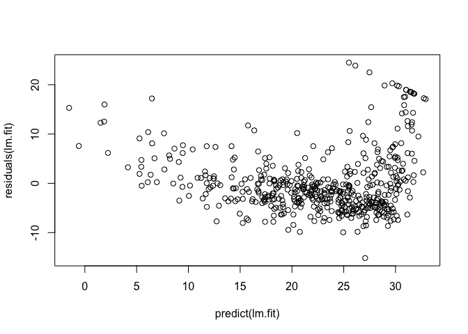
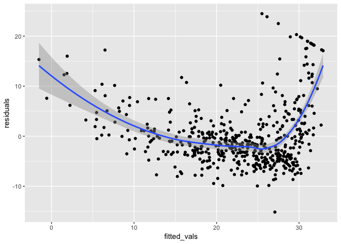
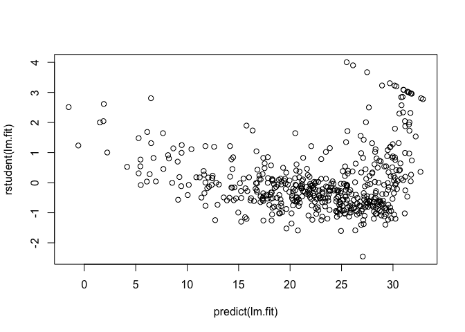
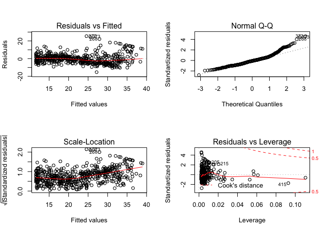

Libraries and Data
==================

Load libraries. Use `Boston` data set in `MASS`.

    library(MASS)
    library(ISLR)

    ## Warning: package 'ISLR' was built under R version 3.4.2

    names(Boston)

    ##  [1] "crim"    "zn"      "indus"   "chas"    "nox"     "rm"      "age"    
    ##  [8] "dis"     "rad"     "tax"     "ptratio" "black"   "lstat"   "medv"

    #?Boston

------------------------------------------------------------------------

Simple Linear Regression
========================

Fit a simple linear model with `medv` (median value of owner occupied
homes) as the response **Y**, and `lstat` as the single predictor,
**X**.

    lm.fit <- lm(medv~lstat, data = Boston)
    lm.fit

    ## 
    ## Call:
    ## lm(formula = medv ~ lstat, data = Boston)
    ## 
    ## Coefficients:
    ## (Intercept)        lstat  
    ##       34.55        -0.95

Get a summary of the linear model fit. `lstat` explains about 54% of the
variance in `medv`, and is significant. That is, the p-value of
*β*1 is sufficiently low to reject
*H*0 : *β*1 = 0, and accept
*H**a* : *β*1 ≠ 0.

    summary(lm.fit)

    ## 
    ## Call:
    ## lm(formula = medv ~ lstat, data = Boston)
    ## 
    ## Residuals:
    ##     Min      1Q  Median      3Q     Max 
    ## -15.168  -3.990  -1.318   2.034  24.500 
    ## 
    ## Coefficients:
    ##             Estimate Std. Error t value Pr(>|t|)    
    ## (Intercept) 34.55384    0.56263   61.41   <2e-16 ***
    ## lstat       -0.95005    0.03873  -24.53   <2e-16 ***
    ## ---
    ## Signif. codes:  0 '***' 0.001 '**' 0.01 '*' 0.05 '.' 0.1 ' ' 1
    ## 
    ## Residual standard error: 6.216 on 504 degrees of freedom
    ## Multiple R-squared:  0.5441, Adjusted R-squared:  0.5432 
    ## F-statistic: 601.6 on 1 and 504 DF,  p-value: < 2.2e-16

What are the data stored in the linear model fit? We can extract them
list-style (`lm.fit$coefficients`), or with extractor functions.

    names(lm.fit)

    ##  [1] "coefficients"  "residuals"     "effects"       "rank"         
    ##  [5] "fitted.values" "assign"        "qr"            "df.residual"  
    ##  [9] "xlevels"       "call"          "terms"         "model"

    coef(lm.fit)

    ## (Intercept)       lstat 
    ##  34.5538409  -0.9500494

In order to obtain the confidence intervals for the coefficient
estimates, we use the `confint()` command.

    confint(lm.fit)

    ##                 2.5 %     97.5 %
    ## (Intercept) 33.448457 35.6592247
    ## lstat       -1.026148 -0.8739505

The `predict()` function can be used to prodice confidence intervals and
prediction intervals for the prediction of `medv` for a given value of
`lstat`.

    # create some testing data
    test_set <- data.frame(lstat = c(5,10,15))

    # use the model to predict Y for these new x.
    predict(lm.fit,
            test_set,
            interval = "confidence") # confidence interval

    ##        fit      lwr      upr
    ## 1 29.80359 29.00741 30.59978
    ## 2 25.05335 24.47413 25.63256
    ## 3 20.30310 19.73159 20.87461

    # prediction interval
    predict(lm.fit,
            test_set,
            interval = "prediction") # prediction interval

    ##        fit       lwr      upr
    ## 1 29.80359 17.565675 42.04151
    ## 2 25.05335 12.827626 37.27907
    ## 3 20.30310  8.077742 32.52846

Confidence and prediction intervals are centered around the same point,
but prediction intervals are wider.

Now we plot `medv` and `lstat` along with the least squartes fit. We
will also attach `Boston` to search path so that we don't have to call
`data = Boston` as a argument in every `plot` or `lm` call.

    attach(Boston) 
    plot(lstat, medv)
    abline(lm.fit, lwd = 2, col = "red")

Examine the diagnostic plots.

    par(mfrow=c(2,2)) # set up graphical device to view all plots at once
    plot(lm.fit) 

Alternatively, we can obtain residuals and studdentized residuals with
`residuals()`, `rstudent()`, and plot them on our own.

    plot(predict(lm.fit), residuals(lm.fit))

    library(tidyverse)

    ## Loading tidyverse: ggplot2
    ## Loading tidyverse: tibble
    ## Loading tidyverse: tidyr
    ## Loading tidyverse: readr
    ## Loading tidyverse: purrr
    ## Loading tidyverse: dplyr

    ## Warning: package 'tibble' was built under R version 3.4.3

    ## Warning: package 'purrr' was built under R version 3.4.2

    ## Warning: package 'dplyr' was built under R version 3.4.2

    ## Conflicts with tidy packages ----------------------------------------------

    ## filter(): dplyr, stats
    ## lag():    dplyr, stats
    ## select(): dplyr, MASS

    data.frame(fitted_vals = predict(lm.fit), 
               residuals = residuals(lm.fit)) %>% 
      ggplot(aes(fitted_vals, residuals)) +
      geom_point() +
      geom_smooth()

    ## `geom_smooth()` using method = 'loess' and formula 'y ~ x'

    ##
    plot(predict(lm.fit), rstudent(lm.fit))

On the basis of residual plots, there is some non-lineary in the
residuals, indicating a function that is not entirely linear. We should
consider high leverage points that might influence our model. We can
compute leverage statistics using the `hatvalues()` function. In
general, if

$h\_{i} &gt; \\frac{p+1}{n}$

we suspect that a point has high leverage. It appears that none of our
points has a leverage statistic large enough to cause concern.

    plot(hatvalues(lm.fit))

    # which max tells us the index of the point with the highest leverage
    which.max(hatvalues(lm.fit))

    ## 375 
    ## 375

    # find threshold for high leverage points
    p <- summary(lm.fit)$coefficients %>% nrow() -1
    n <- nrow(Boston)
    threshold <- p + 1 / n

------------------------------------------------------------------------

Multiple Linear Regression
--------------------------

Now to fit a multiple linear regression using least squares, we use
`lm()`. Syntax is `lm(y ~ x1 + x2 + x3)`. `summary()` now shows the
coefficients for all predictors in the model.

    lm.fit <- lm(medv ~ lstat + age, data = Boston)
    summary(lm.fit)

    ## 
    ## Call:
    ## lm(formula = medv ~ lstat + age, data = Boston)
    ## 
    ## Residuals:
    ##     Min      1Q  Median      3Q     Max 
    ## -15.981  -3.978  -1.283   1.968  23.158 
    ## 
    ## Coefficients:
    ##             Estimate Std. Error t value Pr(>|t|)    
    ## (Intercept) 33.22276    0.73085  45.458  < 2e-16 ***
    ## lstat       -1.03207    0.04819 -21.416  < 2e-16 ***
    ## age          0.03454    0.01223   2.826  0.00491 ** 
    ## ---
    ## Signif. codes:  0 '***' 0.001 '**' 0.01 '*' 0.05 '.' 0.1 ' ' 1
    ## 
    ## Residual standard error: 6.173 on 503 degrees of freedom
    ## Multiple R-squared:  0.5513, Adjusted R-squared:  0.5495 
    ## F-statistic:   309 on 2 and 503 DF,  p-value: < 2.2e-16

Shorthand for **all** predictors is `.` Also, you can access specific
components of the summary with `summary(lm.fit)$r.squared` etc...

    lm.fit <- lm(medv ~ . , data = Boston)
    summary(lm.fit)

    ## 
    ## Call:
    ## lm(formula = medv ~ ., data = Boston)
    ## 
    ## Residuals:
    ##     Min      1Q  Median      3Q     Max 
    ## -15.595  -2.730  -0.518   1.777  26.199 
    ## 
    ## Coefficients:
    ##               Estimate Std. Error t value Pr(>|t|)    
    ## (Intercept)  3.646e+01  5.103e+00   7.144 3.28e-12 ***
    ## crim        -1.080e-01  3.286e-02  -3.287 0.001087 ** 
    ## zn           4.642e-02  1.373e-02   3.382 0.000778 ***
    ## indus        2.056e-02  6.150e-02   0.334 0.738288    
    ## chas         2.687e+00  8.616e-01   3.118 0.001925 ** 
    ## nox         -1.777e+01  3.820e+00  -4.651 4.25e-06 ***
    ## rm           3.810e+00  4.179e-01   9.116  < 2e-16 ***
    ## age          6.922e-04  1.321e-02   0.052 0.958229    
    ## dis         -1.476e+00  1.995e-01  -7.398 6.01e-13 ***
    ## rad          3.060e-01  6.635e-02   4.613 5.07e-06 ***
    ## tax         -1.233e-02  3.760e-03  -3.280 0.001112 ** 
    ## ptratio     -9.527e-01  1.308e-01  -7.283 1.31e-12 ***
    ## black        9.312e-03  2.686e-03   3.467 0.000573 ***
    ## lstat       -5.248e-01  5.072e-02 -10.347  < 2e-16 ***
    ## ---
    ## Signif. codes:  0 '***' 0.001 '**' 0.01 '*' 0.05 '.' 0.1 ' ' 1
    ## 
    ## Residual standard error: 4.745 on 492 degrees of freedom
    ## Multiple R-squared:  0.7406, Adjusted R-squared:  0.7338 
    ## F-statistic: 108.1 on 13 and 492 DF,  p-value: < 2.2e-16

    names(summary(lm.fit)) # all the components of the summary

    ##  [1] "call"          "terms"         "residuals"     "coefficients" 
    ##  [5] "aliased"       "sigma"         "df"            "r.squared"    
    ##  [9] "adj.r.squared" "fstatistic"    "cov.unscaled"

    summary(lm.fit)$r.squared # get model r squared

    ## [1] 0.7406427

    summary(lm.fit)$coefficients # get model coefficients

    ##                  Estimate  Std. Error      t value     Pr(>|t|)
    ## (Intercept)  3.645949e+01 5.103458811   7.14407419 3.283438e-12
    ## crim        -1.080114e-01 0.032864994  -3.28651687 1.086810e-03
    ## zn           4.642046e-02 0.013727462   3.38157628 7.781097e-04
    ## indus        2.055863e-02 0.061495689   0.33431004 7.382881e-01
    ## chas         2.686734e+00 0.861579756   3.11838086 1.925030e-03
    ## nox         -1.776661e+01 3.819743707  -4.65125741 4.245644e-06
    ## rm           3.809865e+00 0.417925254   9.11614020 1.979441e-18
    ## age          6.922246e-04 0.013209782   0.05240243 9.582293e-01
    ## dis         -1.475567e+00 0.199454735  -7.39800360 6.013491e-13
    ## rad          3.060495e-01 0.066346440   4.61289977 5.070529e-06
    ## tax         -1.233459e-02 0.003760536  -3.28000914 1.111637e-03
    ## ptratio     -9.527472e-01 0.130826756  -7.28251056 1.308835e-12
    ## black        9.311683e-03 0.002685965   3.46679256 5.728592e-04
    ## lstat       -5.247584e-01 0.050715278 -10.34714580 7.776912e-23

In a multiple linear regression with many predictors, its possible that
one or more predictors are collinaer with each other. The importance of
a predictor might be masked by the presence of collinerarity. This
introduces uncertainty into the estimate of *β**j*, which in
turn influences the standard error, and t-statistic, and inflates the
p-value, which might lead to failing to reject
*H*0 : *β**j* = 0.

The **variance inflation factor**, or VIF, is a measure of collinearity.
As a rule of thumb, VIF values &gt; 5 or 10 indicate problematic
collinearity. We can calculate VIF with the `cars` package.

    library(car)

    ## Warning: package 'car' was built under R version 3.4.4

    ## Loading required package: carData

    ## Warning: package 'carData' was built under R version 3.4.4

    ## 
    ## Attaching package: 'car'

    ## The following object is masked from 'package:dplyr':
    ## 
    ##     recode

    ## The following object is masked from 'package:purrr':
    ## 
    ##     some

    vif(lm.fit)

    ##     crim       zn    indus     chas      nox       rm      age      dis 
    ## 1.792192 2.298758 3.991596 1.073995 4.393720 1.933744 3.100826 3.955945 
    ##      rad      tax  ptratio    black    lstat 
    ## 7.484496 9.008554 1.799084 1.348521 2.941491

None of our predictors exhibit problematic collinearity above our
threshold of VIF = 10, but some, such as `rad`, and `tax` are moderate
for this data. If any predictors exceeded our threshold, we could
combine predictors, or drop ones that provide redundant information.

------------------------------------------------------------------------

Interaction Terms
=================

Include interaction terms in a linear model within `lm()`. The syntax
`lstat:black` tells R to include an interaction term between `lstat` and
`black`. Moreover, the syntax `lstat*age` is shorthand for
`lstat + age + lstat:age`.

    summary(lm(medv ~ lstat*age, data = Boston))

    ## 
    ## Call:
    ## lm(formula = medv ~ lstat * age, data = Boston)
    ## 
    ## Residuals:
    ##     Min      1Q  Median      3Q     Max 
    ## -15.806  -4.045  -1.333   2.085  27.552 
    ## 
    ## Coefficients:
    ##               Estimate Std. Error t value Pr(>|t|)    
    ## (Intercept) 36.0885359  1.4698355  24.553  < 2e-16 ***
    ## lstat       -1.3921168  0.1674555  -8.313 8.78e-16 ***
    ## age         -0.0007209  0.0198792  -0.036   0.9711    
    ## lstat:age    0.0041560  0.0018518   2.244   0.0252 *  
    ## ---
    ## Signif. codes:  0 '***' 0.001 '**' 0.01 '*' 0.05 '.' 0.1 ' ' 1
    ## 
    ## Residual standard error: 6.149 on 502 degrees of freedom
    ## Multiple R-squared:  0.5557, Adjusted R-squared:  0.5531 
    ## F-statistic: 209.3 on 3 and 502 DF,  p-value: < 2.2e-16

------------------------------------------------------------------------

Non Linear Transformations of Predictors
========================================

The `lm()` fcuntion can also accomodate non-linear transformations of
predictors. For example, for a given predictor *X*, we can create a
predictor *X*2, with the syntax `I(X^2)`. The function `I()`
is necessary. Let's compare the coefficients for *l**s**t**a**t* and
*l**s**t**a**t*2.

    summary(lm(medv ~ lstat + I(lstat^2), data = Boston))

    ## 
    ## Call:
    ## lm(formula = medv ~ lstat + I(lstat^2), data = Boston)
    ## 
    ## Residuals:
    ##      Min       1Q   Median       3Q      Max 
    ## -15.2834  -3.8313  -0.5295   2.3095  25.4148 
    ## 
    ## Coefficients:
    ##              Estimate Std. Error t value Pr(>|t|)    
    ## (Intercept) 42.862007   0.872084   49.15   <2e-16 ***
    ## lstat       -2.332821   0.123803  -18.84   <2e-16 ***
    ## I(lstat^2)   0.043547   0.003745   11.63   <2e-16 ***
    ## ---
    ## Signif. codes:  0 '***' 0.001 '**' 0.01 '*' 0.05 '.' 0.1 ' ' 1
    ## 
    ## Residual standard error: 5.524 on 503 degrees of freedom
    ## Multiple R-squared:  0.6407, Adjusted R-squared:  0.6393 
    ## F-statistic: 448.5 on 2 and 503 DF,  p-value: < 2.2e-16

The near-zero p-value associated with the quadratic term suggests that
it leads to an improved model. We can use the `anova()` function to
further quantify the extent to which the quadratic model is superior to
the linear fit.

    lm.fit <- lm(medv ~ lstat)
    lm.fit2 <- lm(medv ~ lstat + I(lstat^2))

    anova(lm.fit, lm.fit2)

    ## Analysis of Variance Table
    ## 
    ## Model 1: medv ~ lstat
    ## Model 2: medv ~ lstat + I(lstat^2)
    ##   Res.Df   RSS Df Sum of Sq     F    Pr(>F)    
    ## 1    504 19472                                 
    ## 2    503 15347  1    4125.1 135.2 < 2.2e-16 ***
    ## ---
    ## Signif. codes:  0 '***' 0.001 '**' 0.01 '*' 0.05 '.' 0.1 ' ' 1

Here the `anova()` function performs a hypothesis test comparing the two
models.

*H*0: *both models fit the data equally well*  
*H**a*: *the full model is superior*

We see that the F statistic is very high and the p-value is very small
for Model 2 (including the quadratic fit), indicating that the model
which includes a quadratic term outperforms the linear model. Examining
the residuals for the model with the quadratic term, we see that little
evidence for nonlinearity in the residuals.

    par(mfrow=c(2,2))
    plot(lm.fit2)

To test multiple polynomial fits, use `ploy()`.

    lm.fit7 <- lm(medv ~ poly(lstat, 7))
    summary(lm.fit7)

    ## 
    ## Call:
    ## lm(formula = medv ~ poly(lstat, 7))
    ## 
    ## Residuals:
    ##      Min       1Q   Median       3Q      Max 
    ## -14.3746  -3.1382  -0.7072   2.0646  26.9642 
    ## 
    ## Coefficients:
    ##                  Estimate Std. Error t value Pr(>|t|)    
    ## (Intercept)       22.5328     0.2319  97.168  < 2e-16 ***
    ## poly(lstat, 7)1 -152.4595     5.2164 -29.227  < 2e-16 ***
    ## poly(lstat, 7)2   64.2272     5.2164  12.313  < 2e-16 ***
    ## poly(lstat, 7)3  -27.0511     5.2164  -5.186 3.13e-07 ***
    ## poly(lstat, 7)4   25.4517     5.2164   4.879 1.44e-06 ***
    ## poly(lstat, 7)5  -19.2524     5.2164  -3.691 0.000248 ***
    ## poly(lstat, 7)6    6.5088     5.2164   1.248 0.212708    
    ## poly(lstat, 7)7    1.9416     5.2164   0.372 0.709888    
    ## ---
    ## Signif. codes:  0 '***' 0.001 '**' 0.01 '*' 0.05 '.' 0.1 ' ' 1
    ## 
    ## Residual standard error: 5.216 on 498 degrees of freedom
    ## Multiple R-squared:  0.6828, Adjusted R-squared:  0.6783 
    ## F-statistic: 153.1 on 7 and 498 DF,  p-value: < 2.2e-16

This suggests that including polynomial terms up to the fith order
(*X*5) improves model fit, with non-significant results for
*X*6 and higher.

We can of course use other transformations besides polynomials.

    summary(lm(medv ~ log(rm)))

    ## 
    ## Call:
    ## lm(formula = medv ~ log(rm))
    ## 
    ## Residuals:
    ##     Min      1Q  Median      3Q     Max 
    ## -19.487  -2.875  -0.104   2.837  39.816 
    ## 
    ## Coefficients:
    ##             Estimate Std. Error t value Pr(>|t|)    
    ## (Intercept)  -76.488      5.028  -15.21   <2e-16 ***
    ## log(rm)       54.055      2.739   19.73   <2e-16 ***
    ## ---
    ## Signif. codes:  0 '***' 0.001 '**' 0.01 '*' 0.05 '.' 0.1 ' ' 1
    ## 
    ## Residual standard error: 6.915 on 504 degrees of freedom
    ## Multiple R-squared:  0.4358, Adjusted R-squared:  0.4347 
    ## F-statistic: 389.3 on 1 and 504 DF,  p-value: < 2.2e-16

------------------------------------------------------------------------

Qualitative Predictors
======================

Now examine `Carseats` data, part of ISLR. Predict `sales` (child car
seta sales) in 400 locations based on a set of predictors (X).

    names(Carseats) # response and predictors

    ##  [1] "Sales"       "CompPrice"   "Income"      "Advertising" "Population" 
    ##  [6] "Price"       "ShelveLoc"   "Age"         "Education"   "Urban"      
    ## [11] "US"

`ShelveLoc` is a quantitative variable that takes on three values:
*Bad*, *Medium*, and *Good*. Given qualitative variables, R
automatically generates dummy variables. Here we fit a multiple
regression with interation terms and dummy variables.

    lm.fit <- lm(Sales ~ . + Income:Advertising + Price:Age, data = Carseats)
    summary(lm.fit)

    ## 
    ## Call:
    ## lm(formula = Sales ~ . + Income:Advertising + Price:Age, data = Carseats)
    ## 
    ## Residuals:
    ##     Min      1Q  Median      3Q     Max 
    ## -2.9208 -0.7503  0.0177  0.6754  3.3413 
    ## 
    ## Coefficients:
    ##                      Estimate Std. Error t value Pr(>|t|)    
    ## (Intercept)         6.5755654  1.0087470   6.519 2.22e-10 ***
    ## CompPrice           0.0929371  0.0041183  22.567  < 2e-16 ***
    ## Income              0.0108940  0.0026044   4.183 3.57e-05 ***
    ## Advertising         0.0702462  0.0226091   3.107 0.002030 ** 
    ## Population          0.0001592  0.0003679   0.433 0.665330    
    ## Price              -0.1008064  0.0074399 -13.549  < 2e-16 ***
    ## ShelveLocGood       4.8486762  0.1528378  31.724  < 2e-16 ***
    ## ShelveLocMedium     1.9532620  0.1257682  15.531  < 2e-16 ***
    ## Age                -0.0579466  0.0159506  -3.633 0.000318 ***
    ## Education          -0.0208525  0.0196131  -1.063 0.288361    
    ## UrbanYes            0.1401597  0.1124019   1.247 0.213171    
    ## USYes              -0.1575571  0.1489234  -1.058 0.290729    
    ## Income:Advertising  0.0007510  0.0002784   2.698 0.007290 ** 
    ## Price:Age           0.0001068  0.0001333   0.801 0.423812    
    ## ---
    ## Signif. codes:  0 '***' 0.001 '**' 0.01 '*' 0.05 '.' 0.1 ' ' 1
    ## 
    ## Residual standard error: 1.011 on 386 degrees of freedom
    ## Multiple R-squared:  0.8761, Adjusted R-squared:  0.8719 
    ## F-statistic:   210 on 13 and 386 DF,  p-value: < 2.2e-16

The `contrasts()` function returns the coding that R uses for dummy
variables.

    attach(Carseats)
    contrasts(ShelveLoc)

    ##        Good Medium
    ## Bad       0      0
    ## Good      1      0
    ## Medium    0      1

R created 2 dummary variables: `ShelveLocGood` that equals 1 if the
location is good, and 0 otherwise, and `ShelvLocMedium` that equals 1 if
the location is medium and 0 otherwise. Bad shelving location is 0 for
both variables. `ShelvLocGood` and `ShelvLocMedium` are both
significant, but `ShelvLocGood` has a high *β*, indicating that a good
shelving location leads to better sales than a medium or low shelving
location.
