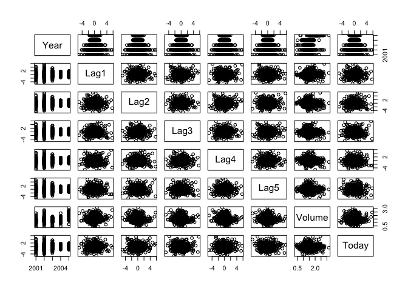
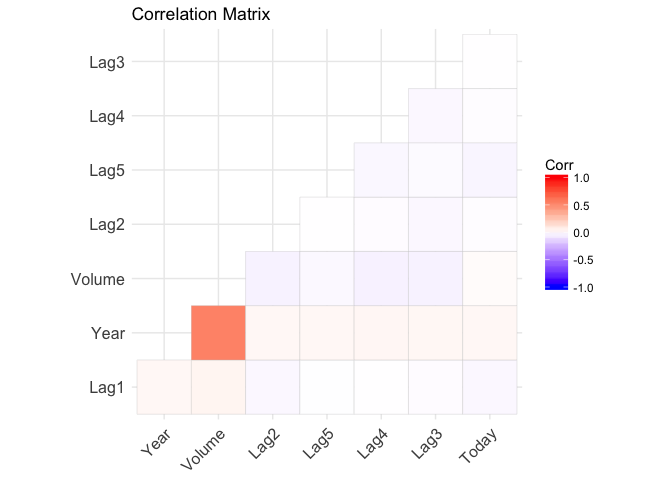
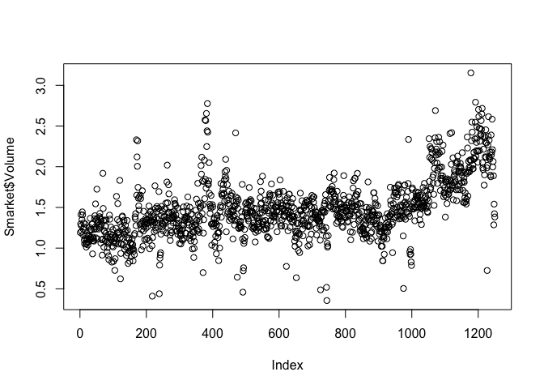

Lab 4: Classification
=====================

*4/27/2018*

------------------------------------------------------------------------

Libraries and Data
==================

Use the `ISLR` library and `Smarket` data.

    library(ISLR)
    names(Smarket)

    ## [1] "Year"      "Lag1"      "Lag2"      "Lag3"      "Lag4"      "Lag5"     
    ## [7] "Volume"    "Today"     "Direction"

    dim(Smarket)

    ## [1] 1250    9

    summary(Smarket)

    ##       Year           Lag1                Lag2          
    ##  Min.   :2001   Min.   :-4.922000   Min.   :-4.922000  
    ##  1st Qu.:2002   1st Qu.:-0.639500   1st Qu.:-0.639500  
    ##  Median :2003   Median : 0.039000   Median : 0.039000  
    ##  Mean   :2003   Mean   : 0.003834   Mean   : 0.003919  
    ##  3rd Qu.:2004   3rd Qu.: 0.596750   3rd Qu.: 0.596750  
    ##  Max.   :2005   Max.   : 5.733000   Max.   : 5.733000  
    ##       Lag3                Lag4                Lag5         
    ##  Min.   :-4.922000   Min.   :-4.922000   Min.   :-4.92200  
    ##  1st Qu.:-0.640000   1st Qu.:-0.640000   1st Qu.:-0.64000  
    ##  Median : 0.038500   Median : 0.038500   Median : 0.03850  
    ##  Mean   : 0.001716   Mean   : 0.001636   Mean   : 0.00561  
    ##  3rd Qu.: 0.596750   3rd Qu.: 0.596750   3rd Qu.: 0.59700  
    ##  Max.   : 5.733000   Max.   : 5.733000   Max.   : 5.73300  
    ##      Volume           Today           Direction 
    ##  Min.   :0.3561   Min.   :-4.922000   Down:602  
    ##  1st Qu.:1.2574   1st Qu.:-0.639500   Up  :648  
    ##  Median :1.4229   Median : 0.038500             
    ##  Mean   :1.4783   Mean   : 0.003138             
    ##  3rd Qu.:1.6417   3rd Qu.: 0.596750             
    ##  Max.   :3.1525   Max.   : 5.733000

`cor()` generates a correlation matrix. Arguments must be numeric.

    #cor(Smarket) - will not work!

    # numeric - remove up/down
    cor(Smarket[,-9])

    ##              Year         Lag1         Lag2         Lag3         Lag4
    ## Year   1.00000000  0.029699649  0.030596422  0.033194581  0.035688718
    ## Lag1   0.02969965  1.000000000 -0.026294328 -0.010803402 -0.002985911
    ## Lag2   0.03059642 -0.026294328  1.000000000 -0.025896670 -0.010853533
    ## Lag3   0.03319458 -0.010803402 -0.025896670  1.000000000 -0.024051036
    ## Lag4   0.03568872 -0.002985911 -0.010853533 -0.024051036  1.000000000
    ## Lag5   0.02978799 -0.005674606 -0.003557949 -0.018808338 -0.027083641
    ## Volume 0.53900647  0.040909908 -0.043383215 -0.041823686 -0.048414246
    ## Today  0.03009523 -0.026155045 -0.010250033 -0.002447647 -0.006899527
    ##                Lag5      Volume        Today
    ## Year    0.029787995  0.53900647  0.030095229
    ## Lag1   -0.005674606  0.04090991 -0.026155045
    ## Lag2   -0.003557949 -0.04338321 -0.010250033
    ## Lag3   -0.018808338 -0.04182369 -0.002447647
    ## Lag4   -0.027083641 -0.04841425 -0.006899527
    ## Lag5    1.000000000 -0.02200231 -0.034860083
    ## Volume -0.022002315  1.00000000  0.014591823
    ## Today  -0.034860083  0.01459182  1.000000000

    # visualize
    pairs(Smarket[,-9])

    # visualize corelation matrix
    library(ggcorrplot)

    ggcorrplot(cor(Smarket[,-9]), type = "lower",
               hc.order = TRUE) + 
      labs(title = "Correlation Matrix")

The only substantial correlation is between `Year` and `Volume`.
`Volume` increases over time.

    plot(Smarket$Volume)

------------------------------------------------------------------------

Logistic Regression
===================

Predict direction using `Lag1` through `Lag5`, and `Volume`. The `glm()`
function fits *generalized linear models*, a class of models which
includes logistic regression. Syntax is the same as `lm()`, but we must
specify `family = binomial` to let R know that our response variable is
binomial.

    attach(Smarket)

    glm.fits <- glm(Direction ~ Lag1 + Lag2 + Lag3 + Lag4 + Lag5 + Volume, 
                    family = binomial, 
                    data = Smarket)

    summary(glm.fits)

    ## 
    ## Call:
    ## glm(formula = Direction ~ Lag1 + Lag2 + Lag3 + Lag4 + Lag5 + 
    ##     Volume, family = binomial, data = Smarket)
    ## 
    ## Deviance Residuals: 
    ##    Min      1Q  Median      3Q     Max  
    ## -1.446  -1.203   1.065   1.145   1.326  
    ## 
    ## Coefficients:
    ##              Estimate Std. Error z value Pr(>|z|)
    ## (Intercept) -0.126000   0.240736  -0.523    0.601
    ## Lag1        -0.073074   0.050167  -1.457    0.145
    ## Lag2        -0.042301   0.050086  -0.845    0.398
    ## Lag3         0.011085   0.049939   0.222    0.824
    ## Lag4         0.009359   0.049974   0.187    0.851
    ## Lag5         0.010313   0.049511   0.208    0.835
    ## Volume       0.135441   0.158360   0.855    0.392
    ## 
    ## (Dispersion parameter for binomial family taken to be 1)
    ## 
    ##     Null deviance: 1731.2  on 1249  degrees of freedom
    ## Residual deviance: 1727.6  on 1243  degrees of freedom
    ## AIC: 1741.6
    ## 
    ## Number of Fisher Scoring iterations: 3

Smallest p-value associated with `Lag1`. Negative
*β**L**a**g*1 suggests that if the market had a positive day
yesterday, it is less likely to go up today.

    coef(glm.fits) # get all beta coefficients

    ##  (Intercept)         Lag1         Lag2         Lag3         Lag4 
    ## -0.126000257 -0.073073746 -0.042301344  0.011085108  0.009358938 
    ##         Lag5       Volume 
    ##  0.010313068  0.135440659

    summary(glm.fits)$coefficients

    ##                 Estimate Std. Error    z value  Pr(>|z|)
    ## (Intercept) -0.126000257 0.24073574 -0.5233966 0.6006983
    ## Lag1        -0.073073746 0.05016739 -1.4565986 0.1452272
    ## Lag2        -0.042301344 0.05008605 -0.8445733 0.3983491
    ## Lag3         0.011085108 0.04993854  0.2219750 0.8243333
    ## Lag4         0.009358938 0.04997413  0.1872757 0.8514445
    ## Lag5         0.010313068 0.04951146  0.2082966 0.8349974
    ## Volume       0.135440659 0.15835970  0.8552723 0.3924004

We can make predicitons with this model using `predict()`. The argument
`type = "response` tells R to out probabilities as *P*(*Y* = 1|*X*), as
opposed to the logit. Since we don't supply any other information to
predict, the model computes probabilties for the training data. We use
`contrasts()` to check how R encoded the response variable in this case,
and see that `1` corresponds to the market going up, while `0`
corresponds to it going down.

    glm.probs <- predict(glm.fits, type = "response") # predicts Y given model and training data
    glm.probs[1:10]

    ##         1         2         3         4         5         6         7 
    ## 0.5070841 0.4814679 0.4811388 0.5152224 0.5107812 0.5069565 0.4926509 
    ##         8         9        10 
    ## 0.5092292 0.5176135 0.4888378

    # what were the directions assigned to "Direction"?
    contrasts(Direction)

    ##      Up
    ## Down  0
    ## Up    1

To convert these predicitons into a factor "Up" or "Down", we do:

    glm.pred = rep("Down", 1250) # 1250 == nrow(Smarket)
    glm.pred[glm.probs > .5] = "Up"

Create a confusion matrix with `table()`

    # view the predicitons
    table(glm.pred, Direction)

    ##         Direction
    ## glm.pred Down  Up
    ##     Down  145 141
    ##     Up    457 507

    # % correct
    (507+145)/1250

    ## [1] 0.5216

    mean(glm.pred == Direction)

    ## [1] 0.5216

52% seems a bit better than randomly guessing, but this is our
**training error rate**.

For more realistic error rate, split data into train and test data sets.
2001-2004 = train, 2005 = test.

    train = (Smarket$Year < 2005)
    test = Smarket[!train, ]

    dim(test) # testing on 252 rows

    ## [1] 252   9

    direction_test <- Smarket$Direction[!train]

Train the model on 2001-2004, and test on 2005. Use argument `subset`.

    # train
    glm.fits <- glm(Direction ~ Lag1 + Lag2 + Lag3 + Lag4 + Lag5 + Volume, 
                    family = binomial, 
                    data = Smarket,
                    subset = train)

    # predict test data
    glm.probs = predict(glm.fits, 
                        test,
                        type = "response")

    # convert probs to factor
    glm.pred = rep("Down", 252)
    glm.pred[glm.probs > .5] = "Up"

    # confusion matrix
    table(glm.pred, direction_test)

    ##         direction_test
    ## glm.pred Down Up
    ##     Down   77 97
    ##     Up     34 44

    mean(glm.pred == direction_test)

    ## [1] 0.4801587

The model performs worse than guessing at random!

Try removing predictors that had very high p-values.

    glm.fits = glm(Direction ~ Lag1 + Lag2, 
                    family = binomial, 
                    data = Smarket,
                    subset = train)

    glm.probs = predict(glm.fits, 
                        test,
                        type = "response")

    glm.pred = rep("Down", 252)
    glm.pred[glm.probs > .5] = "Up"
    table(glm.pred, direction_test)

    ##         direction_test
    ## glm.pred Down  Up
    ##     Down   35  35
    ##     Up     76 106

    mean(glm.pred==direction_test)

    ## [1] 0.5595238

This results in model thatperforms a bit beter than randomly guessing.

To predict on specific days, feed them into a new df:

    predict(glm.fits, newdata = data.frame(Lag1 = c(1.2,1.5), Lag2 = c(1.1,-0.8), type = "response"))

    ##           1           2 
    ## -0.08346346 -0.01562483

------------------------------------------------------------------------

Linear Discriminat Analysis.
============================

Use `lda()` in the `MASS` library. Same sytax as `lm()` and `glm()`.

    library(MASS)
    lda.fit <- lda(Direction ~ Lag1 + Lag2, 
                   data = Smarket,
                   subset = train)
    lda.fit

    ## Call:
    ## lda(Direction ~ Lag1 + Lag2, data = Smarket, subset = train)
    ## 
    ## Prior probabilities of groups:
    ##     Down       Up 
    ## 0.491984 0.508016 
    ## 
    ## Group means:
    ##             Lag1        Lag2
    ## Down  0.04279022  0.03389409
    ## Up   -0.03954635 -0.03132544
    ## 
    ## Coefficients of linear discriminants:
    ##             LD1
    ## Lag1 -0.6420190
    ## Lag2 -0.5135293

**Prior probabilties of groups** are *π**k* (p. 138).

**Group means** are class-specific means *μ**k* (p. 143).

**Coefficients of linear discrimination** are multiplier of the elements
of *X* = *x* in (4.19), (p.143).

------------------------------------------------------------------------

Use `predict()`.

    lda.predict <- predict(lda.fit, test)
    names(lda.predict)

    ## [1] "class"     "posterior" "x"

**class** predicts market movement.

**psoterior** predicts the probability that an observation belongs to
the a class *k*.

**x** contains the linear discriminants, derived from the coefficients
of linear discrimination. High values predict market increase, and low
values predict a market decline.

------------------------------------------------------------------------

How does the model perform?

    lda.class = lda.predict$class

    table(lda.class, direction_test)

    ##          direction_test
    ## lda.class Down  Up
    ##      Down   35  35
    ##      Up     76 106

    mean(lda.class == direction_test)

    ## [1] 0.5595238

Applying an LDA to the data produces a similar result to the multiple
logistic regression.

We can use a different posterior probability threshold other than 50% to
make predictions.

    sum(lda.predict$posterior[,1] > .9) 

    ## [1] 0

On zero days was the posterior probability of a market increase greater
than .9

------------------------------------------------------------------------

Quadratic Discriminant Analysis
===============================

Use `qda()` in `MASS`. Identical syntax to `lda()`.

    qda.fit <- qda(Direction ~ Lag1 + Lag2,
                   data = Smarket,
                   subset = train)

    qda.fit

    ## Call:
    ## qda(Direction ~ Lag1 + Lag2, data = Smarket, subset = train)
    ## 
    ## Prior probabilities of groups:
    ##     Down       Up 
    ## 0.491984 0.508016 
    ## 
    ## Group means:
    ##             Lag1        Lag2
    ## Down  0.04279022  0.03389409
    ## Up   -0.03954635 -0.03132544

Contains prior probabilities of groups (*π**k*) and group
means (*μ**k*), but because the discriminants are quadratic
and less interpretable, it does not contain the coefficients.

    qda.class <- predict(qda.fit, test)$class

    table(qda.class, direction_test)

    ##          direction_test
    ## qda.class Down  Up
    ##      Down   30  20
    ##      Up     81 121

    mean(qda.class == direction_test)

    ## [1] 0.5992063

QDA predictions are accurate about 60% of the time. Not bad.

------------------------------------------------------------------------

K-Nearest Neighbors
===================

Use `knn()` in `class` library. No fitting and predicting, just a single
function with 4 arguments:

-   matrix of training predictors  
-   matrix of testing predictors  
-   vector of class labels for training  
-   value for **K**, the number of nearest neighbors used by the
    classifier

<!-- -->

    # these all work nicely because we attached Smarket earlier and can just call column names
    library(class)
    train_x = cbind(Lag1, Lag2)[train, ]
    test_x = cbind(Lag1, Lag2)[!train, ]
    train_direction = Smarket$Direction[train] # if Smarket wasn't attached, we'd have to write like this

Set a random seed before running `knn()` because in the event of ties, R
randomly breaks ties, and we want reproducible results.

    set.seed(1)
    knn.pred = knn(train_x, test_x, train_direction, k = 1)

    table(knn.pred, direction_test)

    ##         direction_test
    ## knn.pred Down Up
    ##     Down   43 58
    ##     Up     68 83

    mean(knn.pred == direction_test)

    ## [1] 0.5

Results of `k=1` are not good. Only 50% of observations are predicted!
`K=1` might be overly flexible and overfitted to the training data.
Let's try `k=3`.

    set.seed(1)
    knn.pred = knn(train_x, test_x, train_direction, k = 3)

    table(knn.pred, direction_test)

    ##         direction_test
    ## knn.pred Down Up
    ##     Down   48 55
    ##     Up     63 86

    mean(knn.pred == direction_test)

    ## [1] 0.531746

With `k=3` we see a slight improvement. Try a higher k.

    set.seed(1)
    knn.pred = knn(train_x, test_x, train_direction, k = 4)

    table(knn.pred, direction_test)

    ##         direction_test
    ## knn.pred Down Up
    ##     Down   45 58
    ##     Up     66 83

    mean(knn.pred == direction_test)

    ## [1] 0.5079365

Increasing k past 3 offers no more improvement. QDA provides the best
fit to the data thus far. This is likely because the covariance
matricies *Σ**k* are not equal for each class, and the
**Bayes decision boundary** between classes is non-linear, thus us is
better predicted by a quadratic function.

------------------------------------------------------------------------

An Application to Caravan Insurance Data
========================================

Apply KNN to `Caravan` dataset, part of `ISLR`. 6% of people out of
5,822 individuals purchase a caravan, and we have 85 predictors about
them.

    dim(Caravan)

    ## [1] 5822   86

    attach(Caravan)
    summary(Purchase)

    ##   No  Yes 
    ## 5474  348

    348/5474

    ## [1] 0.06357326

The KNN classifier classifies based on **distance**, therefore, it's
really sensitive to predictors with large scales. For example, if `age`
was a predictor, we would obtain different results from KNN if we
represented `age` as years, months, minutes, and microseconds. 12 months
is much more distance than 1 year to KNN. To get around this behavior,
we standardize each of the continuous variables using `scale()`. This
makes every column of data have a standard deviation of 1 and a mean of
0.

    standardized_x = scale(Caravan[,-86]) # exclude the qualitative "Purchase" variable

We now split observations into test and train.

    test = 1:1000 # make first 1,000 observations test data

    # train
    train_x <- standardized_x[-test, ] # trainig predictors (x) are the remining observations
    train_y <- Purchase[-test] # training response (y)

    # test
    test_x <- standardized_x[test, ] # testing predictors (x)
    test_y <- Purchase[test] # test response (y) - to measure accuracy of the model fit to training data

    # set random seed for reproducibility
    set.seed(1)

    # run model
    knn_pred <- knn(train_x, test_x, train_y, k = 1)
    sum(test_y != knn_pred) / 1000 # overall error is 11%

    ## [1] 0.118

    sum(test_y != "No") / 1000 # only 6% of people in test set actually bought a Caravan

    ## [1] 0.059

11% may seem like a good error rate, but since only 6% of customers
purchased insurance, we can get the error rate down to 6% if we **always
predicted "No"**. What we are really intersted in is the True Postive
rate. In other words, how many times did the model predicit an insurance
sale, when an insurance sale actually happened? We can calculate this
from a confusion matrix of the predicted and actual test response.
Specifically (p.149), the
*P**r**e**c**i**s**i**o**n* = *T**P*/(*T**P* + *F**P*) tells us how
precise our prediction was.

    table(test_y, knn_pred)

    ##       knn_pred
    ## test_y  No Yes
    ##    No  873  68
    ##    Yes  50   9

    9/(68 + 9) # we predict 11% of the people that actually buy insurance. That's about twice as good as randomly guessing!

    ## [1] 0.1168831

Let's try again with `K=3`

    set.seed(1)
    knn_pred <- knn(train_x, test_x, train_y, k = 3)
    table(test_y, knn_pred)

    ##       knn_pred
    ## test_y  No Yes
    ##    No  921  20
    ##    Yes  54   5

    5 / (5 + 20) # wow! now we move from 11% to 20% precision!

    ## [1] 0.2

    set.seed(1)
    # by increasing k to 5, we can get 27% precision. That's 4x better than guessing!
    knn_pred <- knn(train_x, test_x, train_y, k = 5)
    table(test_y, knn_pred)

    ##       knn_pred
    ## test_y  No Yes
    ##    No  930  11
    ##    Yes  55   4

    4 / (4 + 11)

    ## [1] 0.2666667

For comparison, let's fit a logistic regression to the data. Recall that
logistic regression uses a .5 probability cutoff, which we can modify.

    set.seed(1)
    glm_fit <- glm(Purchase ~ ., data = Caravan, family = binomial, subset = -test)

    glm_prob = predict(glm_fit, Caravan[test, ], type = "response")
    glm_pred = rep("No", 1000)
    glm_pred[glm_prob > .5] = "Yes"

    table(test_y, glm_pred) # this is terrible! with a cutoff probablity of .5, we obtain 0 TP of the 59 possible

    ##       glm_pred
    ## test_y  No Yes
    ##    No  934   7
    ##    Yes  59   0

    # try again with a cutoff of .25
    glm_pred = rep("No", 1000)
    glm_pred[glm_prob > .25] = "Yes"
    table(test_y, glm_pred) 

    ##       glm_pred
    ## test_y  No Yes
    ##    No  919  22
    ##    Yes  48  11

    11 / (11 + 22) # 33% is really good! That's 5-6 times as good as random guessing!

    ## [1] 0.3333333

Using a cutoff of .25, we obtain a success rate of about 33%! This is
about 5 to 6 times better than random guessing.
