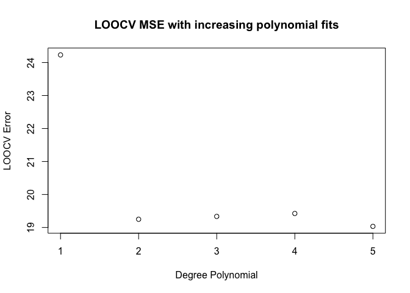

Lab 5: Resampling Methods
=========================

*6/24/2018*

------------------------------------------------------------------------

5.3.1 The Validation Set Approach
---------------------------------

We will use the built-in `Auto` dataset in ISLR. We take half of the 392
observations as training data and fit a linear model.

    library(ISLR)            # for datasets
    set.seed(1)              # for reproducibility
    train <- sample(392,196) # random subset of 196 obs. from original 392 obs

    # fit the linear model
    lm_fit <- lm(mpg ~ horsepower, 
                 data = Auto, 
                 subset = train)

We now use the `predict()` function to estimate the response for all 392
observations, and we use the `mean()` function to calculate the MSE of
the 196 observations in the validation set. Note that the `-train` index
below selects only the observations that are not in the training set.

    # predict the auto data and subset for the test data
    test_pred <- predict(lm_fit, newdata = Auto)[-train]

    # calculate the mean squared error
    mean((test_pred - Auto$mpg[-train])^2)

    ## [1] 26.14142

Therefore, the estimated test MSE for the linear regression fit is
26.14. We can use the `poly()` function to estimate the test error for
the polynomial and cubic regressions.

    # polynomial second degree fit 
    lm_fit2 <- lm(mpg ~ poly(horsepower, 2),
                  data = Auto,
                  subset = train)

    # MSE
    mean((Auto$mpg - predict(lm_fit2, Auto))[-train]^2)

    ## [1] 19.82259

    # polynomial third degree fit 
    lm_fit3 <- lm(mpg ~ poly(horsepower, 3),
                  data = Auto,
                  subset = train)

    # MSE
    mean((Auto$mpg - predict(lm_fit3, Auto))[-train]^2)

    ## [1] 19.78252

These error rates are 19.82 and 19.78, respectively. If we choose a
different training set instead, then we will obtain somewhat different
errors on the validation set.

    set.seed(2)              # reproducibility
    train <- sample(392,196) # new training sample

    # re-fit model
    lm_fit <- lm(mpg ~ horsepower,
                 data = Auto,
                 subset = train)

    # MSE
    mean((Auto$mpg - predict(lm_fit, Auto))[-train]^2)

    ## [1] 23.29559

    # polynomial second degree fit 
    lm_fit2 <- lm(mpg ~ poly(horsepower, 2),
                  data = Auto,
                  subset = train)

    # MSE
    mean((Auto$mpg - predict(lm_fit2, Auto))[-train]^2)

    ## [1] 18.90124

    # polynomial third degree fit 
    lm_fit3 <- lm(mpg ~ poly(horsepower, 3),
                  data = Auto,
                  subset = train)

    # MSE
    mean((Auto$mpg - predict(lm_fit3, Auto))[-train]^2)

    ## [1] 19.2574

Using this split of the observations into a training set and a
validation set, we find that the validation set error rates for the
models with linear, quadratic, and cubic terms are **23.30**, **18.90**,
and **19.26**, respectively.

These results are consistent with our previous findings: a model that
predicts `mpg` using a quadratic function of `horsepower` performs
better than a model that involves only a linear function of
`horsepower`, and there is little evidence in favor of a model that uses
a cubic function of `horsepower`.

------------------------------------------------------------------------

5.3.2 Leave-One-Out Cross-Validation
------------------------------------

`cv.glm()`, part of the `boot` library, computes the LOOCV estimate for
`glm()` models. `glm()` without a `family=""` argument defaults to a
lienar model. Therefore the following two models are equivalent. We use
`glm()` in this section because `cv.glm()` works with glm objects.

    m <- glm(mpg ~ horsepower, data = Auto) # fit a linear model with `glm`
    coef(m) # model coefficients

    ## (Intercept)  horsepower 
    ##  39.9358610  -0.1578447

    m2 <- lm(mpg ~ horsepower, data = Auto) # fit a linear model with `lm`
    coef(m2) # model coefficients

    ## (Intercept)  horsepower 
    ##  39.9358610  -0.1578447

    library(boot) # for LOOCV : `cv.glm()`

    glm_fit <- glm(mpg ~ horsepower, # fit model
                   data = Auto)

    cv_err = cv.glm(Auto, glm_fit)
    cv_err$delta

    ## [1] 24.23151 24.23114

The `delta` element gies us cross validation results: the LOOCV
estimate, which is defined as the average test MSE estimates.

$CV\_{n} = \\frac{1}{n}\\sum\_{i = 1}^{n}MSE\_{i}$

We can repeat this procedure for increasingly complex polynomial fits.
To automate the process, we use the `for()` function to initiate a for
loop which iteratively fits polynomial regressions for polynomials of
order i = 1 to i = 5, computes the associated cross-validation error,
and stores it in the ith element of the vector cv.error. We begin by
initializing the vector.

    cv_error = rep(0, 5)

    # fit glm with increasing degree of polynomial
    for (i in 1:5){
      glm_fit = glm(mpg ~ poly(horsepower, i), 
                    data = Auto)
      cv_error[i] = cv.glm(Auto, glm_fit)$delta[1]
    }

    # plot
    plot(1:5, cv_error, 
         main = "LOOCV MSE with increasing polynomial fits",
         xlab = "Degree Polynomial",
         ylab = "LOOCV Error")

As in Figure 5.4, we see a sharp drop in the estimated test MSE between
the linear and quadratic fits, but then no clear improvement from using
higher-order polynomials.

------------------------------------------------------------------------

5.3.3 k-Fold Cross Validation
-----------------------------

The `cv.glm()` function can also be used to implement k-fold CV. Below
we use *k = 10*, a common choice for *k*, on the `Auto` data set. We
once again set a random seed and initialize a vector in which we will
store the CV errors corresponding to the polynomial fits of orders one
to ten.

    set.seed(17)

    cv.error.10 = rep(0,10) # vector to fill

    for (i in 1:10){
      # fit the model with increasing polynomials
      glm.fit = glm(mpg ~ poly(horsepower, i), data = Auto)
      # store the raw cross-validation estimate of prediciton error
      cv.error.10[i] = cv.glm(Auto, glm.fit, K = 10)$delta[1] 
    }

    cv.error.10

    ##  [1] 24.20520 19.18924 19.30662 19.33799 18.87911 19.02103 18.89609
    ##  [8] 19.71201 18.95140 19.50196

We still see little evidence that using cubic or higher-order polynomial
terms leads to lower test error than simply using a quadratic fit.

------------------------------------------------------------------------

5.3.4 The Bootstrap
-------------------

### Estimating the Accuracy of a Statistic of Interest

One of the great advantages of the bootstrap approach is that it can be
applied in almost all situations. No complicated mathematical
calculations are required. Performing a bootstrap analysis in R entails
only two steps. First, we must create a function that computes the
statistic of interest. Second, we use the the `boot()` function, which
is part of the boot library, to perform the bootstrap by repeatedly
sampling observations from the data set with replacement.

The Portfolio data set in the ISLR package is described in Section 5.2.
To illustrate the use of the bootstrap on this data, we must first
create a function, `alpha.fn()`, which takes as input the (X, Y) data as
well as a vector indicating which observations should be used to
estimate *α*. The function then outputs the estimate for α based on the
selected observations.

    alpha.fn = function(data, index){ 
      X = data$X[index]
      Y = data$Y[index]
      return((var(Y) - cov(X,Y)) / (var(X) + var(Y) - 2*cov(X,Y)))
    }

This function returns, or outputs, an estimate for α based on applying
(5.7) to the observations indexed by the argument index. For instance,
the following command tells R to estimate α using all 100 observations.

    alpha.fn(Portfolio,1:100)

    ## [1] 0.5758321

The next command uses the `sample()` function to randomly select 100
observations from the range 1 to 100, with replacement. This is
equivalent to constructing a new bootstrap data set and recomputing
$\\hat{\\alpha}$ based on the new data set.

    set.seed(1)
    alpha.fn(Portfolio, sample(100, 100, replace = T))

    ## [1] 0.5963833

We can implement a bootstrap analysis by performing this command many
times, recording all of the corresponding estimates for *α*, and
computing the resulting standard deviation. However, the `boot()`
function automates this approach. Below we produce R = 1,000 bootstrap
estimates for *α*.

    boot(Portfolio, alpha.fn, R = 1000)

    ## 
    ## ORDINARY NONPARAMETRIC BOOTSTRAP
    ## 
    ## 
    ## Call:
    ## boot(data = Portfolio, statistic = alpha.fn, R = 1000)
    ## 
    ## 
    ## Bootstrap Statistics :
    ##      original        bias    std. error
    ## t1* 0.5758321 -7.315422e-05  0.08861826

The final output shows that using the original data, $\\hat{\\alpha}$ =
0.5758, and that the bootstrap estimate for $SE(\\hat{\\alpha})$ is
0.0886.

------------------------------------------------------------------------

### Estimating the Accuracy of a Linear Regression Model

The bootstrap approach can be used to assess the variability of the
coefficient estimates and predictions from a statistical learning
method. Here we use the bootstrap approach in order to assess the
variability of the estimates for *β*0 and *β*1,
the intercept and slope terms for the linear regression model that uses
horsepower to predict mpg in the Auto data set. We will compare the
estimates obtained using the bootstrap to those obtained using the
formulas for $SE(\\hat{\\beta\_0})$ and $SE(\\hat{\\beta\_1})$ described
in Section 3.1.2.

We first create a simple function, `boot.fn()`, which takes in the Auto
data set as well as a set of indices for the observations, and returns
the intercept and slope estimates for the linear regression model. We
then apply this function to the full set of 392 observations in order to
compute the estimates of *β*0 and *β*1 on the
entire data set using the usual linear regression coefficient estimate
formulas from Chapter 3.

    boot.fn = function(data,index){
      return(coef(lm(mpg ~ horsepower, data = data, subset = index)))
    }

    boot.fn(Auto, 1:392)

    ## (Intercept)  horsepower 
    ##  39.9358610  -0.1578447

The `boot.fn()` function can also be used in order to create bootstrap
estimates for the intercept and slope terms by randomly sampling from
among the observations with replacement. Here we give two examples.

    set.seed(1)
    boot.fn(Auto, sample(392, 392, replace = T)) 

    ## (Intercept)  horsepower 
    ##  38.7387134  -0.1481952

    boot.fn(Auto, sample(392, 392, replace = T))

    ## (Intercept)  horsepower 
    ##  40.0383086  -0.1596104

Next, we use the `boot()` function to compute the standard errors of
1,000 bootstrap estimates for the intercept and slope terms.

    boot(Auto, boot.fn, 1000)

    ## 
    ## ORDINARY NONPARAMETRIC BOOTSTRAP
    ## 
    ## 
    ## Call:
    ## boot(data = Auto, statistic = boot.fn, R = 1000)
    ## 
    ## 
    ## Bootstrap Statistics :
    ##       original      bias    std. error
    ## t1* 39.9358610  0.02972191 0.860007896
    ## t2* -0.1578447 -0.00030823 0.007404467

This indicates that the bootstrap estimate for $SE(\\hat{\\beta\_0})$ is
0.86, and that the bootstrap estimate for $SE(\\hat{\\beta\_1})$ is
0.0074. As discussed in Section 3.1.2, standard formulas can be used to
compute the standard errors for the regression coefficients in a linear
model. These can be obtained using the `summary()` function.

    summary(lm(mpg ~ horsepower, data = Auto))$coef

    ##               Estimate  Std. Error   t value      Pr(>|t|)
    ## (Intercept) 39.9358610 0.717498656  55.65984 1.220362e-187
    ## horsepower  -0.1578447 0.006445501 -24.48914  7.031989e-81

The standard error estimates for $\\hat{\\beta\_0}$ and
$\\hat{\\beta\_1}$ obtained using the formulas from Section 3.1.2 are
0.717 for the intercept and 0.0064 for the slope. Interestingly, these
are somewhat different from the estimates obtained using the bootstrap.
Does this indicate a problem with the bootstrap? In fact, it suggests
the opposite. Recall that the standard formulas given in Equation 3.8 on
page 66 rely on certain assumptions. For example, they depend on the
unknown parameter *σ*2, the noise variance. We then estimate
*σ*2 using the RSS. Now although the formula for the standard
errors do not rely on the linear model being correct, the estimate for
*σ*2 does. We see in Figure 3.8 on page 91 that there is a
non-linear relationship in the data, and so the residuals from a linear
fit will be inflated, and so will *σ*2,. Secondly, the
standard formulas assume (somewhat unrealistically) that the xi are
fixed, and all the variability comes from the variation in the errors
*ϵ**i*. The bootstrap approach does not rely on any of these
assumptions, and so it is likely giving a more accurate estimate of the
standard errors of $\\hat{\\beta\_0}$ and $\\hat{\\beta\_1}$ than is the
`summary()` function.

Below we compute the bootstrap standard error estimates and the standard
linear regression estimates that result from fitting the quadratic model
to the data. Since this model provides a good fit to the data (Figure
3.8), there is now a better correspondence between the bootstrap
estimates and the standard estimates of $SE(\\hat{\\beta\_0})$,
$SE(\\hat{\\beta\_1})$ and $SE(\\hat{\\beta\_2})$.

    boot.fn = function(data, index){
      # rewrite function as quadratic polynomial
      coefficients(lm(mpg ~ horsepower + I(horsepower^2), data = data, subset = index))
    }

    # obtain bootstrap estaimtes of standard errors of coefficients
    set.seed(1)
    boot(Auto, boot.fn, 1000)

    ## 
    ## ORDINARY NONPARAMETRIC BOOTSTRAP
    ## 
    ## 
    ## Call:
    ## boot(data = Auto, statistic = boot.fn, R = 1000)
    ## 
    ## 
    ## Bootstrap Statistics :
    ##         original        bias     std. error
    ## t1* 56.900099702  6.098115e-03 2.0944855842
    ## t2* -0.466189630 -1.777108e-04 0.0334123802
    ## t3*  0.001230536  1.324315e-06 0.0001208339

    # compare to emperical calculations of SE
    summary(lm(mpg ~ horsepower + I(horsepower^2), data = Auto))$coef

    ##                     Estimate   Std. Error   t value      Pr(>|t|)
    ## (Intercept)     56.900099702 1.8004268063  31.60367 1.740911e-109
    ## horsepower      -0.466189630 0.0311246171 -14.97816  2.289429e-40
    ## I(horsepower^2)  0.001230536 0.0001220759  10.08009  2.196340e-21
