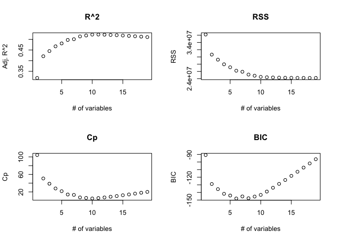
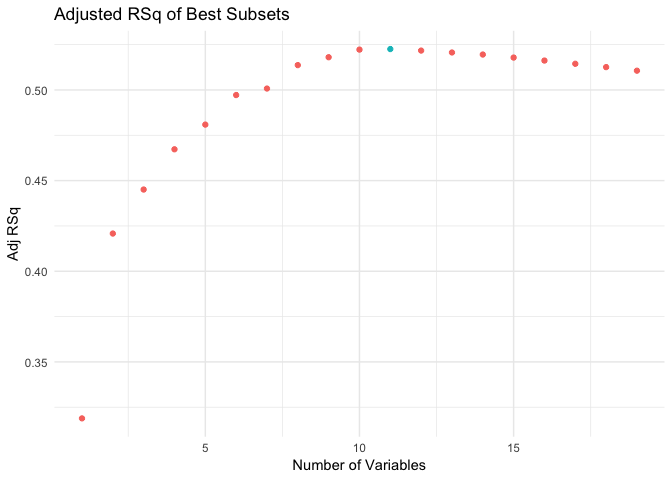
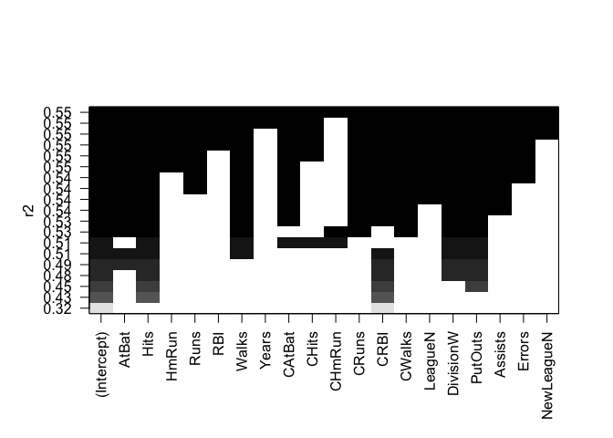
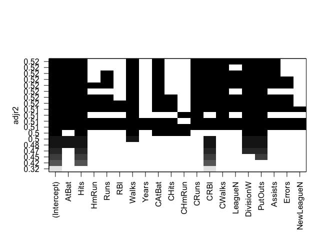
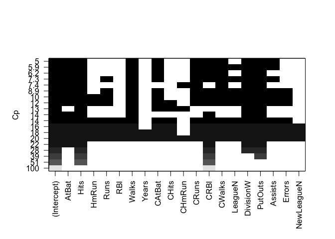
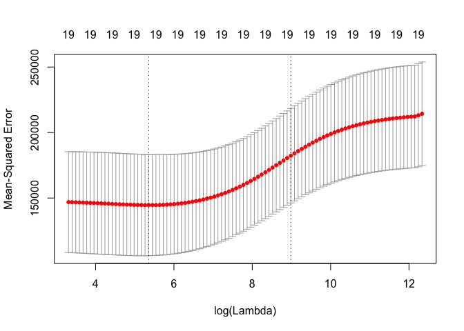
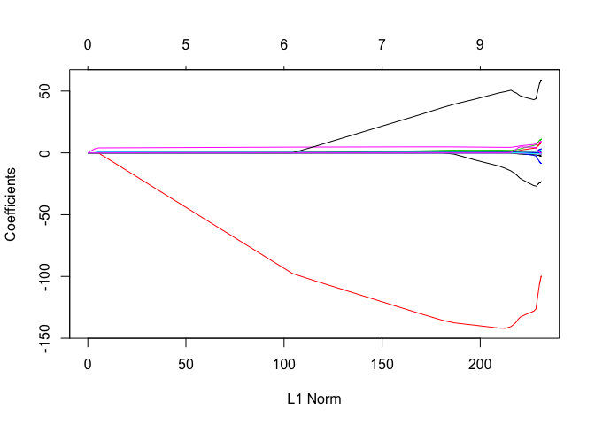
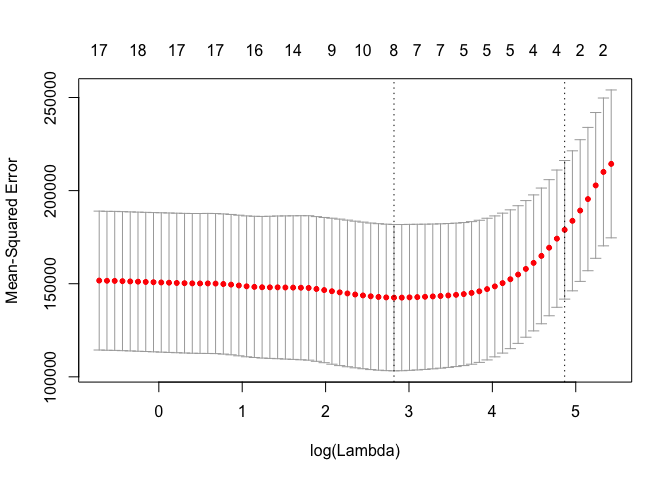
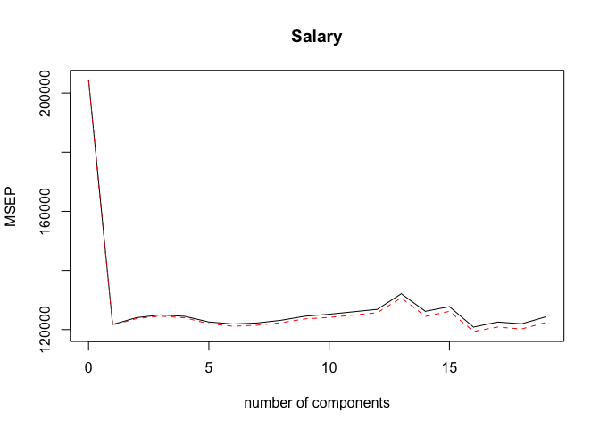
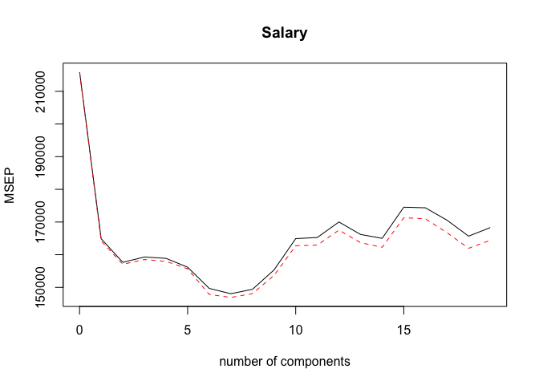

Lab 6: Resampling Methods
================

In the regression setting, the standard linear model *Y* = *β*<sub>0</sub> − *β*<sub>1</sub>*X*<sub>1</sub> + ... + *β*<sub>*p*</sub>*X*<sub>*p*</sub> + *ϵ* can fail in a few settings.

Consider data with *n* &gt; &gt;*p*, that is, the number of observations greatly exceed the number of predictors. This model will tend to have low variance on test data. For data where *n* is not much larger than *p*, there will be a lot of variance in the test set. When *p* &gt; *n*, there is no longer a unique least squares estimate of the regression coefficients, and the variance is technically infinite!

For another example, consider a model with a large number of predictors *p*. A regression with multiple predictors will be challenging to interpret. Many predictors will not be associated with the response, leading to unnecessary complexity in the model specification.

**Subset selection** is a way to reduce the number of predictors used in a regression.

**Ridge regression and the Lasso** are ways to perform *shrinkage* on the predictors. Shrinkage is also referred to as *regularization*.

**PCR, and PLS regression** are methods to abstract the predictors in principal components, and reduce the dimensionality of the predictor space.

In this lab, we cover:

-   Subset Selection
-   Ridge Regression and the Lasso
-   PCR and PLS Regression

6.5 Sub-lab 1: Subset Selection Methods
---------------------------------------

### 6.5.1 Best Subset Selection

``` r
# packages
library(ISLR)
colnames(Hitters)
```

    ##  [1] "AtBat"     "Hits"      "HmRun"     "Runs"      "RBI"      
    ##  [6] "Walks"     "Years"     "CAtBat"    "CHits"     "CHmRun"   
    ## [11] "CRuns"     "CRBI"      "CWalks"    "League"    "Division" 
    ## [16] "PutOuts"   "Assists"   "Errors"    "Salary"    "NewLeague"

``` r
dim(Hitters)
```

    ## [1] 322  20

We apply subset selection to `Hitters` data, wanting to associate a player's `Salary` with various predictors for each player. `Salary` is missing from some players, so we omit these players.

``` r
sum(is.na(Hitters$Salary))
```

    ## [1] 59

``` r
Hitters <- na.omit(Hitters)
dim(Hitters)
```

    ## [1] 263  20

The `regsubsets()` function from the `leaps` library performs best subset selection by identifying the best model given a number of parameters, where "best" is defined by RSS. Similar syntax as `lm()`.

``` r
library(leaps) # for best subset selection
regfit_full <- regsubsets(Salary ~., Hitters)
summary(regfit_full)
```

    ## Subset selection object
    ## Call: regsubsets.formula(Salary ~ ., Hitters)
    ## 19 Variables  (and intercept)
    ##            Forced in Forced out
    ## AtBat          FALSE      FALSE
    ## Hits           FALSE      FALSE
    ## HmRun          FALSE      FALSE
    ## Runs           FALSE      FALSE
    ## RBI            FALSE      FALSE
    ## Walks          FALSE      FALSE
    ## Years          FALSE      FALSE
    ## CAtBat         FALSE      FALSE
    ## CHits          FALSE      FALSE
    ## CHmRun         FALSE      FALSE
    ## CRuns          FALSE      FALSE
    ## CRBI           FALSE      FALSE
    ## CWalks         FALSE      FALSE
    ## LeagueN        FALSE      FALSE
    ## DivisionW      FALSE      FALSE
    ## PutOuts        FALSE      FALSE
    ## Assists        FALSE      FALSE
    ## Errors         FALSE      FALSE
    ## NewLeagueN     FALSE      FALSE
    ## 1 subsets of each size up to 8
    ## Selection Algorithm: exhaustive
    ##          AtBat Hits HmRun Runs RBI Walks Years CAtBat CHits CHmRun CRuns
    ## 1  ( 1 ) " "   " "  " "   " "  " " " "   " "   " "    " "   " "    " "  
    ## 2  ( 1 ) " "   "*"  " "   " "  " " " "   " "   " "    " "   " "    " "  
    ## 3  ( 1 ) " "   "*"  " "   " "  " " " "   " "   " "    " "   " "    " "  
    ## 4  ( 1 ) " "   "*"  " "   " "  " " " "   " "   " "    " "   " "    " "  
    ## 5  ( 1 ) "*"   "*"  " "   " "  " " " "   " "   " "    " "   " "    " "  
    ## 6  ( 1 ) "*"   "*"  " "   " "  " " "*"   " "   " "    " "   " "    " "  
    ## 7  ( 1 ) " "   "*"  " "   " "  " " "*"   " "   "*"    "*"   "*"    " "  
    ## 8  ( 1 ) "*"   "*"  " "   " "  " " "*"   " "   " "    " "   "*"    "*"  
    ##          CRBI CWalks LeagueN DivisionW PutOuts Assists Errors NewLeagueN
    ## 1  ( 1 ) "*"  " "    " "     " "       " "     " "     " "    " "       
    ## 2  ( 1 ) "*"  " "    " "     " "       " "     " "     " "    " "       
    ## 3  ( 1 ) "*"  " "    " "     " "       "*"     " "     " "    " "       
    ## 4  ( 1 ) "*"  " "    " "     "*"       "*"     " "     " "    " "       
    ## 5  ( 1 ) "*"  " "    " "     "*"       "*"     " "     " "    " "       
    ## 6  ( 1 ) "*"  " "    " "     "*"       "*"     " "     " "    " "       
    ## 7  ( 1 ) " "  " "    " "     "*"       "*"     " "     " "    " "       
    ## 8  ( 1 ) " "  "*"    " "     "*"       "*"     " "     " "    " "

An asterisk indicates that a given variable is included in the corresponding model. For example, the best 1 variable model included `CRBI`, the best 2 variable model includes `Hits` and `CRBI`, and so on. We can override the default 8 predictors by specifying the argument `nvmax`. Let's look at subsets with all 19 predictors.

``` r
regfit_full <- regsubsets(Salary ~., Hitters, nvmax = 19)
regfit_summary <- summary(regfit_full)
names(regfit_summary)
```

    ## [1] "which"  "rsq"    "rss"    "adjr2"  "cp"     "bic"    "outmat" "obj"

We can see how *R*<sup>2</sup>, *R**S**S*, *C*<sub>*p*</sub>, *B**I**C* and other parameters change with incresing numbers of predictors.

``` r
par(mfrow = c(2,2))
    plot(regfit_summary$adjr2, main = "R^2", xlab = "# of variables", ylab = "Adj. R^2")
    plot(regfit_summary$rss, main = "RSS", xlab = "# of variables", ylab = "RSS")
    plot(regfit_summary$cp,  main = "Cp", xlab = "# of variables", ylab = "Cp")
    plot(regfit_summary$bic, main = "BIC", xlab = "# of variables", ylab = "BIC")
```



``` r
dev.off()
```

    ## null device 
    ##           1

``` r
which.max(regfit_summary$adjr2)
```

    ## [1] 11

``` r
library(magrittr)
library(ggplot2)
data.frame(x = 1:19, 
           v = regfit_summary$adjr2,
           c = c(rep("black", 10), "red", rep("black", 8))) %>%
ggplot() +
    geom_point(aes(x, v, color = c)) +
    theme_minimal() +
    labs(title = "Adjusted RSq of Best Subsets",
         x = "Number of Variables",
         y = "Adj RSq") +
    guides(color = FALSE)
```



In the same way, we can identify the models with low *B**I**C*, *C*<sub>*p*</sub> and *R**S**S*.

``` r
which.min(regfit_summary$bic)
```

    ## [1] 6

``` r
which.min(regfit_summary$cp)
```

    ## [1] 10

``` r
which.min(regfit_summary$rss)
```

    ## [1] 19

`regfit` has some built-in plotting utilities that show what variables are included in the best models, according to different criteria. As a trivial example, we know that adding more predictors, even random noise, will improve the *R*<sup>2</sup>. The top row in the plot below for *R*<sup>2</sup> shows a sloid black line, indicating that each of the predictors on the x axis are included in the "best" model according to *R*<sup>2</sup>.

``` r
plot(regfit_full, scale = "r2")
```



The best model according to *B**I**C* is different. The best model with *B**I**C* = −150 here includes `AtBat`, `Hits`, `Walks`, `CRBI`, `DivisionW`, and `PutOuts`.

``` r
plot(regfit_full, scale = "bic")
```


And so on with Adjusted *R*<sup>2</sup> and *C*<sub>*p*</sub>.

``` r
plot(regfit_full, scale = "adjr2")
```



``` r
plot(regfit_full, scale = "Cp")
```



Use `coef` to see the coefficients associated with the best subset model. According to the *B**I**C*, the best model had 6 predictors.

``` r
coef(regfit_full, 6)
```

    ##  (Intercept)        AtBat         Hits        Walks         CRBI 
    ##   91.5117981   -1.8685892    7.6043976    3.6976468    0.6430169 
    ##    DivisionW      PutOuts 
    ## -122.9515338    0.2643076

### 6.5.2 Forward and Backward Stepwise Selection

We can also use `regsubsets()` to perform forward stepwise and backward stepwise selection, using the `method` argument: i.e. - `method = "forward"` or `method = "backward"`.

``` r
regfit_fwd <- regsubsets(Salary ~ . ,        # all 19 predictors in model
                         data = Hitters,     # from Hitters df
                         nvmax = 19,         # include subset models with up to 19 predictors
                         method = "forward") # forward stepwise selection

regfit_bwd <- regsubsets(Salary ~ . ,        # all 19 predictors in model
                         data = Hitters,     # from Hitters df
                         nvmax = 19,         # include subset models with up to 19 predictors
                         method = "backward")# backward stepwise selection
summary(regfit_fwd)
```

    ## Subset selection object
    ## Call: regsubsets.formula(Salary ~ ., data = Hitters, nvmax = 19, method = "forward")
    ## 19 Variables  (and intercept)
    ##            Forced in Forced out
    ## AtBat          FALSE      FALSE
    ## Hits           FALSE      FALSE
    ## HmRun          FALSE      FALSE
    ## Runs           FALSE      FALSE
    ## RBI            FALSE      FALSE
    ## Walks          FALSE      FALSE
    ## Years          FALSE      FALSE
    ## CAtBat         FALSE      FALSE
    ## CHits          FALSE      FALSE
    ## CHmRun         FALSE      FALSE
    ## CRuns          FALSE      FALSE
    ## CRBI           FALSE      FALSE
    ## CWalks         FALSE      FALSE
    ## LeagueN        FALSE      FALSE
    ## DivisionW      FALSE      FALSE
    ## PutOuts        FALSE      FALSE
    ## Assists        FALSE      FALSE
    ## Errors         FALSE      FALSE
    ## NewLeagueN     FALSE      FALSE
    ## 1 subsets of each size up to 19
    ## Selection Algorithm: forward
    ##           AtBat Hits HmRun Runs RBI Walks Years CAtBat CHits CHmRun CRuns
    ## 1  ( 1 )  " "   " "  " "   " "  " " " "   " "   " "    " "   " "    " "  
    ## 2  ( 1 )  " "   "*"  " "   " "  " " " "   " "   " "    " "   " "    " "  
    ## 3  ( 1 )  " "   "*"  " "   " "  " " " "   " "   " "    " "   " "    " "  
    ## 4  ( 1 )  " "   "*"  " "   " "  " " " "   " "   " "    " "   " "    " "  
    ## 5  ( 1 )  "*"   "*"  " "   " "  " " " "   " "   " "    " "   " "    " "  
    ## 6  ( 1 )  "*"   "*"  " "   " "  " " "*"   " "   " "    " "   " "    " "  
    ## 7  ( 1 )  "*"   "*"  " "   " "  " " "*"   " "   " "    " "   " "    " "  
    ## 8  ( 1 )  "*"   "*"  " "   " "  " " "*"   " "   " "    " "   " "    "*"  
    ## 9  ( 1 )  "*"   "*"  " "   " "  " " "*"   " "   "*"    " "   " "    "*"  
    ## 10  ( 1 ) "*"   "*"  " "   " "  " " "*"   " "   "*"    " "   " "    "*"  
    ## 11  ( 1 ) "*"   "*"  " "   " "  " " "*"   " "   "*"    " "   " "    "*"  
    ## 12  ( 1 ) "*"   "*"  " "   "*"  " " "*"   " "   "*"    " "   " "    "*"  
    ## 13  ( 1 ) "*"   "*"  " "   "*"  " " "*"   " "   "*"    " "   " "    "*"  
    ## 14  ( 1 ) "*"   "*"  "*"   "*"  " " "*"   " "   "*"    " "   " "    "*"  
    ## 15  ( 1 ) "*"   "*"  "*"   "*"  " " "*"   " "   "*"    "*"   " "    "*"  
    ## 16  ( 1 ) "*"   "*"  "*"   "*"  "*" "*"   " "   "*"    "*"   " "    "*"  
    ## 17  ( 1 ) "*"   "*"  "*"   "*"  "*" "*"   " "   "*"    "*"   " "    "*"  
    ## 18  ( 1 ) "*"   "*"  "*"   "*"  "*" "*"   "*"   "*"    "*"   " "    "*"  
    ## 19  ( 1 ) "*"   "*"  "*"   "*"  "*" "*"   "*"   "*"    "*"   "*"    "*"  
    ##           CRBI CWalks LeagueN DivisionW PutOuts Assists Errors NewLeagueN
    ## 1  ( 1 )  "*"  " "    " "     " "       " "     " "     " "    " "       
    ## 2  ( 1 )  "*"  " "    " "     " "       " "     " "     " "    " "       
    ## 3  ( 1 )  "*"  " "    " "     " "       "*"     " "     " "    " "       
    ## 4  ( 1 )  "*"  " "    " "     "*"       "*"     " "     " "    " "       
    ## 5  ( 1 )  "*"  " "    " "     "*"       "*"     " "     " "    " "       
    ## 6  ( 1 )  "*"  " "    " "     "*"       "*"     " "     " "    " "       
    ## 7  ( 1 )  "*"  "*"    " "     "*"       "*"     " "     " "    " "       
    ## 8  ( 1 )  "*"  "*"    " "     "*"       "*"     " "     " "    " "       
    ## 9  ( 1 )  "*"  "*"    " "     "*"       "*"     " "     " "    " "       
    ## 10  ( 1 ) "*"  "*"    " "     "*"       "*"     "*"     " "    " "       
    ## 11  ( 1 ) "*"  "*"    "*"     "*"       "*"     "*"     " "    " "       
    ## 12  ( 1 ) "*"  "*"    "*"     "*"       "*"     "*"     " "    " "       
    ## 13  ( 1 ) "*"  "*"    "*"     "*"       "*"     "*"     "*"    " "       
    ## 14  ( 1 ) "*"  "*"    "*"     "*"       "*"     "*"     "*"    " "       
    ## 15  ( 1 ) "*"  "*"    "*"     "*"       "*"     "*"     "*"    " "       
    ## 16  ( 1 ) "*"  "*"    "*"     "*"       "*"     "*"     "*"    " "       
    ## 17  ( 1 ) "*"  "*"    "*"     "*"       "*"     "*"     "*"    "*"       
    ## 18  ( 1 ) "*"  "*"    "*"     "*"       "*"     "*"     "*"    "*"       
    ## 19  ( 1 ) "*"  "*"    "*"     "*"       "*"     "*"     "*"    "*"

``` r
summary(regfit_bwd)
```

    ## Subset selection object
    ## Call: regsubsets.formula(Salary ~ ., data = Hitters, nvmax = 19, method = "backward")
    ## 19 Variables  (and intercept)
    ##            Forced in Forced out
    ## AtBat          FALSE      FALSE
    ## Hits           FALSE      FALSE
    ## HmRun          FALSE      FALSE
    ## Runs           FALSE      FALSE
    ## RBI            FALSE      FALSE
    ## Walks          FALSE      FALSE
    ## Years          FALSE      FALSE
    ## CAtBat         FALSE      FALSE
    ## CHits          FALSE      FALSE
    ## CHmRun         FALSE      FALSE
    ## CRuns          FALSE      FALSE
    ## CRBI           FALSE      FALSE
    ## CWalks         FALSE      FALSE
    ## LeagueN        FALSE      FALSE
    ## DivisionW      FALSE      FALSE
    ## PutOuts        FALSE      FALSE
    ## Assists        FALSE      FALSE
    ## Errors         FALSE      FALSE
    ## NewLeagueN     FALSE      FALSE
    ## 1 subsets of each size up to 19
    ## Selection Algorithm: backward
    ##           AtBat Hits HmRun Runs RBI Walks Years CAtBat CHits CHmRun CRuns
    ## 1  ( 1 )  " "   " "  " "   " "  " " " "   " "   " "    " "   " "    "*"  
    ## 2  ( 1 )  " "   "*"  " "   " "  " " " "   " "   " "    " "   " "    "*"  
    ## 3  ( 1 )  " "   "*"  " "   " "  " " " "   " "   " "    " "   " "    "*"  
    ## 4  ( 1 )  "*"   "*"  " "   " "  " " " "   " "   " "    " "   " "    "*"  
    ## 5  ( 1 )  "*"   "*"  " "   " "  " " "*"   " "   " "    " "   " "    "*"  
    ## 6  ( 1 )  "*"   "*"  " "   " "  " " "*"   " "   " "    " "   " "    "*"  
    ## 7  ( 1 )  "*"   "*"  " "   " "  " " "*"   " "   " "    " "   " "    "*"  
    ## 8  ( 1 )  "*"   "*"  " "   " "  " " "*"   " "   " "    " "   " "    "*"  
    ## 9  ( 1 )  "*"   "*"  " "   " "  " " "*"   " "   "*"    " "   " "    "*"  
    ## 10  ( 1 ) "*"   "*"  " "   " "  " " "*"   " "   "*"    " "   " "    "*"  
    ## 11  ( 1 ) "*"   "*"  " "   " "  " " "*"   " "   "*"    " "   " "    "*"  
    ## 12  ( 1 ) "*"   "*"  " "   "*"  " " "*"   " "   "*"    " "   " "    "*"  
    ## 13  ( 1 ) "*"   "*"  " "   "*"  " " "*"   " "   "*"    " "   " "    "*"  
    ## 14  ( 1 ) "*"   "*"  "*"   "*"  " " "*"   " "   "*"    " "   " "    "*"  
    ## 15  ( 1 ) "*"   "*"  "*"   "*"  " " "*"   " "   "*"    "*"   " "    "*"  
    ## 16  ( 1 ) "*"   "*"  "*"   "*"  "*" "*"   " "   "*"    "*"   " "    "*"  
    ## 17  ( 1 ) "*"   "*"  "*"   "*"  "*" "*"   " "   "*"    "*"   " "    "*"  
    ## 18  ( 1 ) "*"   "*"  "*"   "*"  "*" "*"   "*"   "*"    "*"   " "    "*"  
    ## 19  ( 1 ) "*"   "*"  "*"   "*"  "*" "*"   "*"   "*"    "*"   "*"    "*"  
    ##           CRBI CWalks LeagueN DivisionW PutOuts Assists Errors NewLeagueN
    ## 1  ( 1 )  " "  " "    " "     " "       " "     " "     " "    " "       
    ## 2  ( 1 )  " "  " "    " "     " "       " "     " "     " "    " "       
    ## 3  ( 1 )  " "  " "    " "     " "       "*"     " "     " "    " "       
    ## 4  ( 1 )  " "  " "    " "     " "       "*"     " "     " "    " "       
    ## 5  ( 1 )  " "  " "    " "     " "       "*"     " "     " "    " "       
    ## 6  ( 1 )  " "  " "    " "     "*"       "*"     " "     " "    " "       
    ## 7  ( 1 )  " "  "*"    " "     "*"       "*"     " "     " "    " "       
    ## 8  ( 1 )  "*"  "*"    " "     "*"       "*"     " "     " "    " "       
    ## 9  ( 1 )  "*"  "*"    " "     "*"       "*"     " "     " "    " "       
    ## 10  ( 1 ) "*"  "*"    " "     "*"       "*"     "*"     " "    " "       
    ## 11  ( 1 ) "*"  "*"    "*"     "*"       "*"     "*"     " "    " "       
    ## 12  ( 1 ) "*"  "*"    "*"     "*"       "*"     "*"     " "    " "       
    ## 13  ( 1 ) "*"  "*"    "*"     "*"       "*"     "*"     "*"    " "       
    ## 14  ( 1 ) "*"  "*"    "*"     "*"       "*"     "*"     "*"    " "       
    ## 15  ( 1 ) "*"  "*"    "*"     "*"       "*"     "*"     "*"    " "       
    ## 16  ( 1 ) "*"  "*"    "*"     "*"       "*"     "*"     "*"    " "       
    ## 17  ( 1 ) "*"  "*"    "*"     "*"       "*"     "*"     "*"    "*"       
    ## 18  ( 1 ) "*"  "*"    "*"     "*"       "*"     "*"     "*"    "*"       
    ## 19  ( 1 ) "*"  "*"    "*"     "*"       "*"     "*"     "*"    "*"

The best one variable model using forward selection contains only `CRBI`, and the best two variable model also contains `Hits`. For this dataset, the best 6 variable models are identical for forward and backward selection. However, the best seven-variable models identified by forward stepwise se- lection, backward stepwise selection, and best subset selection are different.

``` r
coef(regfit_full, 7)
```

    ##  (Intercept)         Hits        Walks       CAtBat        CHits 
    ##   79.4509472    1.2833513    3.2274264   -0.3752350    1.4957073 
    ##       CHmRun    DivisionW      PutOuts 
    ##    1.4420538 -129.9866432    0.2366813

``` r
coef(regfit_fwd,  7)
```

    ##  (Intercept)        AtBat         Hits        Walks         CRBI 
    ##  109.7873062   -1.9588851    7.4498772    4.9131401    0.8537622 
    ##       CWalks    DivisionW      PutOuts 
    ##   -0.3053070 -127.1223928    0.2533404

``` r
coef(regfit_bwd,  7)
```

    ##  (Intercept)        AtBat         Hits        Walks        CRuns 
    ##  105.6487488   -1.9762838    6.7574914    6.0558691    1.1293095 
    ##       CWalks    DivisionW      PutOuts 
    ##   -0.7163346 -116.1692169    0.3028847

### 6.5.3 Choosing Among Models using the Validation Set Approach and Cross-Validation

We just saw that it is possible to choose among a set of models of different sizes using *C*<sub>*p*</sub>, *B**I**C*, and adjusted *R*<sup>2</sup>. We will now consider how to do this using the validation set and cross-validation approaches.

In order for these approaches to yield accurate estimates of the test error, we must use **only the training observations** to perform all aspects of model-fitting — including variable selection. Therefore, the determination of which model of a given size is best must be made using **only the training observations**. This point is subtle but important. If the full data set is used to perform the best subset selection step, the validation set errors and cross-validation errors that we obtain will not be accurate estimates of the test error.

In order to use the validation set approach, we begin by splitting the observations into a training set and a test set. We do this by creating a random vector, `train`, of elements equal to `TRUE` if the corresponding observation is in the training set, and `FALSE` otherwise. The vector `test` has a `TRUE` if the observation is in the test set, and a `FALSE` otherwise. We also set a random seed so that the user will obtain the same training set / test set split.

``` r
set.seed(1)
train = sample(c(TRUE, FALSE), nrow(Hitters), rep = TRUE)
test  = (!train)
```

Now, we apply `regsubsets()` to the training set in order to perform best subset selection.

``` r
regfit_best = regsubsets(Salary ~ . , data = Hitters[train, ], nvmax=19)
```

Notice that we subset the `Hitters` data frame directly in the call in order to access only the training subset of the data, using the expression `Hitters[train, ]`. We now compute the validation set error for the best model of each model size. We first make a model matrix from the test data.

``` r
test_mat = model.matrix(Salary ~ . , data = Hitters[test, ])
```

The `model.matrix()` function is used in many regression packages for building an 'X' matrix from data. Now we run a loop, and for each size `i`, we extract the coefficients from `regfit_best` for the best model of that size, multiply them into the appropriate columns of the test model matrix to form the predictions, and compute the test MSE.

``` r
val_errors = rep(NA, 19)
for(i in 1:19){
  coefi = coef(regfit_best, id = i)
  pred = test_mat[ , names(coefi)] %*% coefi
  val_errors[i] = mean((Hitters$Salary[test] - pred)^2) 
}
```

We find that the best model is the one that contains ten variables.

``` r
val_errors
```

    ##  [1] 220968.0 169157.1 178518.2 163426.1 168418.1 171270.6 162377.1
    ##  [8] 157909.3 154055.7 148162.1 151156.4 151742.5 152214.5 157358.7
    ## [15] 158541.4 158743.3 159972.7 159859.8 160105.6

``` r
which.min(val_errors)
```

    ## [1] 10

``` r
coef(regfit_best, 10)
```

    ## (Intercept)       AtBat        Hits       Walks      CAtBat       CHits 
    ## -80.2751499  -1.4683816   7.1625314   3.6430345  -0.1855698   1.1053238 
    ##      CHmRun      CWalks     LeagueN   DivisionW     PutOuts 
    ##   1.3844863  -0.7483170  84.5576103 -53.0289658   0.2381662

This was a little tedious, partly because there is no `predict()` method for `regsubsets()`. Since we will be using this function again, we can capture our steps above and write our own predict method.

``` r
predict_regsubsets = function(object, newdata, id, ...){
  form  = as.formula(object$call[[2]])
  mat   = model.matrix(form, newdata)
  coefi = coef(object, id = id)
  xvars = names(coefi)
  mat[ , xvars] %*% coefi
}
```

Our function pretty much mimics what we did above. The only complex part is how we extracted the formula used in the call to `regsubsets()`. We demonstrate how we use this function below, when we do cross-validation.

Finally, we perform best subset selection on the full data set, and select the best ten-variable model. It is important that we make use of the full data set in order to obtain more accurate coefficient estimates. Note that we perform best subset selection on the full data set and select the best ten- variable model, rather than simply using the variables that were obtained from the training set, because the best ten-variable model on the full data set may differ from the corresponding model on the training set.

``` r
regfit_best = regsubsets(Salary ~ . , data = Hitters, nvmax = 19) 
coef(regfit_best, 10)
```

    ##  (Intercept)        AtBat         Hits        Walks       CAtBat 
    ##  162.5354420   -2.1686501    6.9180175    5.7732246   -0.1300798 
    ##        CRuns         CRBI       CWalks    DivisionW      PutOuts 
    ##    1.4082490    0.7743122   -0.8308264 -112.3800575    0.2973726 
    ##      Assists 
    ##    0.2831680

In fact, we see that the best ten-variable model on the full data set has a different set of variables than the best ten-variable model on the training set.

We now try to choose among the models of different sizes using cross-validation. This approach is somewhat involved, as we must perform best subset selection within each of the k training sets. Despite this, we see that with its clever subsetting syntax, `R` makes this job quite easy. First, we create a vector that allocates each observation to one of `k = 10` folds, and we create a matrix in which we will store the results.

``` r
k = 10
set.seed(1)
folds = sample(1:k, nrow(Hitters), replace = TRUE)
cv_errors = matrix(NA, k, 19, dimnames = list(NULL, paste(1:19)))
```

Now we write a for loop that performs cross-validation. In the *jth* fold, the elements of folds that equal `j` are in the test set, and the remainder are in the training set. We make our predictions for each model size (using our new `predict()` method), compute the test errors on the appropriate subset, and store them in the appropriate slot in the matrix `cv_errors`.

``` r
for(j in 1:k){ 
  best_fit = regsubsets(Salary ~ . , data = Hitters[folds != j, ], nvmax = 19)
  
  for(i in 1:19){
    pred = predict_regsubsets(best_fit, Hitters[folds == j, ], id = i)
    cv_errors[j, i] = mean( (Hitters$Salary[folds == j] - pred)^2)
  }
}
```

This has given us a 10×19 matrix, of which the (*i*, *j*)th element corresponds to the test MSE for the *i*th cross-validation fold for the best *j*-variable model. We use the `apply()` function to average over the columns of this matrix in order to obtain a vector for which the *j*th element is the cross-validation error for the *j*-variable model.

``` r
mean_cv_errors = apply(cv_errors, 2, mean)
mean_cv_errors
```

    ##        1        2        3        4        5        6        7        8 
    ## 160093.5 140196.8 153117.0 151159.3 146841.3 138302.6 144346.2 130207.7 
    ##        9       10       11       12       13       14       15       16 
    ## 129459.6 125334.7 125153.8 128273.5 133461.0 133974.6 131825.7 131882.8 
    ##       17       18       19 
    ## 132750.9 133096.2 132804.7

We see that cross-validation selects an eleven-variable model. We now perform best subset selection on the full data set in order to obtain the eleven-variable model.

``` r
reg_best = regsubsets(Salary ~ . , data = Hitters, nvmax = 19)
coef(reg_best, 11)
```

    ##  (Intercept)        AtBat         Hits        Walks       CAtBat 
    ##  135.7512195   -2.1277482    6.9236994    5.6202755   -0.1389914 
    ##        CRuns         CRBI       CWalks      LeagueN    DivisionW 
    ##    1.4553310    0.7852528   -0.8228559   43.1116152 -111.1460252 
    ##      PutOuts      Assists 
    ##    0.2894087    0.2688277

------------------------------------------------------------------------

6.6 Lab 2: Ridge Regression and the Lasso
-----------------------------------------

We will use the glmnet package in order to perform ridge regression and the lasso. The main function in this package is `glmnet()`, which can be used to fit ridge regression models, lasso models, and more. This function has slightly different syntax from other model-fitting functions that we have encountered thus far in this book. In particular, we must pass in an `x` matrix as well as a `y` vector, and we do not use the `y ~ x` syntax. We will now perform ridge regression and the lasso in order to predict `Salary` on the `Hitters` data. Before proceeding ensure that the missing values have been removed from the data, as described in Section 6.5.

``` r
x = model.matrix(Salary ~ ., Hitters)[,-1]
y = Hitters$Salary
```

The `model.matrix()` function is particularly useful for creating x; not only does it produce a matrix corresponding to the 19 predictors but it also automatically transforms any qualitative variables into dummy variables. The latter property is important because `glmnet()` can only take numerical, quantitative inputs.

### 6.6.1 Ridge Regression

The `glmnet()` function has an `alpha` argument that determines what type of model is fit. If `alpha=0` then a ridge regression model is fit, and if `alpha=1` then a lasso model is fit. We first fit a ridge regression model.

``` r
library(glmnet)
```

    ## Loading required package: Matrix

    ## Loading required package: foreach

    ## Loaded glmnet 2.0-16

``` r
grid = 10^seq(10, -2, length = 100)
ridge_mod = glmnet(x, y, alpha = 0, lambda = grid) # alpha = 0 means ridge
```

By default the `glmnet()` function performs ridge regression for an automatically selected range of *λ* values. *λ* is the tuning parameter that controls the influence of the shrinkage penalty. When *λ* = 0, ridge and lasso regression return the least squares estimate for model coefficients. As *λ* → ∞, the influence of the shrinkage penalty grows, and model coefficients are forced towards zero. Ridge regression utilizes the L2 norm as a penalty, whereas the Lasso uses the L2 norm.

Here we have chosen to implement the function over a grid of values ranging from *λ* = 10<sup>10</sup> to *λ* = 10<sup>−2</sup>, essentially covering the full range of scenarios from the null model containing only the intercept (high *λ*), to the least squares fit (*λ* = 0). As we will see, we can also compute model fits for a particular value of *λ* that is not one of the original grid values. Note that by default, the `glmnet()` function standardizes the variables so that they are on the same scale. To turn off this default setting, use the argument `standardize=FALSE`.

Associated with each value of *λ* is a vector of ridge regression coefficients, stored in a matrix that can be accessed by `coef()`. In this case, it is a 20×100 matrix, with 20 rows (one for each predictor, plus an intercept) and 100 columns (one for each value of *λ*).

``` r
# colnames(coef(ridge_mod)) # each column is a value of lambda
dim(coef(ridge_mod))
```

    ## [1]  20 100

We expect the coefficient estimates to be much smaller, in terms of L2 norm, when a large value of *λ* is used, as compared to when a small value of *λ* is used. These are the coefficients when *λ* = 11498, along with their L2 norm:

``` r
ridge_mod$lambda[50]                 # 50th lambda in grid
```

    ## [1] 11497.57

``` r
sqrt(sum(coef(ridge_mod)[-1,50]^2) ) # L2 norm
```

    ## [1] 6.360612

In contrast, here are the coefficients when *λ* = 705, along with their L2 norm. Note the much larger L2 norm of the coefficients associated with this smaller value of *λ*.

``` r
ridge_mod$lambda[60]                 # 60th lambda in grid
```

    ## [1] 705.4802

``` r
sqrt(sum(coef(ridge_mod)[-1,60]^2) ) # L2 norm
```

    ## [1] 57.11001

We can use the `predict()` function for a number of purposes. For instance, we can obtain the ridge regression coefficients for a new value of *λ*, say 50:

``` r
predict(ridge_mod, s = 50, type = "coefficients")[1:20,]
```

    ##   (Intercept)         AtBat          Hits         HmRun          Runs 
    ##  4.876610e+01 -3.580999e-01  1.969359e+00 -1.278248e+00  1.145892e+00 
    ##           RBI         Walks         Years        CAtBat         CHits 
    ##  8.038292e-01  2.716186e+00 -6.218319e+00  5.447837e-03  1.064895e-01 
    ##        CHmRun         CRuns          CRBI        CWalks       LeagueN 
    ##  6.244860e-01  2.214985e-01  2.186914e-01 -1.500245e-01  4.592589e+01 
    ##     DivisionW       PutOuts       Assists        Errors    NewLeagueN 
    ## -1.182011e+02  2.502322e-01  1.215665e-01 -3.278600e+00 -9.496680e+00

We now split the samples into a training set and a test set in order to estimate the test error of ridge regression and the lasso. There are two common ways to randomly split a data set. The first is to produce a random vector of `TRUE`, `FALSE` elements and select the observations corresponding to `TRUE` for the training data. The second is to randomly choose a subset of numbers between 1 and n; these can then be used as the indices for the training observations. The two approaches work equally well. We used the former method in Section 6.5.3. Here we demonstrate the latter approach. We first set a random seed so that the results obtained will be reproducible.

``` r
set.seed(1)
train  = sample(1:nrow(x), nrow(x)/2)
test   = (-train)
y_test = y[test]
```

Next we fit a ridge regression model on the training set, and evaluate its MSE on the test set, using *λ* = 4. Note the use of the `predict()` function again. This time we get predictions for a test set, by replacing `type="coefficients"` with the `newx` argument.

``` r
ridge_mod  = glmnet(x[train,],      # predictors 
                    y[train],       # response
                    alpha = 0,      # 0=ridge, 1=lasso
                    lambda = grid,  # set of lambda to evaluate over
                    thresh = 1e-12) # convergence threshold
ridge_pred = predict(ridge_mod, s = 4, newx = x[test,]) # lambda = 4
mean((ridge_pred - y_test)^2)
```

    ## [1] 101036.8

The test MSE is 101037. Note that if we had instead simply fit a model with just an intercept, we would have predicted each test observation using the mean of the training observations. In that case, we could compute the test set MSE like this:

``` r
mean((mean(y[train]) - y_test)^2)
```

    ## [1] 193253.1

We could also get the same result by fitting a ridge regression model with a very large value of *λ*. Note that 1e10 means 10<sup>10</sup>.

``` r
ridge_pred = predict(ridge_mod, s = 1e10, newx = x[test,]) # lambda = 1e10
mean((ridge_pred - y_test)^2)
```

    ## [1] 193253.1

So fitting a ridge regression model with *λ* = 4 leads to a much lower test MSE than fitting a model with just an intercept. We now check whether there is any benefit to performing ridge regression with *λ* = 4 instead of just performing least squares regression. Recall that least squares is simply ridge regression with *λ* = 0.

``` r
ridge_pred = predict(ridge_mod, s = 0, newx = x[test,]) # lambda = 0; OLS regression
mean((ridge_pred - y_test)^2)
```

    ## [1] 114723.6

``` r
# prove that OLS regression and ridge regresion with lambda = 0 are the same
lm(y ~ x, subset = train)
```

    ## 
    ## Call:
    ## lm(formula = y ~ x, subset = train)
    ## 
    ## Coefficients:
    ## (Intercept)       xAtBat        xHits       xHmRun        xRuns  
    ##   299.42849     -2.54027      8.36682     11.64512     -9.09923  
    ##        xRBI       xWalks       xYears      xCAtBat       xCHits  
    ##     2.44105      9.23440    -22.93673     -0.18154     -0.11598  
    ##     xCHmRun       xCRuns        xCRBI      xCWalks     xLeagueN  
    ##    -1.33888      3.32838      0.07536     -1.07841     59.76065  
    ##  xDivisionW     xPutOuts     xAssists      xErrors  xNewLeagueN  
    ##   -98.86233      0.34087      0.34165     -0.64207     -0.67442

``` r
predict(ridge_mod, s=0, type = "coefficients")[1:20,]
```

    ##  (Intercept)        AtBat         Hits        HmRun         Runs 
    ## 299.44467220  -2.53538355   8.33585019  11.59830815  -9.05971371 
    ##          RBI        Walks        Years       CAtBat        CHits 
    ##   2.45326546   9.21776006 -22.98239583  -0.18191651  -0.10565688 
    ##       CHmRun        CRuns         CRBI       CWalks      LeagueN 
    ##  -1.31721358   3.31152519   0.06590689  -1.07244477  59.75587273 
    ##    DivisionW      PutOuts      Assists       Errors   NewLeagueN 
    ## -98.94393005   0.34083276   0.34155445  -0.65312471  -0.65882930

In general, if we want to fit a (unpenalized) least squares model, then we should use the `lm()` function, since that function provides more useful outputs, such as standard errors and p-values for the coefficients. In general, instead of arbitrarily choosing *λ* = 4, it would be better to use cross-validation to choose the tuning parameter *λ*. We can do this using the built-in cross-validation function, `cv.glmnet()`. By default, the function performs **ten-fold cross-validation**, though this can be changed using the argument `folds`. Note that we set a random seed first so our results will be reproducible, since the choice of the cross-validation folds is random.

``` r
set.seed(1)
cv_out = cv.glmnet(x[train, ], y[train], alpha = 0)
plot(cv_out)
```



``` r
bestlam = cv_out$lambda.min
bestlam
```

    ## [1] 211.7416

Therefore, we see that the value of *λ* that results in the smallest cross-validation error is 212. What is the test MSE associated with this value of *λ*?

``` r
ridge_pred = predict(ridge_mod, s = bestlam, newx = x[test, ])
mean((ridge_pred - y_test)^2)
```

    ## [1] 96015.51

This represents a further improvement over the test MSE that we got using *λ* = 4. Finally, we refit our ridge regression model on the full data set, using the value of *λ* chosen by cross-validation, and examine the coefficient estimates.

``` r
out = glmnet(x, y, alpha = 0) # fit ridge on full dataset
predict(out, type = "coefficients", s = bestlam)[1:20, ] # use best lambda
```

    ##  (Intercept)        AtBat         Hits        HmRun         Runs 
    ##   9.88487157   0.03143991   1.00882875   0.13927624   1.11320781 
    ##          RBI        Walks        Years       CAtBat        CHits 
    ##   0.87318990   1.80410229   0.13074383   0.01113978   0.06489843 
    ##       CHmRun        CRuns         CRBI       CWalks      LeagueN 
    ##   0.45158546   0.12900049   0.13737712   0.02908572  27.18227527 
    ##    DivisionW      PutOuts      Assists       Errors   NewLeagueN 
    ## -91.63411282   0.19149252   0.04254536  -1.81244470   7.21208394

As expected, none of the coefficients are zero--ridge regression does not perform variable selection!

------------------------------------------------------------------------

### 6.6.2 The Lasso

We saw that ridge regression with a wise choice of *λ* can outperform least squares as well as the null model on the Hitters data set. We now ask whether the lasso can yield either a more accurate or a more interpretable model than ridge regression. In order to fit a lasso model, we once again use the `glmnet()` function; however, this time we use the argument `alpha=1`. Other than that change, we proceed just as we did in fitting a ridge model.

``` r
lasso_mod = glmnet(x[train, ], y[train], alpha = 1) # fit lasso model w/ alpha=1
plot(lasso_mod)
```



We can see from the coefficient plot that depending on the choice of tuning parameter, some of the coefficients will be exactly equal to zero. We now perform cross-validation and compute the associated test error.

``` r
set.seed(1)
cv_out = cv.glmnet(x[train, ], y[train], alpha = 1)
plot(cv_out)
```



``` r
bestlam = cv_out$lambda.min
lasso_pred = predict(lasso_mod, s = bestlam, newx = x[test, ]) # predict wtih CV lambda
mean((lasso_pred - y[test])^2) # test MSE
```

    ## [1] 100838.2

This is substantially lower than the test set MSE of the null model and of least squares, and very similar to the test MSE of ridge regression with *λ* chosen by cross-validation. However, the lasso has a substantial advantage over ridge regression in that the resulting coefficient estimates are sparse. Here we see that twelve of the nineteen coefficient estimates are exactly zero. So the lasso model with *λ* chosen by cross-validation contains only seven variables.

``` r
out = glmnet(x, y, alpha = 1, lambda = grid)
lasso_coef = predict(out, type = "coefficients", s = bestlam)[1:20, ]
lasso_coef
```

    ##  (Intercept)        AtBat         Hits        HmRun         Runs 
    ##   18.5394844    0.0000000    1.8735390    0.0000000    0.0000000 
    ##          RBI        Walks        Years       CAtBat        CHits 
    ##    0.0000000    2.2178444    0.0000000    0.0000000    0.0000000 
    ##       CHmRun        CRuns         CRBI       CWalks      LeagueN 
    ##    0.0000000    0.2071252    0.4130132    0.0000000    3.2666677 
    ##    DivisionW      PutOuts      Assists       Errors   NewLeagueN 
    ## -103.4845458    0.2204284    0.0000000    0.0000000    0.0000000

------------------------------------------------------------------------

6.7 Lab 3: PCR and PLS Regression
---------------------------------

### 6.7.1 Principal Components Regression

Principal components regression (PCR) can be performed using the `pcr()` function, which is part of the `pls` library. We now apply PCR to the `Hitters` data, in order to predict `salary`. Again, ensure that the missing values have been removed from the data, as described in Section 6.5.

``` r
library(pls)
```

    ## 
    ## Attaching package: 'pls'

    ## The following object is masked from 'package:stats':
    ## 
    ##     loadings

``` r
set.seed(2)
pcr_fit = pcr(Salary ~ ., data = Hitters, scale = TRUE, validation = "CV")
```

The syntax for the `pcr()` function is similar to that for `lm()`, with a few additional options. Setting `scale=TRUE` has the effect of standardizing each predictor, using (6.6), prior to generating the principal components, so that the scale on which each variable is measured will not have an effect. Setting `validation="CV"` causes `pcr()` to compute the 10-fold cross-validation error for each possible value of **M**, the number of principal components used. The resulting fit can be examined using `summary()`.

``` r
summary(pcr_fit)
```

    ## Data:    X dimension: 263 19 
    ##  Y dimension: 263 1
    ## Fit method: svdpc
    ## Number of components considered: 19
    ## 
    ## VALIDATION: RMSEP
    ## Cross-validated using 10 random segments.
    ##        (Intercept)  1 comps  2 comps  3 comps  4 comps  5 comps  6 comps
    ## CV             452    348.9    352.2    353.5    352.8    350.1    349.1
    ## adjCV          452    348.7    351.8    352.9    352.1    349.3    348.0
    ##        7 comps  8 comps  9 comps  10 comps  11 comps  12 comps  13 comps
    ## CV       349.6    350.9    352.9     353.8     355.0     356.2     363.5
    ## adjCV    348.5    349.8    351.6     352.3     353.4     354.5     361.6
    ##        14 comps  15 comps  16 comps  17 comps  18 comps  19 comps
    ## CV        355.2     357.4     347.6     350.1     349.2     352.6
    ## adjCV     352.8     355.2     345.5     347.6     346.7     349.8
    ## 
    ## TRAINING: % variance explained
    ##         1 comps  2 comps  3 comps  4 comps  5 comps  6 comps  7 comps
    ## X         38.31    60.16    70.84    79.03    84.29    88.63    92.26
    ## Salary    40.63    41.58    42.17    43.22    44.90    46.48    46.69
    ##         8 comps  9 comps  10 comps  11 comps  12 comps  13 comps  14 comps
    ## X         94.96    96.28     97.26     97.98     98.65     99.15     99.47
    ## Salary    46.75    46.86     47.76     47.82     47.85     48.10     50.40
    ##         15 comps  16 comps  17 comps  18 comps  19 comps
    ## X          99.75     99.89     99.97     99.99    100.00
    ## Salary     50.55     53.01     53.85     54.61     54.61

The CV score is provided for each possible number of components, ranging from **M** = 0 onwards. (We have printed the CV output only up to **M** = 4.) Note that `pcr()` reports the *root mean squared error*; in order to obtain the usual MSE, we must square this quantity. For instance, a root mean squared error of 352.8 corresponds to an MSE of 352.82 = 124468. One can also plot the cross-validation scores using the `validationplot()` function. Using `val.type="MSEP"` will cause the cross-validation MSE to be plotted.

``` r
validationplot(pcr_fit, val.type = "MSEP")
```



We see that the smallest cross-validation error occurs when **M** = 16 components are used. This is barely fewer than **M** = 19, which amounts to simply performing least squares, because when all of the components are used in PCR no dimension reduction occurs. However, from the plot we also see that the cross-validation error is roughly the same when only one component is included in the model. This suggests that a model that uses just a small number of components might suffice.

The `summary()` function also provides the percentage of variance explained in the predictors and in the response using different numbers of components. This concept is discussed in greater detail in Chapter 10. Briefly, we can think of this as the amount of information about the predictors or the response that is captured using **M** principal components. For example, setting **M** = 1 only captures 38.31% of all the variance, or information, in the predictors. In contrast, using **M** = 6 increases the value to 88.63%. If we were to use all **M** = **p** = 19 components, this would increase to 100%.

We now perform PCR on the training data and evaluate its test set performance.

``` r
set.seed(1)
pcr_fit = pcr(Salary ~ ., 
              data = Hitters, 
              subset = train, 
              scale = TRUE, 
              validation = "CV")

validationplot(pcr_fit, val.type = "MSEP")
```



Now we find that the lowest cross-validation error occurs when **M** = 7 component are used. We compute the test MSE as follows.

``` r
pcr_pred = predict(pcr_fit, x[test, ], ncomp = 7) # use first 7 PCs
mean((pcr_pred - y_test)^2)
```

    ## [1] 96556.22

This test set MSE is competitive with the results obtained using ridge regression and the lasso. However, as a result of the way PCR is implemented, the final model is more difficult to interpret because it does not perform any kind of variable selection or even directly produce coefficient estimates.

Finally, we fit PCR on the full data set, using **M** = 7, the number of components identified by cross-validation.

``` r
pcr_fit = pcr(y ~ x, scale = TRUE, ncomp = 7)
summary(pcr_fit)
```

    ## Data:    X dimension: 263 19 
    ##  Y dimension: 263 1
    ## Fit method: svdpc
    ## Number of components considered: 7
    ## TRAINING: % variance explained
    ##    1 comps  2 comps  3 comps  4 comps  5 comps  6 comps  7 comps
    ## X    38.31    60.16    70.84    79.03    84.29    88.63    92.26
    ## y    40.63    41.58    42.17    43.22    44.90    46.48    46.69

------------------------------------------------------------------------

### 6.7.2 Partial Least Squares

We implement partial least squares (PLS) using the `plsr()` function, also in the `pls` library. The syntax is just like that of the `pcr()` function.

``` r
set.seed(1)
pls_fit = plsr(Salary ~ ., 
               data = Hitters, 
               subset = train, 
               scale = TRUE, 
               validation = "CV")

summary(pls_fit)
```

    ## Data:    X dimension: 131 19 
    ##  Y dimension: 131 1
    ## Fit method: kernelpls
    ## Number of components considered: 19
    ## 
    ## VALIDATION: RMSEP
    ## Cross-validated using 10 random segments.
    ##        (Intercept)  1 comps  2 comps  3 comps  4 comps  5 comps  6 comps
    ## CV           464.6    394.2    391.5    393.1    395.0    415.0    424.0
    ## adjCV        464.6    393.4    390.2    391.1    392.9    411.5    418.8
    ##        7 comps  8 comps  9 comps  10 comps  11 comps  12 comps  13 comps
    ## CV       424.5    415.8    404.6     407.1     412.0     414.4     410.3
    ## adjCV    418.9    411.4    400.7     402.2     407.2     409.3     405.6
    ##        14 comps  15 comps  16 comps  17 comps  18 comps  19 comps
    ## CV        406.2     408.6     410.5     408.8     407.8     410.2
    ## adjCV     401.8     403.9     405.6     404.1     403.2     405.5
    ## 
    ## TRAINING: % variance explained
    ##         1 comps  2 comps  3 comps  4 comps  5 comps  6 comps  7 comps
    ## X         38.12    53.46    66.05    74.49    79.33    84.56    87.09
    ## Salary    33.58    38.96    41.57    42.43    44.04    45.59    47.05
    ##         8 comps  9 comps  10 comps  11 comps  12 comps  13 comps  14 comps
    ## X         90.74    92.55     93.94     97.23     97.88     98.35     98.85
    ## Salary    47.53    48.42     49.68     50.04     50.54     50.78     50.92
    ##         15 comps  16 comps  17 comps  18 comps  19 comps
    ## X          99.11     99.43     99.78     99.99    100.00
    ## Salary     51.04     51.11     51.15     51.16     51.18

The lowest cross-validation error occurs when only **M** = 2 partial least squares directions are used. We now evaluate the corresponding test set MSE.

``` r
pls_pred = predict(pls_fit, x[test, ], ncomp = 2) # two PCs
mean((pls_pred - y_test)^2)
```

    ## [1] 101417.5

The test MSE is comparable to, but slightly higher than, the test MSE obtained using ridge regression, the lasso, and PCR. Finally, we perform PLS using the full data set, using **M** = 2, the number of components identified by cross-validation.

``` r
pls_fit = plsr(Salary ~., data = Hitters, scale = TRUE, ncomp=2)
summary(pls_fit)
```

    ## Data:    X dimension: 263 19 
    ##  Y dimension: 263 1
    ## Fit method: kernelpls
    ## Number of components considered: 2
    ## TRAINING: % variance explained
    ##         1 comps  2 comps
    ## X         38.08    51.03
    ## Salary    43.05    46.40

Notice that the percentage of variance in Salary that the two-component PLS fit explains, 46.40%, is almost as much as that explained using the final seven-component model PCR fit, 46.69%. This is because PCR only attempts to maximize the amount of variance explained in the predictors, while PLS searches for directions that explain variance in both the predictors and the response.
