7.8 Lab: Non-linear Modeling
============================

In this lab, we reconsider the `Wage` data considered throughout the book, and in the `ISLR` package.

``` r
library(ISLR)
attach(Wage)
```

7.8.1 Polynomial Regression and Step Functions
----------------------------------------------

Reproduce Figre 7.1.

``` r
fit = lm(wage ~ poly(age, 4), data = Wage)
coef(summary(fit))
```

    ##                 Estimate Std. Error    t value     Pr(>|t|)
    ## (Intercept)    111.70361  0.7287409 153.283015 0.000000e+00
    ## poly(age, 4)1  447.06785 39.9147851  11.200558 1.484604e-28
    ## poly(age, 4)2 -478.31581 39.9147851 -11.983424 2.355831e-32
    ## poly(age, 4)3  125.52169 39.9147851   3.144742 1.678622e-03
    ## poly(age, 4)4  -77.91118 39.9147851  -1.951938 5.103865e-02

The `poly()` function allows us to specify a fourth degree polynomial without typing out the long formula with powers of age (i.e. - *a**g**e* + *a**g**e*<sup>2</sup> + *a**g**e*<sup>3</sup> + ... + *a**g**e*<sup>*n*</sup>). The `coef()` returns a matrix whose columns are a basis of *orthogonal polynomials*, which essentially means that each column is a linear combination of variables *a**g**e* + *a**g**e*<sup>2</sup> + *a**g**e*<sup>3</sup> + *a**g**e*<sup>4</sup>. We can also use `poly()` to obtain *a**g**e* + *a**g**e*<sup>2</sup> + *a**g**e*<sup>3</sup> + *a**g**e*<sup>4</sup> directly. We do this by setting the argument `raw = TRUE` in the `poly()` function.

``` r
fit2 = lm(wage ~ poly(age, 4, raw = TRUE), data = Wage) 
coef(summary(fit2))
```

    ##                                Estimate   Std. Error   t value
    ## (Intercept)               -1.841542e+02 6.004038e+01 -3.067172
    ## poly(age, 4, raw = TRUE)1  2.124552e+01 5.886748e+00  3.609042
    ## poly(age, 4, raw = TRUE)2 -5.638593e-01 2.061083e-01 -2.735743
    ## poly(age, 4, raw = TRUE)3  6.810688e-03 3.065931e-03  2.221409
    ## poly(age, 4, raw = TRUE)4 -3.203830e-05 1.641359e-05 -1.951938
    ##                               Pr(>|t|)
    ## (Intercept)               0.0021802539
    ## poly(age, 4, raw = TRUE)1 0.0003123618
    ## poly(age, 4, raw = TRUE)2 0.0062606446
    ## poly(age, 4, raw = TRUE)3 0.0263977518
    ## poly(age, 4, raw = TRUE)4 0.0510386498

There are several other ways of fitting this model in `R`. For example:

``` r
fit2a = lm(wage ~ age + I(age^2) + I(age^3) + I(age^4), data = Wage)
coef(summary(fit2a))
```

    ##                  Estimate   Std. Error   t value     Pr(>|t|)
    ## (Intercept) -1.841542e+02 6.004038e+01 -3.067172 0.0021802539
    ## age          2.124552e+01 5.886748e+00  3.609042 0.0003123618
    ## I(age^2)    -5.638593e-01 2.061083e-01 -2.735743 0.0062606446
    ## I(age^3)     6.810688e-03 3.065931e-03  2.221409 0.0263977518
    ## I(age^4)    -3.203830e-05 1.641359e-05 -1.951938 0.0510386498

Another way:

``` r
fit2b = lm(wage ~ cbind(age, age^2, age^3, age^4), data = Wage)
```

We now create a grid of values for `age` at which we want predictions, and then call the generic `predict()` function, specifying that we want standard errors as well.

``` r
agelims  = range(age)
age_grid = seq(from = agelims[1], to = agelims[2])
preds    = predict(fit, 
                   newdata = list(age = age_grid), # has to be a list of length 1
                   se = TRUE)

# calculate standard errors +- 2*se
se_bands = cbind(preds$fit + 2*preds$se, preds$fit - 2*preds$se) 
```

Finally, we plot the data and add the fit from the degree-4 polynomial.

``` r
par(mfrow = c(1, 2), mar = c(4.5, 4.5, 1, 1), oma = c(0, 0, 4, 0))
plot(age, wage, xlim = agelims, cex = 0.5, col = "darkgrey")
title("Degree-4 Polynomial", outer = TRUE)
lines(age_grid, preds$fit, lwd = 2, col = "blue")
matlines(age_grid, se_bands, lwd = 1, col = "blue", lty = 3)
```


In performing a polynomial regression, we must decide on the degree of the polynomial to use. One way to do this is by using the hypothesis tests. We now fit models ranging from linear to a degree-5 polynomial and seek to determine the simplest model which is sufficient to explain the relationship between `wage` and `age`. We use the `anova()` function, which performs an *analysis of variance* (ANOVA, using an F-test) in order to test the null hypothesis that a model *M*<sub>1</sub> is sufficient to explain the data against the alternative hypothesis that a more complex model *M*<sub>2</sub> is required. In order to use the `anova()` function, *M*<sub>1</sub> and *M*<sub>2</sub> must be *nested* models: the predictors in *M*<sub>1</sub> must be a subset of the predictors in *M*<sub>2</sub>. In this case, we fit five different models and sequentially compare the simpler model to the more complex model.

``` r
fit_1 = lm(wage ~ age, data = Wage)
fit_2 = lm(wage ~ poly(age, 2), data = Wage)
fit_3 = lm(wage ~ poly(age, 3), data = Wage)
fit_4 = lm(wage ~ poly(age, 4), data = Wage)
fit_5 = lm(wage ~ poly(age, 5), data = Wage)
anova(fit_1, fit_2, fit_3, fit_4, fit_5)
```

    ## Analysis of Variance Table
    ## 
    ## Model 1: wage ~ age
    ## Model 2: wage ~ poly(age, 2)
    ## Model 3: wage ~ poly(age, 3)
    ## Model 4: wage ~ poly(age, 4)
    ## Model 5: wage ~ poly(age, 5)
    ##   Res.Df     RSS Df Sum of Sq        F    Pr(>F)    
    ## 1   2998 5022216                                    
    ## 2   2997 4793430  1    228786 143.5931 < 2.2e-16 ***
    ## 3   2996 4777674  1     15756   9.8888  0.001679 ** 
    ## 4   2995 4771604  1      6070   3.8098  0.051046 .  
    ## 5   2994 4770322  1      1283   0.8050  0.369682    
    ## ---
    ## Signif. codes:  0 '***' 0.001 '**' 0.01 '*' 0.05 '.' 0.1 ' ' 1

The p-value comparing the linear `Model 1` to the quadratic `Model 2` is essentially zero (10<sup>−15</sup>), indicating that we reject the null hypothesis and accept the laternative: a linear fit is no sufficient. Similarly, we see that the p-value comparing the quadratic `Model 2` to the cubic `Model 3` is very low (0.0017), so the quadratic fit is also insufficient. The p-value comparing the cubic and degree-4 polynomials, `Model 3` and `Model 4`, is approximately 5, while the degree-5 polynomial `Model 5` seems unnecessary. Thus, we cannot reject the null hypothesis, and accept that the degree-3 polynomial model `Model 3` is sufficient. In summary, either a cubic or quartic polynomial appear to provide a reasonable fit to the data, but lower- or higher-order models are not justified.

In this case, instad of using the `anova()` function, we can obtain these p-values more succinctly by exploiting the fact that `poly()` creates orthogonal polynomials.

``` r
coef(summary(fit_5))
```

    ##                 Estimate Std. Error     t value     Pr(>|t|)
    ## (Intercept)    111.70361  0.7287647 153.2780243 0.000000e+00
    ## poly(age, 5)1  447.06785 39.9160847  11.2001930 1.491111e-28
    ## poly(age, 5)2 -478.31581 39.9160847 -11.9830341 2.367734e-32
    ## poly(age, 5)3  125.52169 39.9160847   3.1446392 1.679213e-03
    ## poly(age, 5)4  -77.91118 39.9160847  -1.9518743 5.104623e-02
    ## poly(age, 5)5  -35.81289 39.9160847  -0.8972045 3.696820e-01

Notice that these p-values are the same, and in fact the square of the t-statistics are equal to the F-statistics from the `anova()` function; for example:

``` r
(-11.983)^2
```

    ## [1] 143.5923

However, the ANOVA method works wheter or not we used the orthogonal polynomials; it also works when we have other terms in the model as well. For example, we can use `anova()` to compare these three models.

``` r
fit_1 = lm(wage ~ education + age, data = Wage)
fit_2 = lm(wage ~ education + poly(age, 2), data = Wage)
fit_3 = lm(wage ~ education + poly(age, 3), data = Wage)
anova(fit_1, fit_2, fit_3)
```

    ## Analysis of Variance Table
    ## 
    ## Model 1: wage ~ education + age
    ## Model 2: wage ~ education + poly(age, 2)
    ## Model 3: wage ~ education + poly(age, 3)
    ##   Res.Df     RSS Df Sum of Sq        F Pr(>F)    
    ## 1   2994 3867992                                 
    ## 2   2993 3725395  1    142597 114.6969 <2e-16 ***
    ## 3   2992 3719809  1      5587   4.4936 0.0341 *  
    ## ---
    ## Signif. codes:  0 '***' 0.001 '**' 0.01 '*' 0.05 '.' 0.1 ' ' 1

As an alternative using hypothesis tests and ANOVA, we could choose the polynomial degree using cross-validation, as discussed in Chapter 5.

Next we consider the task of predicting whether an individual earns more than $250,000 per year. We proceed much as before, except that first we create the approporiate response vector, and then apply the `glm()` function using `family = "binomial"` in order to fit a polynomial logistics regression function.

``` r
fit = glm(I(wage > 250) ~ poly(age, 4), data = Wage, family = "binomial")
```

Note that we use `I(wage > 250)` in order to create this binary response variable on the fly. Try runningn`I(Wage$wage > 250)`, and you will see that it creates a binary boolean vector of `TRUE` and `FALSE`. Then, `glm()` coerces to binary by setting the `TRUE`s = `1` and the `FALSE`s = 0.

Once again, we use `predict()` to make predicitons:

``` r
preds = predict(fit, 
                newdata = list(age = age_grid),
                se = TRUE)
```

However, calculating the confidence intervals is slightly more involved than the linear regresion case. The default predction type for a `glm()` model is `typ = "link"`, which is what we use here. This means that we get predictions for the *logit*, this is, we have fit a model of the form:

$$log(\\frac{Pr(Y = 1|X)}{1- Pr(Y = 1|X)}) = X \\beta,$$

and the predicitons given are of the form $X \\hat{\\beta}$. The standard errors given are also of this form. In order to obtain confidence intervals for *P**r*(*Y* = 1|*X*), we use the transformation

$$Pr(Y = 1|X) = \\frac{exp(X \\beta)}{1 + exp(X \\beta)}$$
.

``` r
# predictions
pfit = exp(preds$fit) / (1 + exp(preds$fit))

# standard errors
se_bands_logit = cbind(preds$fit + 2*preds$se.fit, 
                       preds$fit - 2*preds$se.fit)

# calculate confidence intervals
se_bands = exp(se_bands_logit) / (1 + exp(se_bands_logit))
```

Note that we could have directly computed the probabilities by selecting the `type = "response"` option in the predict function.

``` r
preds = predict(fit, 
                newdata = list(age = age_grid),
                type = "response",
                se = TRUE)
```

However, the corresponding confidence intervals would not have been sensible because we would end up with negative probabilties!

Finally, we make the right hand plot in Figure 7.1:

``` r
plot(age, I(wage > 250), xlim = agelims, type = "n", ylim = c(0,.2))
points(jitter(age), I((wage > 250)/5), cex = 0.5, pch = "|", col = "darkgrey")
lines(age_grid, pfit, lwd = 2, col = "blue")
matlines(age_grid, se_bands, lwd = 1, col = "blue", lty = 3)
```

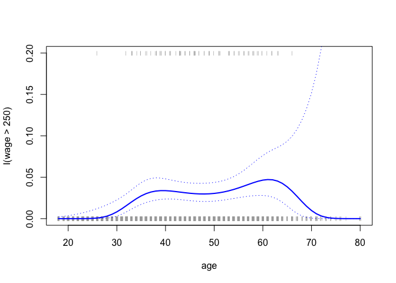

In order to fit a step function, as discussed in Section 7.2, we use the `cut()` function.

``` r
table(cut(age, 4))
```

    ## 
    ## (17.9,33.5]   (33.5,49]   (49,64.5] (64.5,80.1] 
    ##         750        1399         779          72

``` r
fit = lm(wage ~ cut(age, 4), data = Wage)
coef(summary(fit))
```

    ##                         Estimate Std. Error   t value     Pr(>|t|)
    ## (Intercept)            94.158392   1.476069 63.789970 0.000000e+00
    ## cut(age, 4)(33.5,49]   24.053491   1.829431 13.148074 1.982315e-38
    ## cut(age, 4)(49,64.5]   23.664559   2.067958 11.443444 1.040750e-29
    ## cut(age, 4)(64.5,80.1]  7.640592   4.987424  1.531972 1.256350e-01

Here `cut()` automatically picked cutpoints, but we can specify our own with the `breaks` argument. The `cut()` function returns an ordered categorical variable; the `lm()` function then creates a set of dummy variables for use in the regreion. The `age<33.5` category is left out, so the **intercept** coefficient of $94, 160 can be interpreted as the average salary for those under 33.5 years of age, and the other coefficients can be interpreted as the average **additional** salary for those in other age groups. We can produce predictions and plots just as we did in the case of the polynomial fit.

------------------------------------------------------------------------

7.8.2 Splines
-------------

In order to fit regression splines in R, we use the `splines` library. In Section 7.4, we saw that regression splines can be fit by constructing an appropriate matrix of basis functions. The `bs()` function generates the entire matrix of basis functions for splines with the specified set of knots. By default, cubic splines are produced. Fitting `wage` to `age` using a regression spline is simple:

``` r
library(splines)
fit = lm(wage ~ bs(age, knots = c(25, 40, 60)), data = Wage)
pred = predict(fit, newdata = list(age = age_grid), se=T)
plot(age, wage, col = "gray")
lines(age_grid, pred$fit, lwd = 2)
lines(age_grid, pred$fit + 2 * pred$se, lty = "dashed")
lines(age_grid, pred$fit - 2 * pred$se, lty = "dashed")
```


Here we have prespecified knots at ages 25, 40, and 60. This produces a spline with six basis functions. (Recall that a cubic spline with three knots has seven degrees of freedom; these degrees of freedom are used up by an intercept, plus six basis functions.) We could also use the df option to produce a spline with knots at uniform quantiles of the data.

``` r
dim(bs(age,knots=c(25,40,60)))
```

    ## [1] 3000    6

``` r
dim(bs(age,df=6))
```

    ## [1] 3000    6

``` r
attr(bs(age,df=6),"knots")
```

    ##   25%   50%   75% 
    ## 33.75 42.00 51.00

In this case R chooses knots at ages 33.8, 42.0, and 51.0, which correspond to the 25th, 50th, and 75th percentiles of age. The function `bs()` also has a degree argument, so we can fit splines of any degree, rather than the default degree of 3 (which yields a cubic spline).

In order to instead fit a natural spline, we use the `ns()` function. Here we fit a natural spline with four degrees of freedom.

``` r
fit2 = lm(wage ~ ns(age, df = 4), data = Wage)
pred2 = predict(fit2, newdata = list(age = age_grid), se = T)

plot(age, wage, col = "gray")
lines(age_grid, pred2$fit, col = "red", lwd = 2)
```


As with the `bs()` function, we could instead specify the knots directly using the knots option. In order to fit a smoothing spline, we use the `smooth.spline()` function. Figure 7.8 was produced with the following code:

``` r
plot(age, wage, xlim = agelims, cex = .5, col = "darkgrey")
title ("Smoothing Spline")
fit = smooth.spline(age, wage, df = 16)
fit2 = smooth.spline(age, wage, cv = TRUE)
```

    ## Warning in smooth.spline(age, wage, cv = TRUE): cross-validation with non-
    ## unique 'x' values seems doubtful

``` r
fit2$df
```

    ## [1] 6.794596

``` r
lines(fit, col = "red", lwd = 2)
lines(fit2, col = "blue", lwd = 2)
legend("topright", legend = c("16 DF", "6.8 DF"),
col = c("red", "blue"), lty = 1, lwd = 2, cex = .8)
```

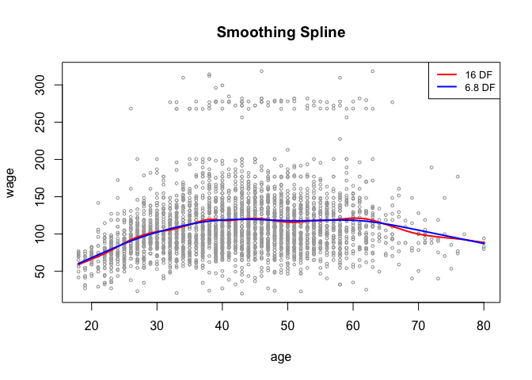

Notice that in the first call to `smooth.spline()`, we specified `df=16`. The function then determines which value of *λ* leads to 16 degrees of freedom. In the second call to `smooth.spline()`, we select the smoothness level by cross-validation; this results in a value of *λ* that yields 6.8 degrees of freedom.

In order to perform local regression, we use the `loess()` function. This is the default smoothing method used by `geom_smooth()` in `ggplot2`.

``` r
plot(age, wage, xlim = agelims, cex = .5, col = "darkgrey")
title ("Local Regression")
fit = loess(wage ~ age, span = .2, data = Wage)
fit2 = loess(wage ~ age, span = .5, data = Wage)
lines(age_grid, predict(fit, data.frame(age = age_grid)), col = "red", lwd = 2)
lines(age_grid, predict(fit2, data.frame(age = age_grid)), col = "blue", lwd = 2)
legend("topright", legend = c("Span=0.2", "Span=0.5"), 
       col = c("red","blue"), lty = 1, lwd = 2, cex = .8)
```


Here we have performed local linear regression using spans of 0.2 and 0.5: that is, each neighborhood consists of 20% or 50% of the observations. The larger the span, the smoother the fit. The `locfit` library can also be used for fitting local regression models in R.

------------------------------------------------------------------------

7.8.3 GAMs
----------

We now fit a GAM to predict wage using natural spline functions of year and age, treating education as a qualitative predictor, as in (7.16). Since this is just a big linear regression model using an appropriate choice of basis functions, we can simply do this using the `lm()` function.

``` r
gam1 = lm(wage ~ ns(year, 4) + ns(age, 5) + education, data = Wage)
```

We now fit the model (7.16) using smoothing splines rather than natural splines. In order to fit more general sorts of GAMs, using smoothing splines or other components that cannot be expressed in terms of basis functions and then fit using least squares regression, we will need to use the `gam` library in R.

The `s()` function, which is part of the `gam` library, is used to indicate that we would like to use a smoothing spline. We specify that the function of `year` should have 4 degrees of freedom, and that that the function of `age` will have 5 degrees of freedom. Since `education` is qualitative, we leave it as is, and it is converted into 4 dummy variables. We use the `gam()` function in order to fit a GAM using these components. All of the terms in (7.16) are fit simultaneously, taking each other into account to explain the response.

``` r
library(gam)
```

    ## Loading required package: foreach

    ## Loaded gam 1.16

``` r
gam.m3 = gam(wage ~ s(year, 4) + s(age, 5) + education, data = Wage)
```

In order to produce Figure 7.12, we simply call the `plot()` function:

``` r
par(mfrow = c(1, 3))
plot(gam.m3, se = TRUE, col = "blue")
```

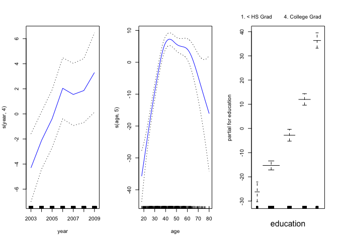

The generic `plot()` function recognizes that `gam2` is an object of class `gam`, and invokes the appropriate `plot.Gam()` method. Conveniently, even though `gam1` is not of class `gam` but rather of class `lm`, we can still use `plot.Gam()` on it. Figure 7.11 was produced using the following expression:

``` r
plot.Gam(gam1, se = TRUE, col = "red")
```

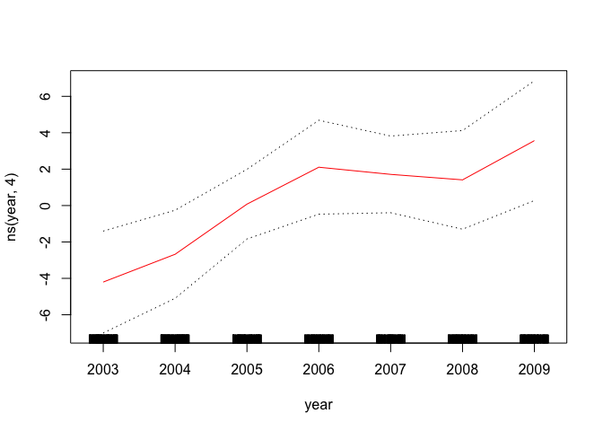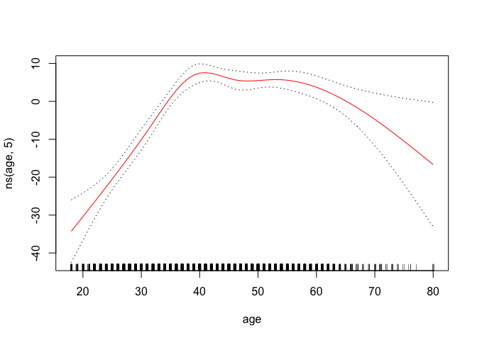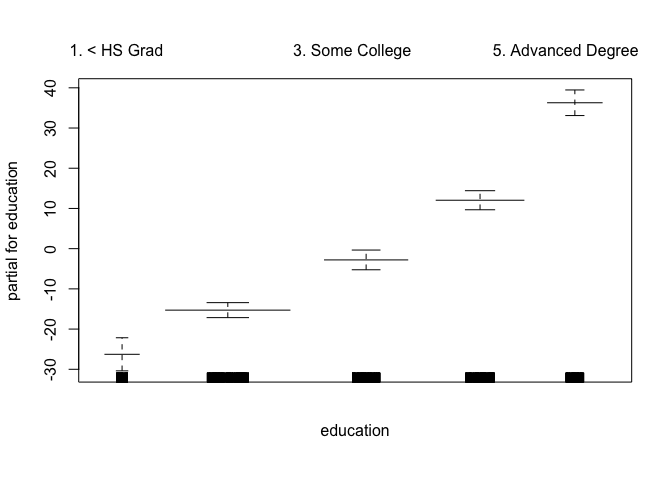

Notice here we had to use `plot.Gam()` rather than the generic `plot()` function.

In these plots, the function of `year` looks rather linear. We can perform a series of ANOVA tests in order to determine which of these three models is best: a GAM that excludes `year` (M1), a GAM that uses a linear function of `year` (M2), or a GAM that uses a spline function of `year` (M3).

``` r
gam.m1 = gam(wage ~ s(age ,5) + education, data = Wage) # excludes year
gam.m2 = gam(wage ~ year + s(age ,5) + education, data = Wage) # linear year
gam.m3 = gam(wage ~ s(year, 4) + s(age, 5) + education, data = Wage) # from before: sline year
anova(gam.m1, gam.m2, gam.m3, test = "F")
```

    ## Analysis of Deviance Table
    ## 
    ## Model 1: wage ~ s(age, 5) + education
    ## Model 2: wage ~ year + s(age, 5) + education
    ## Model 3: wage ~ s(year, 4) + s(age, 5) + education
    ##   Resid. Df Resid. Dev Df Deviance       F    Pr(>F)    
    ## 1      2990    3711731                                  
    ## 2      2989    3693842  1  17889.2 14.4771 0.0001447 ***
    ## 3      2986    3689770  3   4071.1  1.0982 0.3485661    
    ## ---
    ## Signif. codes:  0 '***' 0.001 '**' 0.01 '*' 0.05 '.' 0.1 ' ' 1

We find that there is compelling evidence that a GAM with a linear function of `year` is better than a GAM that does not include `year` at all (p-value = 0.00014). However, there is no evidence that a non-linear function of `year` is needed (p-value = 0.349). In other words, based on the results of this ANOVA, M2 is preferred.

The `summary()` function produces a summary of the gam fit.

``` r
summary(gam.m3)
```

    ## 
    ## Call: gam(formula = wage ~ s(year, 4) + s(age, 5) + education, data = Wage)
    ## Deviance Residuals:
    ##     Min      1Q  Median      3Q     Max 
    ## -119.43  -19.70   -3.33   14.17  213.48 
    ## 
    ## (Dispersion Parameter for gaussian family taken to be 1235.69)
    ## 
    ##     Null Deviance: 5222086 on 2999 degrees of freedom
    ## Residual Deviance: 3689770 on 2986 degrees of freedom
    ## AIC: 29887.75 
    ## 
    ## Number of Local Scoring Iterations: 2 
    ## 
    ## Anova for Parametric Effects
    ##              Df  Sum Sq Mean Sq F value    Pr(>F)    
    ## s(year, 4)    1   27162   27162  21.981 2.877e-06 ***
    ## s(age, 5)     1  195338  195338 158.081 < 2.2e-16 ***
    ## education     4 1069726  267432 216.423 < 2.2e-16 ***
    ## Residuals  2986 3689770    1236                      
    ## ---
    ## Signif. codes:  0 '***' 0.001 '**' 0.01 '*' 0.05 '.' 0.1 ' ' 1
    ## 
    ## Anova for Nonparametric Effects
    ##             Npar Df Npar F  Pr(F)    
    ## (Intercept)                          
    ## s(year, 4)        3  1.086 0.3537    
    ## s(age, 5)         4 32.380 <2e-16 ***
    ## education                            
    ## ---
    ## Signif. codes:  0 '***' 0.001 '**' 0.01 '*' 0.05 '.' 0.1 ' ' 1

The p-values for `year` and `age` correspond to a null hypothesis of a linear relationship versus the alternative of a non-linear relationship. The large p-value for `year` reinforces our conclusion from the ANOVA test that a linear function is adequate for this term. However, there is very clear evidence that a non-linear term is required for `age`.

We can make predictions from `gam` objects, just like from `lm` objects, using the `predict()` method for the class `gam`. Here we make predictions on the training set.

``` r
preds = predict(gam.m2, newdata = Wage)
head(preds)
```

    ##    231655     86582    161300    155159     11443    376662 
    ##  49.98235  99.55449 112.76257 127.50172 101.15355 131.30566

We can also use local regression fits as building blocks in a GAM, using the `lo()` function.

``` r
gam.lo = gam(wage ~ s(year, df = 4) + lo(age, span = 0.7) + education, data = Wage)
plot.Gam(gam.lo, se = TRUE, col = "green")
```

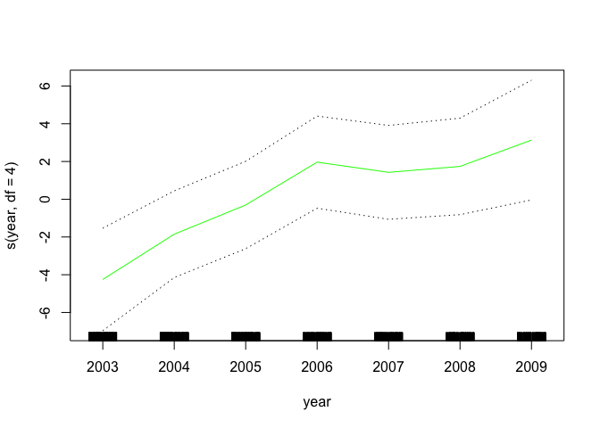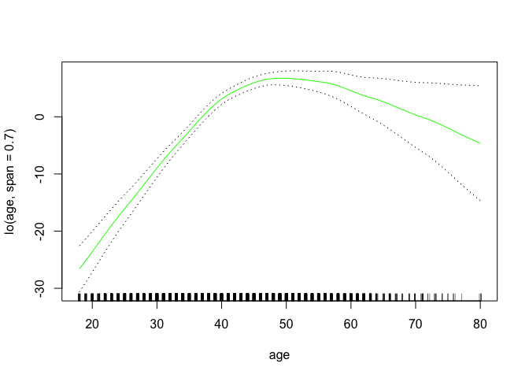

Here we have used local regression for the `age` term, with a span of 0.7. We can also use the `lo()` function to create interactions before calling the `gam()` function. For example,

``` r
gam.lo.i = gam(wage ~ lo(year, age, span=0.5) + education, data = Wage)
```

    ## Warning in lo.wam(x, z, wz, fit$smooth, which, fit$smooth.frame,
    ## bf.maxit, : liv too small. (Discovered by lowesd)

    ## Warning in lo.wam(x, z, wz, fit$smooth, which, fit$smooth.frame,
    ## bf.maxit, : lv too small. (Discovered by lowesd)

    ## Warning in lo.wam(x, z, wz, fit$smooth, which, fit$smooth.frame,
    ## bf.maxit, : liv too small. (Discovered by lowesd)

    ## Warning in lo.wam(x, z, wz, fit$smooth, which, fit$smooth.frame,
    ## bf.maxit, : lv too small. (Discovered by lowesd)

fits a two-term model, in which the first term is an interaction between `year` and `age`, fit by a local regression surface. We can plot the resulting two-dimensional surface if we first install the `akima` package.

``` r
library(akima)
plot(gam.lo.i)
```

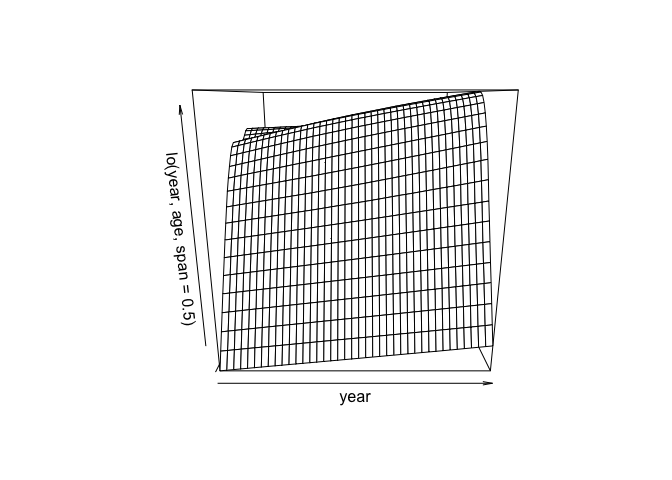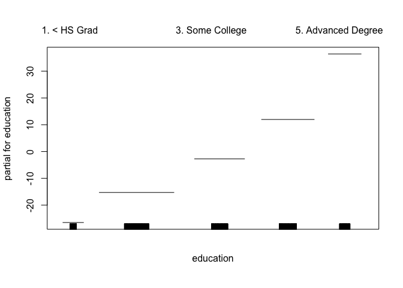

In order to fit a logistic regression GAM, we once again use the `I()` function in constructing the binary response variable, and set `family=binomial`.

``` r
gam.lr = gam(I(wage > 250) ~ year + s(age, df = 5) + education, family = binomial, data = Wage)
par(mfrow = c(1, 3))
plot(gam.lr, se = T, col = "green")
```


It is easy to see that there are no high earners in the `<HS` category:

``` r
table(education, I(wage > 250))
```

    ##                     
    ## education            FALSE TRUE
    ##   1. < HS Grad         268    0
    ##   2. HS Grad           966    5
    ##   3. Some College      643    7
    ##   4. College Grad      663   22
    ##   5. Advanced Degree   381   45

Hence, we fit a logistic regression GAM using all but this category. This provides more sensible results.

``` r
gam.lr.s = gam(I(wage > 250) ~ year + s(age, df = 5) + education, 
               family = binomial, data = Wage, subset = (education != "1. < HS Grad"))
plot(gam.lr.s, se = T, col = "green")
```

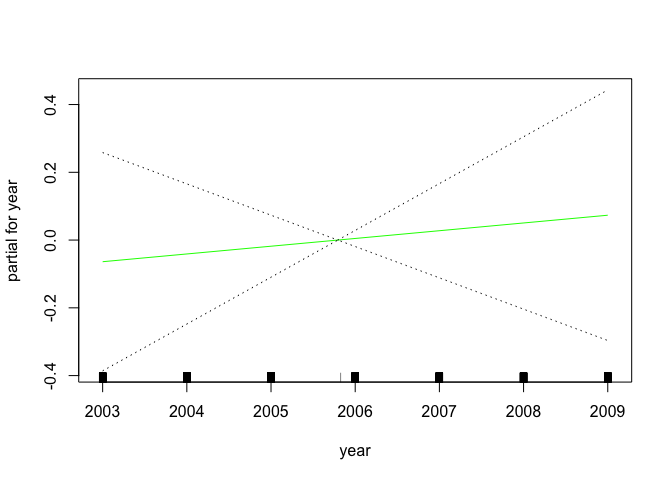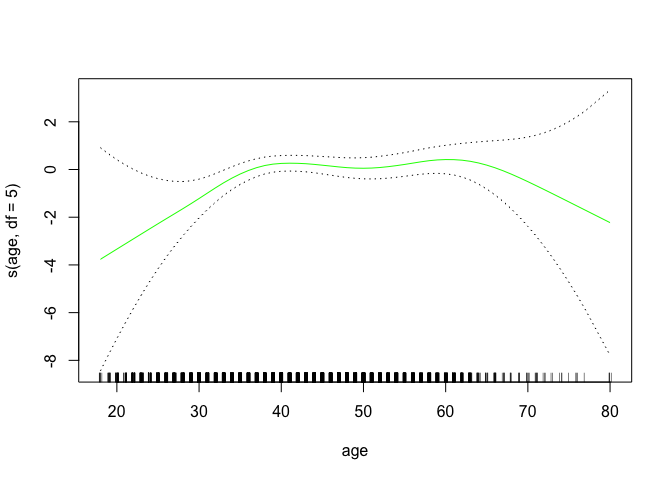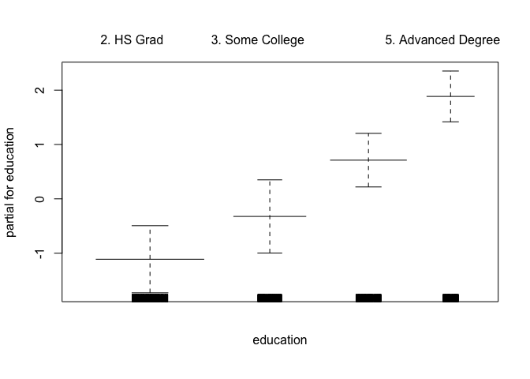
