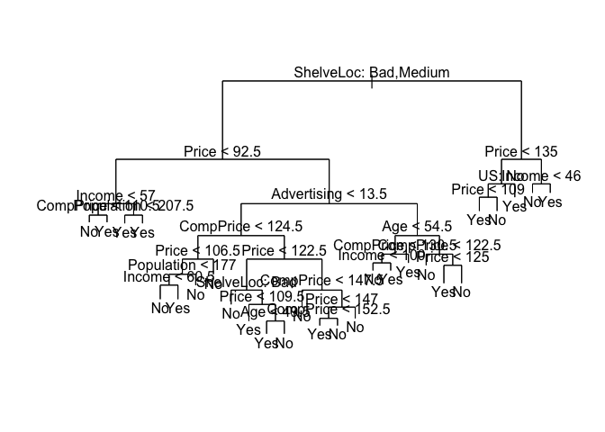
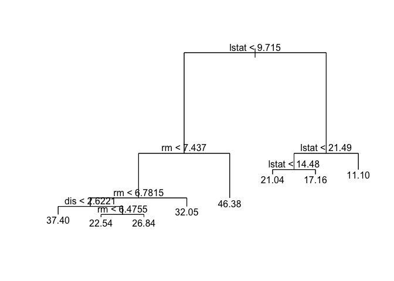
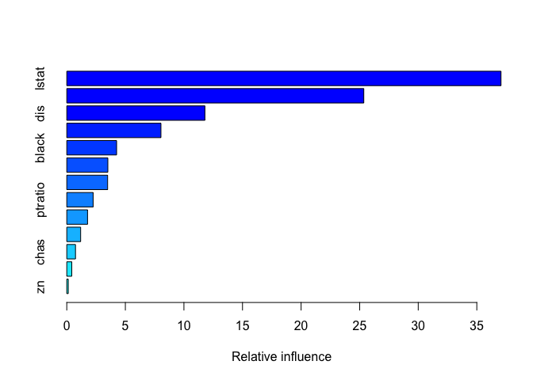

8.3 Lab: Decision Trees
=======================

8.3.1 Fitting Classification Trees
----------------------------------

The `tree` is used to construct classification and regression trees.

    library(tree)

We first use classification trees to analyze the Carseats data set. In
these data, `Sales` is a continuous variable, and so we begin by
recoding it as a binary variable. We use the `ifelse()` function to
create a variable, called `High`, which takes on a value of `Yes` if the
`Sales` variable exceeds 8, and takes on a value of `No` otherwise.

    library(ISLR)
    attach(Carseats)
    High=ifelse(Sales <=8,"No","Yes")

Finally, we use the `data.frame()` function to merge High with the rest
of the Carseats data.

    Carseats = data.frame(Carseats ,High)

We now use the `tree()` function to fit a classification tree in order
to predict `High` using all variables but `Sales`. The syntax of the
`tree()` function is quite similar to that of the `lm()` function.

    tree_carseats = tree(High ~ . -Sales, Carseats)

The `summary()` function lists the variables that are used as internal
nodes in the tree, the number of terminal nodes, and the (training)
error rate.

    summary(tree_carseats)

    ## 
    ## Classification tree:
    ## tree(formula = High ~ . - Sales, data = Carseats)
    ## Variables actually used in tree construction:
    ## [1] "ShelveLoc"   "Price"       "Income"      "CompPrice"   "Population" 
    ## [6] "Advertising" "Age"         "US"         
    ## Number of terminal nodes:  27 
    ## Residual mean deviance:  0.4575 = 170.7 / 373 
    ## Misclassification error rate: 0.09 = 36 / 400

We see that the training error rate is 9%. For classification trees, the
deviance reported in the output of `summary()` is given by.

\begin{equation}
-2 \sum_m \sum_k n_{mk}log (\hat{p}_{mk})
\end{equation}
Where *n**m**k* is the number of observations in the
*m**t**h* terminal node belonging to the *k**t**h*
class. A small deviance indicates a tree that provides a good fit to the
(training) data. The residual mean deviance reported is simply the
deviance divided by *n* − |*T*0|, which in this case is
400 − 27 = 373.

One of the most attractive properties of trees is that they can be
graphically displayed. We use the `plot()` function to display the tree
structure, and the `text()` function to display the node labels. The
argument `pretty=0` instructs R to include the category names for any
qualitative predictors, rather than simply displaying a letter for each
category.

    plot(tree_carseats)
    text(tree_carseats, pretty = 0)

The most important indicator of `Sales` appears to be shelving location,
since the first branch differentiates `Good` locations from `Bad` and
`Medium` locations.

If we just type the name of the tree object, `R` prints output
corresponding to each branch of the tree. `R` displays the split
criterion (e.g. `Price < 92.5`), the number of observations in that
branch, the deviance, the overall prediction for the branch (`Yes` or
`No`), and the fraction of observations in that branch that take on
values of `Yes` and `No`. Branches that lead to terminal nodes are
indicated using asterisks.

    tree_carseats

    ## node), split, n, deviance, yval, (yprob)
    ##       * denotes terminal node
    ## 
    ##   1) root 400 541.500 No ( 0.59000 0.41000 )  
    ##     2) ShelveLoc: Bad,Medium 315 390.600 No ( 0.68889 0.31111 )  
    ##       4) Price < 92.5 46  56.530 Yes ( 0.30435 0.69565 )  
    ##         8) Income < 57 10  12.220 No ( 0.70000 0.30000 )  
    ##          16) CompPrice < 110.5 5   0.000 No ( 1.00000 0.00000 ) *
    ##          17) CompPrice > 110.5 5   6.730 Yes ( 0.40000 0.60000 ) *
    ##         9) Income > 57 36  35.470 Yes ( 0.19444 0.80556 )  
    ##          18) Population < 207.5 16  21.170 Yes ( 0.37500 0.62500 ) *
    ##          19) Population > 207.5 20   7.941 Yes ( 0.05000 0.95000 ) *
    ##       5) Price > 92.5 269 299.800 No ( 0.75465 0.24535 )  
    ##        10) Advertising < 13.5 224 213.200 No ( 0.81696 0.18304 )  
    ##          20) CompPrice < 124.5 96  44.890 No ( 0.93750 0.06250 )  
    ##            40) Price < 106.5 38  33.150 No ( 0.84211 0.15789 )  
    ##              80) Population < 177 12  16.300 No ( 0.58333 0.41667 )  
    ##               160) Income < 60.5 6   0.000 No ( 1.00000 0.00000 ) *
    ##               161) Income > 60.5 6   5.407 Yes ( 0.16667 0.83333 ) *
    ##              81) Population > 177 26   8.477 No ( 0.96154 0.03846 ) *
    ##            41) Price > 106.5 58   0.000 No ( 1.00000 0.00000 ) *
    ##          21) CompPrice > 124.5 128 150.200 No ( 0.72656 0.27344 )  
    ##            42) Price < 122.5 51  70.680 Yes ( 0.49020 0.50980 )  
    ##              84) ShelveLoc: Bad 11   6.702 No ( 0.90909 0.09091 ) *
    ##              85) ShelveLoc: Medium 40  52.930 Yes ( 0.37500 0.62500 )  
    ##               170) Price < 109.5 16   7.481 Yes ( 0.06250 0.93750 ) *
    ##               171) Price > 109.5 24  32.600 No ( 0.58333 0.41667 )  
    ##                 342) Age < 49.5 13  16.050 Yes ( 0.30769 0.69231 ) *
    ##                 343) Age > 49.5 11   6.702 No ( 0.90909 0.09091 ) *
    ##            43) Price > 122.5 77  55.540 No ( 0.88312 0.11688 )  
    ##              86) CompPrice < 147.5 58  17.400 No ( 0.96552 0.03448 ) *
    ##              87) CompPrice > 147.5 19  25.010 No ( 0.63158 0.36842 )  
    ##               174) Price < 147 12  16.300 Yes ( 0.41667 0.58333 )  
    ##                 348) CompPrice < 152.5 7   5.742 Yes ( 0.14286 0.85714 ) *
    ##                 349) CompPrice > 152.5 5   5.004 No ( 0.80000 0.20000 ) *
    ##               175) Price > 147 7   0.000 No ( 1.00000 0.00000 ) *
    ##        11) Advertising > 13.5 45  61.830 Yes ( 0.44444 0.55556 )  
    ##          22) Age < 54.5 25  25.020 Yes ( 0.20000 0.80000 )  
    ##            44) CompPrice < 130.5 14  18.250 Yes ( 0.35714 0.64286 )  
    ##              88) Income < 100 9  12.370 No ( 0.55556 0.44444 ) *
    ##              89) Income > 100 5   0.000 Yes ( 0.00000 1.00000 ) *
    ##            45) CompPrice > 130.5 11   0.000 Yes ( 0.00000 1.00000 ) *
    ##          23) Age > 54.5 20  22.490 No ( 0.75000 0.25000 )  
    ##            46) CompPrice < 122.5 10   0.000 No ( 1.00000 0.00000 ) *
    ##            47) CompPrice > 122.5 10  13.860 No ( 0.50000 0.50000 )  
    ##              94) Price < 125 5   0.000 Yes ( 0.00000 1.00000 ) *
    ##              95) Price > 125 5   0.000 No ( 1.00000 0.00000 ) *
    ##     3) ShelveLoc: Good 85  90.330 Yes ( 0.22353 0.77647 )  
    ##       6) Price < 135 68  49.260 Yes ( 0.11765 0.88235 )  
    ##        12) US: No 17  22.070 Yes ( 0.35294 0.64706 )  
    ##          24) Price < 109 8   0.000 Yes ( 0.00000 1.00000 ) *
    ##          25) Price > 109 9  11.460 No ( 0.66667 0.33333 ) *
    ##        13) US: Yes 51  16.880 Yes ( 0.03922 0.96078 ) *
    ##       7) Price > 135 17  22.070 No ( 0.64706 0.35294 )  
    ##        14) Income < 46 6   0.000 No ( 1.00000 0.00000 ) *
    ##        15) Income > 46 11  15.160 Yes ( 0.45455 0.54545 ) *

In order to properly evaluate the performance of a classification tree
on these data, we must estimate the test error rather than simply
computing the training error. We split the observations into a training
set and a test set, build the tree using the training set, and evaluate
its performance on the test data. The `predict()` function can be used
for this purpose. In the case of a classification tree, the argument
`type="class"` instructs `R` to return the actual class prediction. This
approach leads to correct predictions for around 71.5% of the locations
in the test data set.

    set.seed(2)
    train = sample(1:nrow(Carseats), 200)  # train set: 50% of data
    Carseats_test = Carseats [-train, ]    # test set:  50% of data
    High_test = High[-train]
    tree_carseats = tree(High ~ . -Sales, Carseats, subset = train)
    tree_pred = predict(tree_carseats, Carseats_test, type = "class")
    table(tree_pred, High_test)  # confusion matrix

    ##          High_test
    ## tree_pred No Yes
    ##       No  86  27
    ##       Yes 30  57

    (86 + 57) / 200              # overall accuracy

    ## [1] 0.715

Next, we consider whether pruning the tree might lead to improved
results. The function `cv.tree()` performs cross-validation in order to
determine the optimal level of tree complexity; cost complexity pruning
is used in order to select a sequence of trees for consideration. We use
the argument `FUN=prune.misclass` in order to indicate that we want the
classification error rate to guide the cross-validation and pruning
process, rather than the default for the `cv.tree()` function, which is
deviance. `The cv.tree()` function reports the number of terminal nodes
of each tree considered (size) as well as the corresponding error rate
and the value of the cost-complexity parameter used (`k`, which
corresponds to *α* in (8.4)).

    set.seed(3)
    cv_carseats = cv.tree(tree_carseats, FUN = prune.misclass)
    names(cv_carseats)

    ## [1] "size"   "dev"    "k"      "method"

    cv_carseats

    ## $size
    ## [1] 19 17 14 13  9  7  3  2  1
    ## 
    ## $dev
    ## [1] 55 55 53 52 50 56 69 65 80
    ## 
    ## $k
    ## [1]       -Inf  0.0000000  0.6666667  1.0000000  1.7500000  2.0000000
    ## [7]  4.2500000  5.0000000 23.0000000
    ## 
    ## $method
    ## [1] "misclass"
    ## 
    ## attr(,"class")
    ## [1] "prune"         "tree.sequence"

Note that, despite the name, `dev` corresponds to the cross-validation
error rate in this instance. The tree with nine terminal nodes results
in the lowest cross-validation error rate, with 50 cross-validation
errors. We plot the error rate as a function of both `size` and `k`.

    par(mfrow=c(1,2))
    plot(cv_carseats$size, cv_carseats$dev, type="b")
    plot(cv_carseats$k,    cv_carseats$dev, type="b")

We now apply the `prune.misclass()` function in order to prune the tree
to obtain the nine-node tree.

    prune_carseats = prune.misclass(tree_carseats, best=9)
    plot(prune_carseats)
    text(prune_carseats, pretty = 0)

How well does this pruned tree perform on the test data set? Once again,
we apply the `predict()` function.

    tree_pred = predict(prune_carseats, Carseats_test, type = "class")
    table(tree_pred, High_test)

    ##          High_test
    ## tree_pred No Yes
    ##       No  94  24
    ##       Yes 22  60

    (94 + 60) / 200

    ## [1] 0.77

Now 77% of the test observations are correctly classified, so not only
has the pruning process produced a more interpretable tree, but it has
also improved the classification accuracy.

If we increase the value of `best`, we obtain a larger pruned tree with
lower classification accuracy:

    prune_carseats = prune.misclass(tree_carseats, best=15)
    plot(prune_carseats )
    text(prune_carseats, pretty = 0)

    tree_pred = predict(prune_carseats, Carseats_test, type="class")
    table(tree_pred, High_test)

    ##          High_test
    ## tree_pred No Yes
    ##       No  86  22
    ##       Yes 30  62

    (86 + 62) / 200

    ## [1] 0.74

------------------------------------------------------------------------

8.3.2 Fitting Regression Trees
------------------------------

Here we fit a regression tree to the `Boston` data set. First, we create
a training set, and fit the tree to the training data.

    library(MASS)
    set.seed(1)
    train = sample(1:nrow(Boston), nrow(Boston)/2) # train on 50% of data
    tree_boston = tree(medv ~ ., Boston, subset=train)
    summary(tree_boston)

    ## 
    ## Regression tree:
    ## tree(formula = medv ~ ., data = Boston, subset = train)
    ## Variables actually used in tree construction:
    ## [1] "lstat" "rm"    "dis"  
    ## Number of terminal nodes:  8 
    ## Residual mean deviance:  12.65 = 3099 / 245 
    ## Distribution of residuals:
    ##      Min.   1st Qu.    Median      Mean   3rd Qu.      Max. 
    ## -14.10000  -2.04200  -0.05357   0.00000   1.96000  12.60000

Notice that the output of `summary()` indicates that only three of the
variables have been used in constructing the tree. In the context of a
regression tree, the deviance is simply the sum of squared errors for
the tree. We now plot the tree.

    plot(tree_boston)
    text(tree_boston, pretty = 0)

The variable `lstat` measures the percentage of individuals with lower
socioeconomic status. The tree indicates that lower values of `lstat`
correspond to more expensive houses. The tree predicts a median house
price of $46,400 for larger homes (varaible `rm` = average number of
rooms per dwelling) in suburbs in which residents have high
socioeconomic status (`rm >= 7.437` and `lstat < 9.715`).

Now we use the `cv.tree()` function to see whether pruning the tree will
improve performance.

    cv_boston = cv.tree(tree_boston) # `FUN=prune.misclass` == classification
    plot(cv_boston$size, cv_boston$dev, type = "b")

In this case, the most complex tree is selected by cross-validation (try
printing `cv_boston`, and you see that the tree of size 8 has the lowest
deviance). However, if we wish to prune the tree, we could do so as
follows, using the `prune.tree()` function:

    prune_boston = prune.tree(tree_boston, best=5)
    plot(prune_boston)
    text(prune_boston, pretty=0)

In keeping with the cross-validation results (the most complex tree of
depth 8 has the best results), we use the unpruned tree to make
predictions on the test set.

    yhat = predict(tree_boston, newdata = Boston[-train, ])
    boston_test = Boston[-train, "medv"]
    plot(yhat, boston_test)
    abline(0 ,1)

    mean((yhat - boston_test)^2) # MSE

    ## [1] 25.04559

In other words, the test set MSE associated with the regression tree is
25.05. The square root of the MSE is therefore around 5.005, indicating
that this model leads to test predictions that are within around $5,005
of the true median home value for the suburb.

------------------------------------------------------------------------

8.3.3 Bagging and Random Forests
--------------------------------

Here we apply bagging and random forests to the `Boston` data, using the
`randomForest` package in `R`. The exact results obtained in this
section may depend on the version of `R` and the version of the
`randomForest` package installed on your computer. Recall that bagging
is simply a special case of a random forest with *m* = *p* (we use all
preductors *p* at each split in bagging, whereas in RF, we use a random
sample of *m* preductors at each split). Therefore, the `randomForest()`
function can be used to perform both random forests and bagging. We
perform bagging by making the `mtry` argument (number of variables
randomly sampled as candiates at each split) equal to the number of
predictors (13):

    library(randomForest)

    ## randomForest 4.6-14

    ## Type rfNews() to see new features/changes/bug fixes.

    set.seed(1)
    bag_boston = randomForest(medv ~ ., data = Boston, subset = train, 
                              mtry = 13, importance = TRUE)
    bag_boston

    ## 
    ## Call:
    ##  randomForest(formula = medv ~ ., data = Boston, mtry = 13, importance = TRUE,      subset = train) 
    ##                Type of random forest: regression
    ##                      Number of trees: 500
    ## No. of variables tried at each split: 13
    ## 
    ##           Mean of squared residuals: 11.15723
    ##                     % Var explained: 86.49

As mentioned before, the argument `mtry=13` indicates that all 13
predictors should be considered for each split of the tree — in other
words, that bagging should be done. How well does this bagged model
perform on the test set?

    yhat_bag = predict(bag_boston, newdata = Boston[-train, ]) # test preds
    plot(yhat_bag, boston_test)
    abline(0, 1)

    mean((yhat_bag - boston_test)^2)

    ## [1] 13.50808

The test set MSE associated with the bagged regression tree is 13.16,
almost half that obtained using using an optimally-pruned single tree.
We could change the number of trees grown by `randomForest()` using the
`ntree` argument (default value is 500):

    bag_boston = randomForest(medv ~ ., data=Boston, subset=train, mtry=13, ntree=25)
    yhat_bag = predict(bag_boston, newdata=Boston[-train, ])
    mean((yhat_bag - boston_test)^2)

    ## [1] 13.94835

Growing a random forest proceeds in exactly the same way, except that we
use a smaller value of the `mtry` argument. By default, `randomForest()`
uses *p*/3 variables when building a random forest of regression trees,
and $\\sqrt p$ variables when building a random forest of classification
trees. Here we use `mtry = 6`.

    set.seed(1)
    rf_boston = randomForest(medv ~ ., data=Boston, subset=train, 
                             mtry=6, importance=TRUE)
    yhat_rf = predict(rf_boston, newdata=Boston[-train, ])
    mean((yhat_rf - boston_test)^2)

    ## [1] 11.66454

The test set MSE is 11.31; this indicates that random forests yielded an
improvement over bagging in this case. A reduction in test error when
the tree depth is pruned indicates that in this case, trees grown to
their terminal depth results in overfitting.

Using the `importance()` function, we can view the importance of each
variable.

    importance(rf_boston)

    ##           %IncMSE IncNodePurity
    ## crim    12.132320     986.50338
    ## zn       1.955579      57.96945
    ## indus    9.069302     882.78261
    ## chas     2.210835      45.22941
    ## nox     11.104823    1044.33776
    ## rm      31.784033    6359.31971
    ## age     10.962684     516.82969
    ## dis     15.015236    1224.11605
    ## rad      4.118011      95.94586
    ## tax      8.587932     502.96719
    ## ptratio 12.503896     830.77523
    ## black    6.702609     341.30361
    ## lstat   30.695224    7505.73936

Two measures of variable importance are reported. The former is based
upon the mean decrease of accuracy in predictions on the out of bag
samples when a given variable is excluded from the model. The latter is
a measure of the total decrease in node impurity that results from
splits over that variable, averaged over all trees (this was plotted in
Figure 8.9). In the case of regression trees, the node impurity is
measured by the training RSS, and for classification trees by the
deviance. Plots of these importance measures can be produced using the
`varImpPlot()` function.

    varImpPlot(rf_boston)

The results indicate that across all of the trees considered in the
random forest, the wealth level of the community (`lstat`) and the house
size (`rm`) are by far the two most important variables.

------------------------------------------------------------------------

8.3.4 Boosting
--------------

Here we use the `gbm` package, and within it the `gbm()` function, to
fit boosted regression trees to the Boston data set. We run `gbm()` with
the option `distribution="gaussian"` since this is a regression problem;
if it were a binary classification problem, we would use
`distribution="bernoulli"`. The argument `n.trees=5000` indicates that
we want 5000 trees, and the option `interaction.depth=4` limits the
depth of each tree.

    library(gbm)

    ## Warning: package 'gbm' was built under R version 3.5.2

    ## Loaded gbm 2.1.5

    set.seed(1)
    boost_boston=gbm(medv ~ ., data=Boston[train, ], distribution="gaussian", 
                     n.trees=5000, interaction.depth=4)

The `summary()` function produces a relative influence plot and also
outputs the relative influence statistics.

    summary(boost_boston)

    ##             var    rel.inf
    ## lstat     lstat 37.0661275
    ## rm           rm 25.3533123
    ## dis         dis 11.7903016
    ## crim       crim  8.0388750
    ## black     black  4.2531659
    ## nox         nox  3.5058570
    ## age         age  3.4868724
    ## ptratio ptratio  2.2500385
    ## indus     indus  1.7725070
    ## tax         tax  1.1836592
    ## chas       chas  0.7441319
    ## rad         rad  0.4274311
    ## zn           zn  0.1277206

We see that `lstat` and `rm` are by far the most important variables. We
can also produce partial dependence plots for these two variables. These
plots illustrate the marginal effect of the selected variables on the
response after integrating out the other variables. In this case, as we
might expect, median house prices are increasing with `rm` (number of
rooms) and decreasing with `lstat` (percentage of low income
population).

    par(mfrow=c(1,2)) 
    plot(boost_boston, i="rm", main = "Partial Dependence of Median Value on `rm`") 

    plot(boost_boston, i="lstat", main = "Partial Dependence of Median Value on `lstat`") 

We now use the boosted model to predict `medv` on the test set:

    yhat_boost = predict(boost_boston, newdata=Boston[-train, ], n.trees=5000)
    mean((yhat_boost - boston_test)^2)

    ## [1] 10.81479

The test MSE obtained is 10.8; similar to the test MSE for random
forests and superior to that for bagging. If we want to, we can perform
boosting with a different value of the shrinkage parameter *λ* in
(8.10). The default value is 0.1, but this is easily modified. Here we
take *λ* = 0.001.

    boost_boston=gbm(medv ~ ., data=Boston[train, ], 
                     distribution="gaussian", n.trees=5000, 
                     interaction.depth=4, shrinkage=0.001, verbose=F)
    yhat_boost=predict(boost_boston, newdata=Boston[-train, ], n.trees=5000)
    mean((yhat_boost - boston_test)^2)

    ## [1] 11.85315

In this case, using learning rate *λ* = 0.001 leads to a slightly
greater test MSE than *λ* = 0.001. From the documentation:

> \[Learning rates\] of 0.001 to 0.1 usually work, but a smaller
> learning rate typically requires more trees \[in order to obtain good
> performance\].
