9.6 Lab: Support Vector Machines
================================

9.6.1 Support Vector Classifier
-------------------------------

The `e1071` library contains implementations for a number of statistical
learning methods. In particular, the `svm()` function can be used to fit
a support vector classifier when the argument `kernel="linear"` is used.
This function uses a slightly different formulation from (9.14) and
(9.25) for the support vector classifier. A cost argument allows us to
specify the cost of a violation to the margin. When the cost argument is
small, then the margins will be wide and many support vectors will be on
the margin or will violate the margin. When the cost argument is large,
then the margins will be narrow and there will be few support vectors on
the margin or violating the margin.

We now use the `svm()` function to fit the support vector classifier for
a given value of the cost parameter. Here we demonstrate the use of this
function on a two-dimensional example so that we can plot the resulting
decision boundary. We begin by generating the observations, which belong
to two classes.

    set.seed(1)
    x=matrix(rnorm(20*2), ncol=2)
    y=c(rep(-1,10), rep(1,10))
    x[y==1,]=x[y==1,] + 1

We begin by checking whether the classes are linearly separable.

    plot(x, col=(3-y))

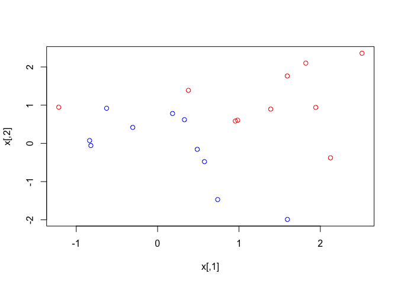

They are not. Next, we fit the support vector classifier. Note that in
order for the `svm()` function to perform classification (as opposed to
SVM-based regression), we must encode the response as a `factor`
variable. We now create a data frame with the response coded as a
factor.

    dat=data.frame(x=x, y=as.factor(y))
    library(e1071)
    svmfit=svm(y~., data=dat, kernel="linear", cost=10, scale=FALSE)

The argument scale=FALSE tells the `svm()` function not to scale each
feature to have mean zero or standard deviation one; depending on the
application, one might prefer to use `scale=TRUE`. We can now plot the
support vector classifier obtained:

    plot(svmfit, dat)

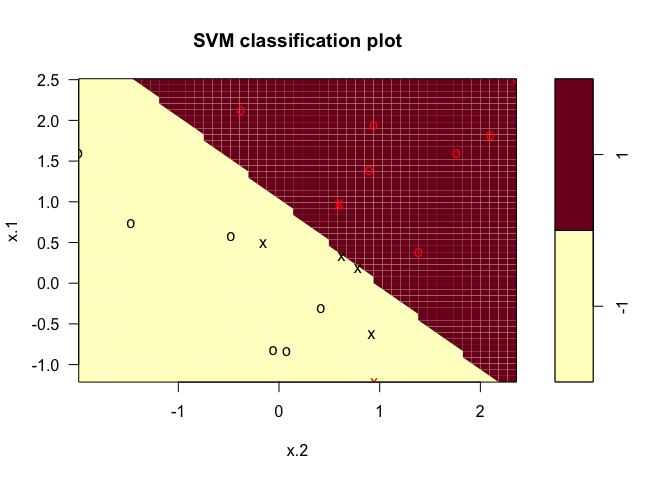

Note that the two arguments to the `plot.svm()` function are the output
of the call to `svm()`, as well as the data used in the call to `svm()`.
The region of feature space that will be assigned to the `−1` class is
shown in light blue, and the region that will be assigned to the `+1`
class is shown in purple. The decision boundary between the two classes
is linear (because we used the argument `kernel="linear"`), though due
to the way in which the plotting function is implemented in this library
the decision boundary looks somewhat jagged in the plot. We see that in
this case only one observation is misclassified. (Note that here the
second feature is plotted on the x-axis and the first feature is plotted
on the y-axis, in contrast to the behavior of the usual `plot()`
function in R.) The support vectors are plotted as crosses and the
remaining observations are plotted as circles; we see here that there
are seven support vectors. We can determine their identities as follows:

    svmfit$index

    ## [1]  1  2  5  7 14 16 17

We can obtain some basic information about the support vector classifier
fit using the `summary()` command:

    summary(svmfit)

    ## 
    ## Call:
    ## svm(formula = y ~ ., data = dat, kernel = "linear", cost = 10, 
    ##     scale = FALSE)
    ## 
    ## 
    ## Parameters:
    ##    SVM-Type:  C-classification 
    ##  SVM-Kernel:  linear 
    ##        cost:  10 
    ##       gamma:  0.5 
    ## 
    ## Number of Support Vectors:  7
    ## 
    ##  ( 4 3 )
    ## 
    ## 
    ## Number of Classes:  2 
    ## 
    ## Levels: 
    ##  -1 1

This tells us, for instance, that a linear kernel was used with
`cost=10`, and that there were seven support vectors, four in one class
and three in the other. What if we instead used a smaller value of the
cost parameter?

    svmfit=svm(y~., data=dat, kernel="linear", cost=0.1, scale=FALSE)
    plot(svmfit, dat)

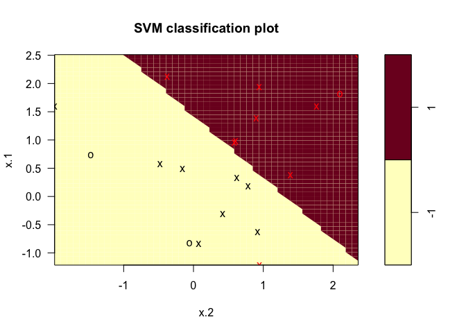

    svmfit$index

    ##  [1]  1  2  3  4  5  7  9 10 12 13 14 15 16 17 18 20

    summary(svmfit)

    ## 
    ## Call:
    ## svm(formula = y ~ ., data = dat, kernel = "linear", cost = 0.1, 
    ##     scale = FALSE)
    ## 
    ## 
    ## Parameters:
    ##    SVM-Type:  C-classification 
    ##  SVM-Kernel:  linear 
    ##        cost:  0.1 
    ##       gamma:  0.5 
    ## 
    ## Number of Support Vectors:  16
    ## 
    ##  ( 8 8 )
    ## 
    ## 
    ## Number of Classes:  2 
    ## 
    ## Levels: 
    ##  -1 1

Now that a smaller value of the cost parameter is being used, we obtain
a larger number of support vectors, because the margin is now wider.
Unfortunately, the `svm()` function does not explicitly output the
coefficients of the linear decision boundary obtained when the support
vector classifier is fit, nor does it output the width of the margin.

The `e1071` library includes a built-in function, `tune()`, to perform
cross-validation. By default, `tune()` performs ten-fold
cross-validation on a set of models of interest. In order to use this
function, we pass in relevant information about the set of models that
are under consideration. The following command indicates that we want to
compare SVMs with a linear kernel, using a `range` of values of the cost
parameter.

    set.seed(1)
    tune.out=tune(svm,y~.,data=dat,kernel="linear", 
                  ranges=list(cost=c(0.001, 0.01, 0.1, 1,5,10,100)))

We can easily access the cross-validation errors for each of these
models using the `summary()` command:

    summary(tune.out)

    ## 
    ## Parameter tuning of 'svm':
    ## 
    ## - sampling method: 10-fold cross validation 
    ## 
    ## - best parameters:
    ##  cost
    ##   0.1
    ## 
    ## - best performance: 0.05 
    ## 
    ## - Detailed performance results:
    ##    cost error dispersion
    ## 1 1e-03  0.55  0.4377975
    ## 2 1e-02  0.55  0.4377975
    ## 3 1e-01  0.05  0.1581139
    ## 4 1e+00  0.15  0.2415229
    ## 5 5e+00  0.15  0.2415229
    ## 6 1e+01  0.15  0.2415229
    ## 7 1e+02  0.15  0.2415229

We see that `cost=0.1` results in the lowest cross-validation error
rate. The `tune()` function stores the best model obtained, which can be
accessed as follows:

    bestmod=tune.out$best.model
    summary(bestmod)

    ## 
    ## Call:
    ## best.tune(method = svm, train.x = y ~ ., data = dat, ranges = list(cost = c(0.001, 
    ##     0.01, 0.1, 1, 5, 10, 100)), kernel = "linear")
    ## 
    ## 
    ## Parameters:
    ##    SVM-Type:  C-classification 
    ##  SVM-Kernel:  linear 
    ##        cost:  0.1 
    ##       gamma:  0.5 
    ## 
    ## Number of Support Vectors:  16
    ## 
    ##  ( 8 8 )
    ## 
    ## 
    ## Number of Classes:  2 
    ## 
    ## Levels: 
    ##  -1 1

The `predict()` function can be used to predict the class label on a set
of test observations, at any given value of the cost parameter. We begin
by generating a test data set.

    xtest=matrix(rnorm(20*2), ncol=2)
    ytest=sample(c(-1,1), 20, rep=TRUE)
    xtest[ytest==1,]=xtest[ytest==1,] + 1
    testdat=data.frame(x=xtest, y=as.factor(ytest))

Now we predict the class labels of these test observations. Here we use
the best model obtained through cross-validation in order to make
predictions.

    ypred=predict(bestmod, testdat)
    table(predict=ypred, truth=testdat$y)

    ##        truth
    ## predict -1 1
    ##      -1  9 1
    ##      1   2 8

Thus, with this value of `cost`, 19 of the test observations are
correctly classified. What if we had instead used `cost=0.01`?

    svmfit=svm(y~., data=dat, kernel="linear", cost=.01, scale=FALSE)
    ypred=predict(svmfit ,testdat)
    table(predict=ypred, truth=testdat$y)

    ##        truth
    ## predict -1  1
    ##      -1 11  6
    ##      1   0  3

In this case one additional observation is misclassified.

Now consider a situation in which the two classes are linearly
separable. Then we can find a separating hyperplane using the `svm()`
function. We first further separate the two classes in our simulated
data so that they are linearly separable:

    x[y==1,]=x[y==1,]+0.5
    plot(x, col=(y+5)/2, pch=19)

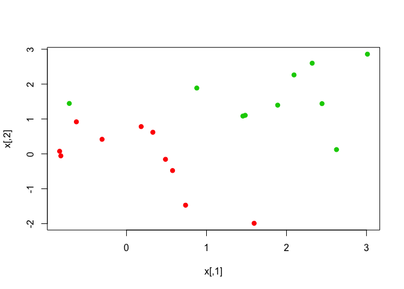

Now the observations are just barely linearly separable. We fit the
support vector classifier and plot the resulting hyperplane, using a
very large value of `cost` so that no observations are misclassified.

    dat=data.frame(x=x,y=as.factor(y))
    svmfit=svm(y~., data=dat, kernel="linear", cost=1e5)
    summary(svmfit)

    ## 
    ## Call:
    ## svm(formula = y ~ ., data = dat, kernel = "linear", cost = 1e+05)
    ## 
    ## 
    ## Parameters:
    ##    SVM-Type:  C-classification 
    ##  SVM-Kernel:  linear 
    ##        cost:  1e+05 
    ##       gamma:  0.5 
    ## 
    ## Number of Support Vectors:  3
    ## 
    ##  ( 1 2 )
    ## 
    ## 
    ## Number of Classes:  2 
    ## 
    ## Levels: 
    ##  -1 1

No training errors were made and only three support vectors were used.
However, we can see from the figure that the margin is very narrow
(because the observations that are not support vectors, indicated as
circles, are very close to the decision boundary). It seems likely that
this model will perform poorly on test data. We now try a smaller value
of `cost`:

    svmfit=svm(y~., data=dat, kernel="linear", cost=1)
    summary(svmfit)

    ## 
    ## Call:
    ## svm(formula = y ~ ., data = dat, kernel = "linear", cost = 1)
    ## 
    ## 
    ## Parameters:
    ##    SVM-Type:  C-classification 
    ##  SVM-Kernel:  linear 
    ##        cost:  1 
    ##       gamma:  0.5 
    ## 
    ## Number of Support Vectors:  7
    ## 
    ##  ( 4 3 )
    ## 
    ## 
    ## Number of Classes:  2 
    ## 
    ## Levels: 
    ##  -1 1

    plot(svmfit ,dat)

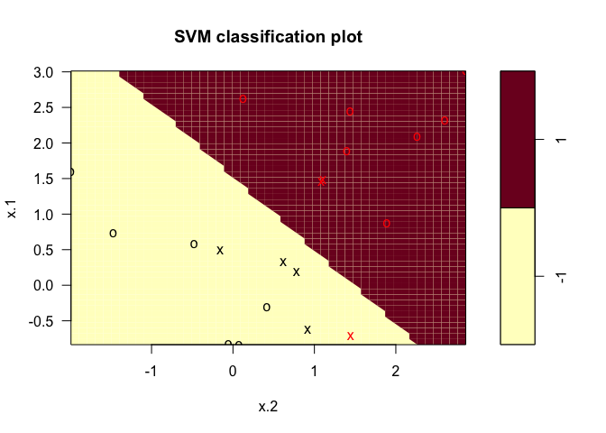

Using `cost=1`, we misclassify a training observation, but we also
obtain a much wider margin and make use of seven support vectors. It
seems likely that this model will perform better on test data than the
model with `cost=1e5`.

------------------------------------------------------------------------

9.6.2 Support Vector Machine
----------------------------

In order to fit an SVM using a non-linear kernel, we once again use the
`svm()` function. However, now we use a different value of the parameter
`kernel`. To fit an SVM with a polynomial kernel we use
`kernel="polynomial"`, and to fit an SVM with a radial kernel we use
`kernel="radial"`. In the former case we also use the `degree` argument
to specify a degree for the polynomial kernel (this is d in (9.22)), and
in the latter case we use `gamma` to specify a value of γ for the radial
basis kernel (9.24).

We first generate some data with a non-linear class boundary, as
follows:

    set.seed(1)
    x=matrix(rnorm(200*2), ncol=2)
    x[1:100,]=x[1:100,]+2
    x[101:150,]=x[101:150,]-2
    y=c(rep(1,150),rep(2,50))
    dat=data.frame(x=x,y=as.factor(y))

Plotting the data makes it clear that the class boundary is indeed
non-linear:

    plot(x, col=y)

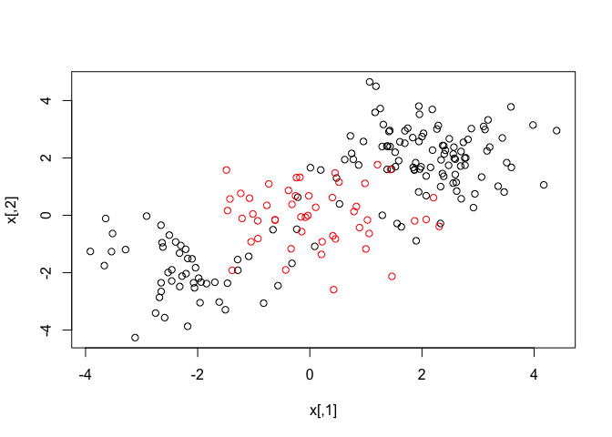

The data is randomly split into training and testing groups. We then fit
the training data using the `svm()` function with a radial kernel and γ
= 1:

    train=sample(200,100)
    svmfit=svm(y~., data=dat[train,], kernel="radial", gamma=1, cost =1)
    plot(svmfit , dat[train ,])

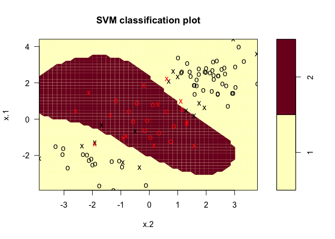

The plot shows that the resulting SVM has a decidedly non-linear
boundary. The `summary()` function can be used to obtain some
information about the SVM fit:

    summary(svmfit)

    ## 
    ## Call:
    ## svm(formula = y ~ ., data = dat[train, ], kernel = "radial", 
    ##     gamma = 1, cost = 1)
    ## 
    ## 
    ## Parameters:
    ##    SVM-Type:  C-classification 
    ##  SVM-Kernel:  radial 
    ##        cost:  1 
    ##       gamma:  1 
    ## 
    ## Number of Support Vectors:  31
    ## 
    ##  ( 16 15 )
    ## 
    ## 
    ## Number of Classes:  2 
    ## 
    ## Levels: 
    ##  1 2

We can see from the figure that there are a fair number of training
errors in this SVM fit. If we increase the value of cost, we can reduce
the number of training errors. However, this comes at the price of a
more irregular decision boundary that seems to be at risk of overfitting
the data.

    svmfit=svm(y~., data=dat[train,], kernel="radial", gamma=1, cost=1e5)
    plot(svmfit ,dat[train ,])

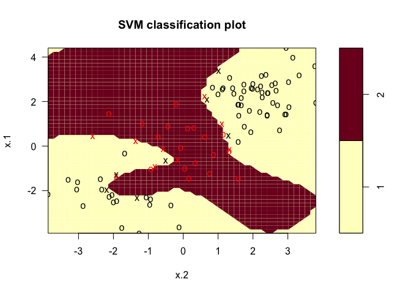

We can perform cross-validation using `tune()` to select the best choice
of γ and cost for an SVM with a radial kernel:

    set.seed(1)
    tune.out=tune(svm, y~., data=dat[train,], kernel="radial",
                  ranges=list(cost=c(0.1,1,10,100,1000), 
                              gamma=c(0.5,1,2,3,4))
                  )
    summary(tune.out)

    ## 
    ## Parameter tuning of 'svm':
    ## 
    ## - sampling method: 10-fold cross validation 
    ## 
    ## - best parameters:
    ##  cost gamma
    ##     1   0.5
    ## 
    ## - best performance: 0.07 
    ## 
    ## - Detailed performance results:
    ##     cost gamma error dispersion
    ## 1  1e-01   0.5  0.26 0.15776213
    ## 2  1e+00   0.5  0.07 0.08232726
    ## 3  1e+01   0.5  0.07 0.08232726
    ## 4  1e+02   0.5  0.14 0.15055453
    ## 5  1e+03   0.5  0.11 0.07378648
    ## 6  1e-01   1.0  0.22 0.16193277
    ## 7  1e+00   1.0  0.07 0.08232726
    ## 8  1e+01   1.0  0.09 0.07378648
    ## 9  1e+02   1.0  0.12 0.12292726
    ## 10 1e+03   1.0  0.11 0.11005049
    ## 11 1e-01   2.0  0.27 0.15670212
    ## 12 1e+00   2.0  0.07 0.08232726
    ## 13 1e+01   2.0  0.11 0.07378648
    ## 14 1e+02   2.0  0.12 0.13165612
    ## 15 1e+03   2.0  0.16 0.13498971
    ## 16 1e-01   3.0  0.27 0.15670212
    ## 17 1e+00   3.0  0.07 0.08232726
    ## 18 1e+01   3.0  0.08 0.07888106
    ## 19 1e+02   3.0  0.13 0.14181365
    ## 20 1e+03   3.0  0.15 0.13540064
    ## 21 1e-01   4.0  0.27 0.15670212
    ## 22 1e+00   4.0  0.07 0.08232726
    ## 23 1e+01   4.0  0.09 0.07378648
    ## 24 1e+02   4.0  0.13 0.14181365
    ## 25 1e+03   4.0  0.15 0.13540064

Therefore, the best choice of parameters involves `cost=1` and
`gamma=2`. We can view the test set predictions for this model by
applying the `predict()` function to the data. Notice that to do this we
subset the dataframe `dat` using `-train` as an index set.

    table(true=dat[-train,"y"], pred=predict(tune.out$best.model, newx=dat[-train ,]))

    ##     pred
    ## true  1  2
    ##    1 54 23
    ##    2 17  6

39% of test observations are misclassified by this SVM.

------------------------------------------------------------------------

9.6.3 ROC Curves
----------------

The `ROCR` package can be used to produce ROC curves such as those in
Figures 9.10 and 9.11. We first write a short function to plot an ROC
curve given a vector containing a numerical score for each observation,
`pred`, and a vector containing the class label for each observation,
`truth`.

    library(ROCR) 

    ## Loading required package: gplots

    ## 
    ## Attaching package: 'gplots'

    ## The following object is masked from 'package:stats':
    ## 
    ##     lowess

    rocplot=function(pred, truth, ...){
      predob = prediction(pred, truth)
      perf = performance (predob , "tpr", "fpr") 
      plot(perf ,...)
    }

SVMs and support vector classifiers output class labels for each
observa- tion. However, it is also possible to obtain *fitted values*
for each observation, which are the numerical scores used to obtain the
class labels. For instance, in the case of a support vector classifier,
the fitted value for an observation
*X* = (*X*1, *X*2, ..., *X**p*)*T*
takes the form
*β̂*0 + *β̂*1*X*1 + *β̂*2*X*2 + ... + *β̂**p**X**p*.
For an SVM with a non-linear kernel, the equation that yields the fitted
value is given in (9.23). In essence, the sign of the fitted value
determines on which side of the decision boundary the observation lies.
Therefore, the relationship between the fitted value and the class
prediction for a given observation is simple: if the fitted value
exceeds zero then the observation is assigned to one class, and if it is
less than zero than it is assigned to the other. In order to obtain the
fitted values for a given SVM model fit, we use `decision.values=TRUE`
when fitting `svm()`. Then the `predict()` function will output the
fitted values.

    svmfit.opt=svm(y~., data=dat[train,], kernel="radial", 
                   gamma=2, cost=1, decision.values=T)
    fitted=attributes(predict(svmfit.opt,dat[train,], decision.values=TRUE))$decision.values

Now we can produce the ROC plot.

    par(mfrow=c(1,2))
    rocplot(fitted, dat[train ,"y"], main="Training Data")

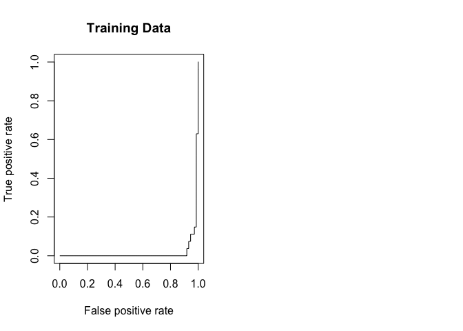

SVM appears to be producing accurate predictions. By increasing γ we can
produce a more flexible fit and generate further improvements in
accuracy.

    par(mfrow=c(1,2))
    rocplot(fitted, dat[train ,"y"], main="Training Data")
    svmfit.flex=svm(y~., data=dat[train,], kernel="radial", gamma=50, cost=1, decision.values=T)
    fitted=attributes(predict(svmfit.flex, dat[train, ], decision.values=T))$decision.values
    rocplot(fitted, dat[train ,"y"], add=TRUE, col="red")

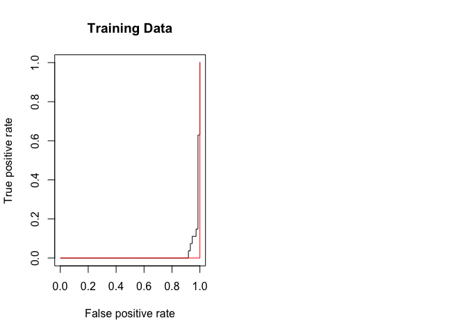

However, these ROC curves are all on the training data. We are really
more interested in the level of prediction accuracy on the test data.
When we compute the ROC curves on the test data, the model with γ = 2
appears to provide the most accurate results.

    par(mfrow=c(1,2))
    rocplot(fitted, dat[train ,"y"], main="Training Data")
    svmfit.flex=svm(y~., data=dat[train,], kernel="radial", gamma=50, cost=1, decision.values=T)
    fitted=attributes(predict(svmfit.flex, dat[train, ], decision.values=T))$decision.values
    rocplot(fitted, dat[train ,"y"], add=TRUE, col="red")

    fitted=attributes(predict(svmfit.opt,dat[-train,],decision.values=T))$decision.values
    rocplot(fitted ,dat[-train ,"y"],main="Test Data")
    fitted=attributes(predict(svmfit.flex,dat[-train,],decision.values=T))$decision.values
    rocplot(fitted ,dat[-train ,"y"],add=T,col="red")

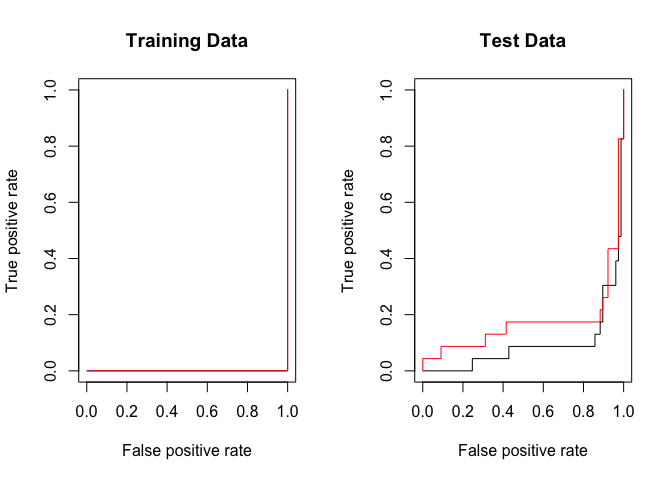

------------------------------------------------------------------------

9.6.4 SVM With Multiple Classes
-------------------------------

If the response is a factor containing more than two levels, then the
`svm()` function will perform multi-class classification using the
one-versus-one approach. We explore that setting here by generating a
third class of observations.

    set.seed(1)
    x=rbind(x, matrix(rnorm(50*2), ncol=2))
    y=c(y, rep(0,50))
    x[y==0,2]=x[y==0,2]+2
    dat=data.frame(x=x, y=as.factor(y))
    par(mfrow=c(1,1))
    plot(x,col=(y+1))

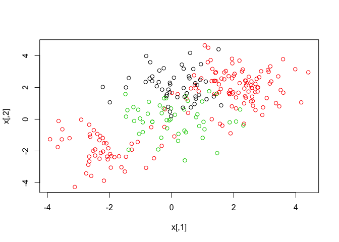

We now fit an SVM to the data:

    svmfit=svm(y~., data=dat, kernel="radial", cost=10, gamma=1) 
    plot(svmfit , dat)

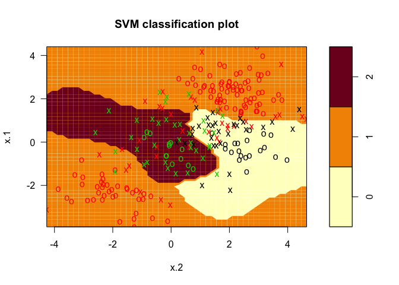

The `e1071` library can also be used to perform support vector
regression, if the response vector that is passed in to `svm()` is
numerical rather than a factor.

------------------------------------------------------------------------

9.6.5 Application to Gene Expression Data
-----------------------------------------

We now examine the `Khan` data set, which consists of a number of tissue
samples corresponding to four distinct types of small round blue cell
tumors. For each tissue sample, gene expression measurements are
available. The data set consists of training data, `xtrain` and
`ytrain`, and testing data, `xtest` and `ytest.`

We examine the dimension of the data:

    library(ISLR)
    names(Khan)

    ## [1] "xtrain" "xtest"  "ytrain" "ytest"

    dim(Khan$xtrain )

    ## [1]   63 2308

    dim(Khan$xtest )

    ## [1]   20 2308

    length(Khan$ytrain )

    ## [1] 63

    length(Khan$ytest )

    ## [1] 20

This data set consists of expression measurements for 2308 genes. The
training and test sets consist of 63 and 20 observations respectively.

    table(Khan$ytrain ) 

    ## 
    ##  1  2  3  4 
    ##  8 23 12 20

    table(Khan$ytest )

    ## 
    ## 1 2 3 4 
    ## 3 6 6 5

We will use a support vector approach to predict cancer subtype using
gene expression measurements. In this data set, there are a very large
number of features relative to the number of observations. This suggests
that we should use a linear kernel, because the additional flexibility
that will result from using a polynomial or radial kernel is
unnecessary.

    dat=data.frame(x=Khan$xtrain , y=as.factor(Khan$ytrain))
    out=svm(y~., data=dat, kernel="linear",cost=10)
    summary(out)

    ## 
    ## Call:
    ## svm(formula = y ~ ., data = dat, kernel = "linear", cost = 10)
    ## 
    ## 
    ## Parameters:
    ##    SVM-Type:  C-classification 
    ##  SVM-Kernel:  linear 
    ##        cost:  10 
    ##       gamma:  0.0004332756 
    ## 
    ## Number of Support Vectors:  58
    ## 
    ##  ( 20 20 11 7 )
    ## 
    ## 
    ## Number of Classes:  4 
    ## 
    ## Levels: 
    ##  1 2 3 4

    table(out$fitted, dat$y)

    ##    
    ##      1  2  3  4
    ##   1  8  0  0  0
    ##   2  0 23  0  0
    ##   3  0  0 12  0
    ##   4  0  0  0 20

We see that there are *no* training errors. In fact, this is not
surprising, because the large number of variables relative to the number
of observations implies that it is easy to find hyperplanes that fully
separate the classes. We are most interested not in the support vector
classifier’s performance on the training observations, but rather its
performance on the test observations.

    dat.te=data.frame(x=Khan$xtest , y=as.factor(Khan$ytest))
    pred.te=predict(out, newdata=dat.te)
    table(pred.te, dat.te$y)

    ##        
    ## pred.te 1 2 3 4
    ##       1 3 0 0 0
    ##       2 0 6 2 0
    ##       3 0 0 4 0
    ##       4 0 0 0 5

We see that using `cost=10` yields two test set errors on this data.
