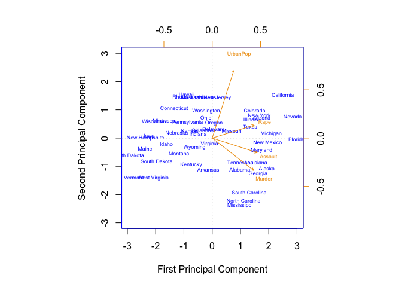

10.4 Lab 1: Principal Components Analysis
=========================================

In this lab, we perform PCA on the `USArrests` data set, which is part
of the base `R` package. The rows of the data set contain the fifty
states, in alphabetical order.

    states <- row.names(USArrests)
    states

    ##  [1] "Alabama"        "Alaska"         "Arizona"        "Arkansas"      
    ##  [5] "California"     "Colorado"       "Connecticut"    "Delaware"      
    ##  [9] "Florida"        "Georgia"        "Hawaii"         "Idaho"         
    ## [13] "Illinois"       "Indiana"        "Iowa"           "Kansas"        
    ## [17] "Kentucky"       "Louisiana"      "Maine"          "Maryland"      
    ## [21] "Massachusetts"  "Michigan"       "Minnesota"      "Mississippi"   
    ## [25] "Missouri"       "Montana"        "Nebraska"       "Nevada"        
    ## [29] "New Hampshire"  "New Jersey"     "New Mexico"     "New York"      
    ## [33] "North Carolina" "North Dakota"   "Ohio"           "Oklahoma"      
    ## [37] "Oregon"         "Pennsylvania"   "Rhode Island"   "South Carolina"
    ## [41] "South Dakota"   "Tennessee"      "Texas"          "Utah"          
    ## [45] "Vermont"        "Virginia"       "Washington"     "West Virginia" 
    ## [49] "Wisconsin"      "Wyoming"

The columns of the data contain 4 variables:

    names(USArrests)

    ## [1] "Murder"   "Assault"  "UrbanPop" "Rape"

We first briefly examine the data. We notice that the variables have
vastly different means.

    apply(USArrests, 2, mean)

    ##   Murder  Assault UrbanPop     Rape 
    ##    7.788  170.760   65.540   21.232

    apply(USArrests, 2, var)

    ##     Murder    Assault   UrbanPop       Rape 
    ##   18.97047 6945.16571  209.51878   87.72916

    gather(USArrests, stat, value) %>% 
      ggplot(aes(value)) +
      geom_histogram(bins = 50) +
      facet_wrap(~stat) +
      labs(x = "Value", y = "Count")

Not surprisingly, the variables also have vastly different variances.
The broad ranges of means and variances among the variables are not
surprising: the `UrbanPop` variable measures the percentage of the
population in each state living in an urban area, which is not a
comparable number to the number of rapes in each state per 100,000
individuals. If we failed to scale the variables before performing PCA,
then most of the principal components that we observed would be driven
by the `Assault` variable, since it has by far the largest mean and
variance. Thus, it is important to standardize the variables to have
mean zero and standard deviation one before performing PCA.

Perform principal components analysis using the `prcomp()` function,
which is one of several functions in `R` that perform PCA.

    pr.out = prcomp(USArrests , scale=TRUE)

By default, the `prcomp()` function centers the variables to have mean
zero. By using the option `scale=TRUE`, we scale the variables to have
standard deviation one. The output from `prcomp()` contains a number of
useful quantities.

    names(pr.out)

    ## [1] "sdev"     "rotation" "center"   "scale"    "x"

The `center` and `scale` components correspond to the means and standard
deviations of the variables that were used for scaling prior to
implementing PCA.

    pr.out$center

    ##   Murder  Assault UrbanPop     Rape 
    ##    7.788  170.760   65.540   21.232

    pr.out$scale

    ##    Murder   Assault  UrbanPop      Rape 
    ##  4.355510 83.337661 14.474763  9.366385

The `rotation` matrix provides the principal component loadings; each
column of `pr.out$rotation` contains the corresponding principal
component loading vector.

    pr.out$rotation

    ##                 PC1        PC2        PC3         PC4
    ## Murder   -0.5358995  0.4181809 -0.3412327  0.64922780
    ## Assault  -0.5831836  0.1879856 -0.2681484 -0.74340748
    ## UrbanPop -0.2781909 -0.8728062 -0.3780158  0.13387773
    ## Rape     -0.5434321 -0.1673186  0.8177779  0.08902432

We see that there are four distinct principal components. This is to be
expected because there are in general min(*n* − 1, *p*) informative
principal components in a data set with *n* observations and *p*
variables.

Using the `prcomp()` function as we did above, we do not need to
explicitly multiply the data by the principal component loading vectors
in order to obtain the principal component score vectors. Rather the 50
× 4 matrix `x` has as its columns the principal component score vectors.
That is, the *kth* column is the *kth* principal component score vector.

    dim(pr.out$x)

    ## [1] 50  4

    head(pr.out$x)

    ##                   PC1        PC2         PC3          PC4
    ## Alabama    -0.9756604  1.1220012 -0.43980366  0.154696581
    ## Alaska     -1.9305379  1.0624269  2.01950027 -0.434175454
    ## Arizona    -1.7454429 -0.7384595  0.05423025 -0.826264240
    ## Arkansas    0.1399989  1.1085423  0.11342217 -0.180973554
    ## California -2.4986128 -1.5274267  0.59254100 -0.338559240
    ## Colorado   -1.4993407 -0.9776297  1.08400162  0.001450164

We can plot the first two principal components as follows:

    biplot(pr.out, scale = 0, cex = 0.55)

The `scale=0` argument to `biplot()` ensures that the arrows are scaled
to represent the loadings; other values for scale give slightly
different biplots with different interpretations.

Notice that this figure is a mirror image of Figure 10.1. Recall that
the principal components are only unique up to a sign change, so we can
reproduce Figure 10.1 by making a few small changes:

    pr.out$rotation = -pr.out$rotation
    pr.out$x = -pr.out$x
    biplot(pr.out, 
           scale =0, 
           col   = c("blue","orange2"),
           cex   = 0.55,
           xlab  = "First Principal Component",
           ylab  = "Second Principal Component",
           arrow.len = 0.05)
    abline(v=0, h=0, cex=0.5, col = 'grey', lty=3)

Figure 10.1 plots the first two principal components of these data. The
figure represents both the principal component scores and the loading
vectors in a single biplot display. The loadings are also given in Table
10.1.

In Figure 10.1, we see that the first loading vector places
approximately equal weight on `Assault`, `Murder`, and `Rape`, with much
less weight on `UrbanPop`. Hence this component roughly corresponds to a
measure of overall rates of serious crimes. The second loading vector
places most of its weight on `UrbanPop` and much less weight on the
other three features. Hence, this component roughly corresponds to the
level of urbanization of the state. Overall, we see that the
crime-related variables (`Murder`, `Assault`, and `Rape`) are located
close to each other, and that the `UrbanPop` variable is far from the
other three. This indicates that the crime-related variables are
correlated with each other — states with high murder rates tend to have
high assault and rape rates — and that the `UrbanPop` variable is less
correlated with the other three.

We can examine differences between the states via the two principal
component score vectors shown in Figure 10.1. Our discussion of the
loading vectors suggests that states with large positive scores on the
first component, such as California, Nevada and Florida, have high crime
rates, while states like North Dakota, with negative scores on the first
component, have low crime rates. California also has a high score on the
second component, indicating a high level of urbanization, while the
opposite is true for states like Mississippi. States close to zero on
both components, such as Indiana, have approximately average levels of
both crime and urbanization.

------------------------------------------------------------------------

The `prcomp()` function also outputs the standard deviation of each
principal component. For instance, on the `USArrests` data set, we can
access these standard deviations as follows:

    pr.out$sdev

    ## [1] 1.5748783 0.9948694 0.5971291 0.4164494

The variance explained by each principal component is obtained by
squaring these:

    pr.var = pr.out$sdev ^2
    pr.var

    ## [1] 2.4802416 0.9897652 0.3565632 0.1734301

By definition, principal components are arranged in order of varaince
explained. To compute the proportion of variance explained by each
principal component, we simply divide the variance explained by each
principal component by the total variance explained by all four
principal components:

    pve = pr.var / sum(pr.var)
    pve

    ## [1] 0.62006039 0.24744129 0.08914080 0.04335752

We see that the first principal component explains 62.0% of the variance
in the data, the next principal component explains 24.7% of the
variance, and so forth. We can plot the PVE explained by each component,
as well as the cumulative PVE, as follows:

    pve <- data.frame(pc = 1:4, pve = pve, cs = cumsum(pve))
    pve <- tidyr::gather(pve, stat, val, -pc)

    lab <- as_labeller(c("cs"= "Cumulative Proportion of Variance Explained", 
                         "pve" = "Proportion of Variance Explained"))

    ggplot(pve, aes(pc, val)) +
      geom_point() + 
      geom_line() +
      facet_wrap(~stat, labeller = lab) +
      labs(x = "Principal Component", y = "Proportion") +
      theme(panel.grid.minor = element_blank())

------------------------------------------------------------------------

10.5 Lab 2: Clustering
======================

10.5.1 K-Means Clustering
-------------------------
